  


## Содержание

[Преамбула](#преамбула)  
[Общие правила](#общие-правила)  
[Пояснения к таблицам](#пояснения-к-таблицам)  
[Упражнение 00](#упражнение-00)  
[Упражнение 01](#упражнение-01)  
[Упражнение 02](#упражнение-02)  
[Упражнение 03](#упражнение-03)  
[Упражнение 04](#упражнение-04)  
[Упражнение 05](#упражнение-05)  
[Упражнение 06](#упражнение-06)  
[Упражнение 07](#упражнение-07)  
[Упражнение 08](#упражнение-08)  
[Упражнение 09](#упражнение-09)  


## Преамбула

Путь развития SQL   


Основные изменения в стандартах SQL:
|  |  |
| ------ | ------ |
|  | 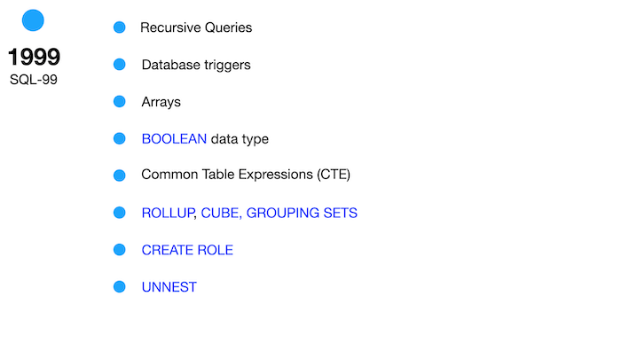 |
| 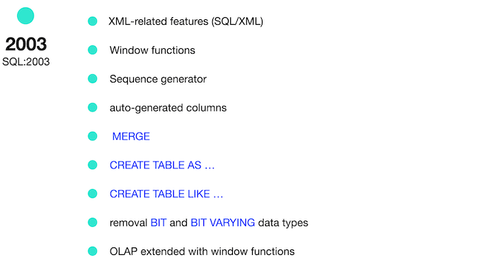 |  |
|  |  |


## Общие правила

- Убедитесь, что используете последнюю версию PostgreSQL.  
- Для оценки ваше решение должно находиться в репозитории git, в ветке develop и папке src.  
- Вы не должны оставлять в своей директории никаких других файлов, кроме тех, которые явно указаны в инструкциях по упражнению.   
- Убедитесь, что у вас есть собственная база данных и доступ к ней в вашем кластере PostgreSQL.
- Скачайте [script](materials/model.sql) с моделью базы данных здесь и примените скрипт к своей базе данных (вы можете использовать командную строку с psql или просто запустить его через любую среду IDE, например DataGrip от JetBrains или pgAdmin от PostgreSQL community).
- Все задачи содержат список разрешенных и запрещенных разделов с перечисленными параметрами базы данных, типами баз данных, конструкциями SQL и т.д.  
- И да пребудет с вами SQL-сила!
- Абсолютно все может быть представлено в SQL! Давайте начнем и повеселимся!


## Пояснения к таблицам

Для работы с таблицами используйте PostgreSQL и pgAdmin4.  

Логический вид используемой в задании модели базы данных.  
  


1. Таблица **pizzeria** (таблица-справочник с доступными пиццериями)
- id - первичный ключ
- name - название пиццерии
- rating - средняя оценка пиццерии (от 0 до 5 баллов)
2. Таблица **person** (таблица словаря с лицами, которые любят пиццу)
- id - первичный ключ
- name - имя человека
- age - возраст человека
- gender - пол человека
- address - адрес человека
3. Таблица **menu** (таблица-словарь с доступным меню и ценой на конкретную пиццу)
- id - первичный ключ
- pizzeria_id - внешний ключ для пиццерии
- pizza_name - название пиццы в пиццерии
- price - цена конкретной пиццы
4. Таблица **person_visits** (оперативная таблица с информацией о посещениях пиццерии)
- id - первичный ключ
- person_id - внешний ключ для человека
- pizzeria_id - внешний ключ для пиццерии
- visit_date - дата (например, 2022-01-01) посещения человека
5. Таблица **person_order** (Оперативная таблица с информацией о заказах людей)
- id - первичный ключ
- person_id - внешний ключ к person
- menu_id - внешний ключ к меню
- order_date - дата (например, 2022-01-01) заказа человека

Посещение человека и заказ человека являются разными объектами и не содержат никакой корреляции между данными.   
Например, клиент может находиться в одном ресторане (просто просматривая меню) и в это время сделать заказ в другом по телефону или с помощью мобильного приложения.   
Или в другом случае просто быть дома и снова позвонить с заказом без каких-либо посещений.  


## Упражнение 00

| Упражнение 00: Первые шаги в мир SQL | |
|---------------------------------------|--------------------------------------------------------------------------------------------------------------------------|
| Каталог для сдачи в эксплуатацию | ex00 |
| Файлы для передачи | `day00_ex00.sql` |
| **Разрешено** | |
| Язык | ANSI SQL |

Сделайте запрос select, который: 
- вернет все имена и возраст человека из города ‘Kazan’  

<details>
  <summary>Решение</summary>
</p>

```sql
	SELECT 
			person.name,
			person.age
	  FROM	person
	 WHERE	person.address = 'Kazan';
```

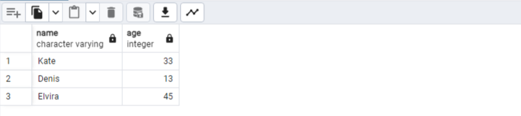

</p>
</details>


## Упражнение 01

| Упражнение 01: Первые шаги в мир SQL | |
|---------------------------------------|--------------------------------------------------------------------------------------------------------------------------|
| Каталог для сдачи в эксплуатацию | ex01 |
| Файлы для отправки | `day00_ex01.sql` |
| **Разрешено** | |
| Язык | ANSI SQL |

Сделайте запрос select, который:  
- вернет имена и возраст всех женщин из города ‘‘Kazan’’    

Отсортируйте результат по имени.  

<details>
  <summary>Решение</summary>
</p>

```sql
	SELECT 
			person.name,
			person.age
	  FROM	person
	 WHERE	person.address = 'Kazan'
	   AND	person.gender = 'female'
  ORDER BY	person.name;
```

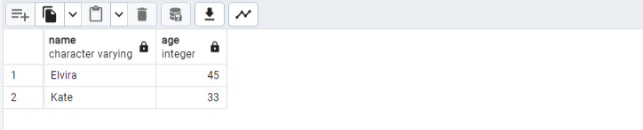

</p>
</details>


## Упражнение 02

| Упражнение 02: Первые шаги в мир SQL | |
|---------------------------------------|--------------------------------------------------------------------------------------------------------------------------|
| Каталог для сдачи в эксплуатацию | ex02 |
| Файлы для передачи | `day00_ex02.sql` |
| **Разрешено** | |
| Язык | ANSI SQL |

Сделайте 2 различных инструкции select, которые возвращают название пиццерии и рейтинг с рейтингом от 3,5 до 5 баллов (включая предельные баллы).  
Отсрортируйте по рейтингу пиццерии.  

- 1-й оператор select должен содержать знаки сравнения (<=, >=)
- 2-й оператор select должен содержать ключевое слово `BETWEEN`

<details>
  <summary>Решение</summary>
</p>

```sql
	SELECT 
			pizzeria.name,
			pizzeria.rating
	  FROM	pizzeria
	 WHERE	pizzeria.rating >= '3.5' AND pizzeria.rating <= '5'
  ORDER BY	pizzeria.rating;
```
```sql
	SELECT 
			pizzeria.name,
			pizzeria.rating
	  FROM	pizzeria
	 WHERE 	pizzeria.rating BETWEEN 3.5 AND 5
  ORDER BY	pizzeria.rating;
```

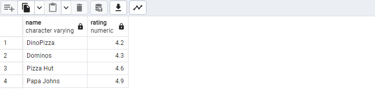

</p>
</details>


## Упражнение 03

| Упражнение 03: Первые шаги в мир SQL | |
|---------------------------------------|--------------------------------------------------------------------------------------------------------------------------|
| Каталог для сдачи в эксплуатацию | ex03 |
| Файлы для передачи | `day00_ex03.sql` |
| **Разрешено** | |
| Язык | ANSI SQL |

Сделайте запрос select, который:  
- возвращает идентификаторы лиц (person.id - без дублирования), которые:
	- посещали пиццерии в период с 6 января 2022 года по 9 января 2022 года (включая все дни)  
	- посещали пиццерию с идентификатором 2   

Отсортируйте по person.id в режиме убывания.

<details>
  <summary>Решение</summary>
</p>

```sql
	SELECT 	DISTINCT person_visits.person_id
	  FROM	person_visits
	 WHERE 	person_visits.visit_date BETWEEN '2022-01-06' AND '2022-01-09'
	 	OR	person_visits.pizzeria_id = 2
  ORDER BY	person_visits.person_id DESC;
```

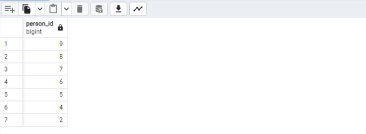

</p>
</details>


## Упражнение 04

| Упражнение 04: Первые шаги в мир SQL | |
|---------------------------------------|--------------------------------------------------------------------------------------------------------------------------|
| Каталог для сдачи | ex04 |
| Файлы для сдачи | `day00_ex04.sql` |
| **Разрешено** | |
| Язык | ANSI SQL |

Сделайте запрос select, который: 
- возвращает одно вычисляемое поле с именем ‘person_information’ в одной строке, как описано в следующем примере:
`Anna (age:16,gender:'female',address:'Moscow')`

Отсортируйте по столбцу расчета в порядке возрастания.  

<details>
  <summary>Решение</summary>
</p>

> - `||` операция конкатенации для объединения строк  
> - `' (age:', ',gender:"', '",address:"'` - строковые литералы для форматирования итогового выражения  
> - `COALESCE(person.address, '')` - возвращает первое непустое значение из person.address или пустую строку, если person.address равно NULL  

```sql
	SELECT 
    		person.name || ' (age:' || person.age || ',gender:"' || person.gender || '",address:"' || COALESCE(person.address, '') || '")' AS person_information
	  FROM 	person
  ORDER BY 	person_information
-- 	 LIMIT 	1;
```

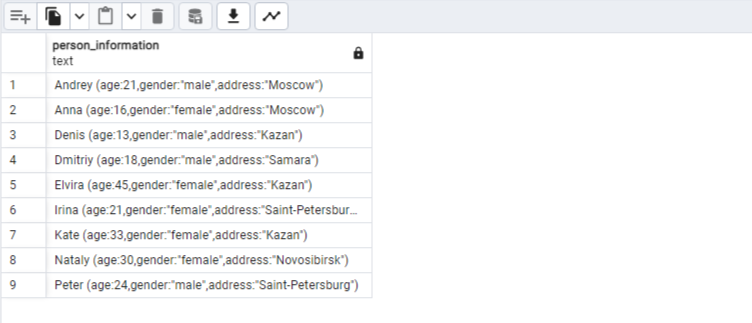

</p>
</details>


## Упражнение 05

| Упражнение 05: Первые шаги в мир SQL | |
|---------------------------------------|--------------------------------------------------------------------------------------------------------------------------|
| Каталог для сдачи | ex05 |
| Файлы для сдачи | `day00_ex05.sql` |
| **Разрешено** | |
| Язык | ANSI SQL |
| **Отказано** |
| Синтаксическая конструкция SQL | `IN`, любые типы `JOINs` |

Сделайте запрос select, который вернет имена пользователей (на основе внутреннего запроса в пункте `SELECT`), которые:
- сделали заказы для меню с идентификаторами 13, 14 и 18
- дата заказов должна быть равна 7 января 2022 года.   

Конструкции из раздела "Отказано" не должны быть использованы в решении.  

Пример внутреннего запроса  
```sql
    SELECT 
	    (SELECT ... ) AS NAME  -- this is an internal query in a main SELECT clause
    FROM ...
    WHERE ...
```
<details>
  <summary>Решение</summary>
</p>

```sql
	SELECT (
			 SELECT person.name 
			   FROM person 
			  WHERE person.id = person_order.person_id  -- проводим связь между таблицами person и person_order
	)
	  FROM	person_order
	 WHERE	( -- скобки для соответствия выборке по дате
		 	person_order.menu_id = 13 
		OR 	person_order.menu_id = 14 
		OR 	person_order.menu_id = 18
	 )
	   AND 	person_order.order_date = '2022-01-07';
```

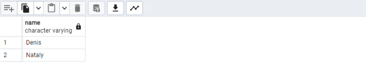

</p>
</details>

## Упражнение 06

| Упражнение 06: Первые шаги в мир SQL | |
|---------------------------------------|--------------------------------------------------------------------------------------------------------------------------|
| Каталог для сдачи в эксплуатацию | ex06 |
| Файлы для передачи | `day00_ex06.sql` |
| **Разрешено** | |
| Язык | ANSI SQL |
| **Запрещено** |
| Синтаксическая конструкция SQL | `IN`, любые типы `JOINs` |

Используйте конструкцию SQL из упражнения 05.
- добавьте новый вычисляемый столбец (используйте имя столбца ‘check_name’) с инструкцией проверки в предложении `SELECT`.

Псевдокод для этой проверки  
```c
if (person_name == 'Denis') затем верните true
else возвращает значение false
```

<details>
  <summary>Решение</summary>
</p>

```sql
	SELECT (
			SELECT 	person.name 
			  FROM 	person 
			 WHERE 	person.id = person_order.person_id  -- проводим связь между таблицами person и person_order
	),
	  CASE -- создаём новый столбец с результатом проверки имени
			WHEN (
					SELECT person.name 
					  FROM person 
					 WHERE person.id = person_order.person_id) = 'Denis' 
					 THEN 'true' 
					 ELSE 'false'
			END AS 	check_name
	  FROM	person_order
	 WHERE	( -- скобки для соответствия выборке по дате
		 	person_order.menu_id = 13 
		OR 	person_order.menu_id = 14 
		OR 	person_order.menu_id = 18
	 )
	   AND 	person_order.order_date = '2022-01-07';
```

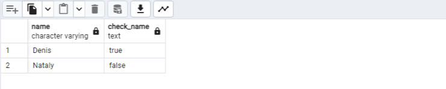

</p>
</details>


## Упражнение 07

| Упражнение 07: Первые шаги в мир SQL | |
|---------------------------------------|--------------------------------------------------------------------------------------------------------------------------|
| Каталог для сдачи в эксплуатацию | ex07 |
| Файлы для ввода | `day00_ex07.sql` |
| **Разрешено** | |
| Язык | ANSI SQL |

Давайте применим интервалы данных для таблицы `person`.
Создайте SQL-инструкцию, которая возвращает идентификаторы человека, имена людей и интервал возраста человека (задайте имя нового вычисляемого столбца как ‘interval_info’) на основе псевдокода, приведенного ниже.

```sql
    if (age >= 10 and age <= 20) then return 'interval #1'
    else if (age > 20 and age < 24) then return 'interval #2'
    else return 'interval #3'
```

Отсортируйте результат по столбцу ‘interval_info’ в порядке возрастания.

<details>
  <summary>Решение</summary>
</p>

```sql
	SELECT 	
			person.id,
			person.name,
	  CASE
			WHEN person.age BETWEEN 10 AND 20 THEN 'interval #1' 
			WHEN person.age BETWEEN 20 AND 24 THEN 'interval #2'
			ELSE 'interval #3'
	END AS 	interval_info
	  FROM 	person 
  ORDER BY 	interval_info;	
```

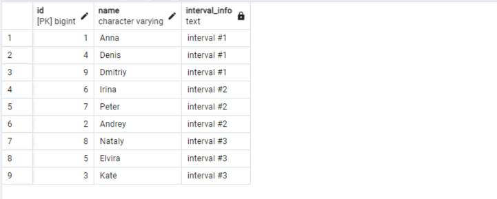

</p>
</details>


## Упражнение 08

| Упражнение 08: Первые шаги в мир SQL | |
|---------------------------------------|--------------------------------------------------------------------------------------------------------------------------|
| Каталог для сдачи в эксплуатацию | ex08 |
| Файлы для передачи | `day00_ex08.sql` |
| **Разрешено** | |
| Язык | ANSI SQL |

Создайте инструкцию SQL, которая возвращает все результаты из таблицы `person_order` со строками, идентификатор которых является четным числом.   
Результат должен быть упорядочен по возвращаемому идентификатору.

<details>
  <summary>Решение</summary>
</p>

```sql
	SELECT 	
			*
	  FROM 	person_order 
	 WHERE 	person_order.person_id % 2 = 0
  ORDER BY 	person_order.person_id
```

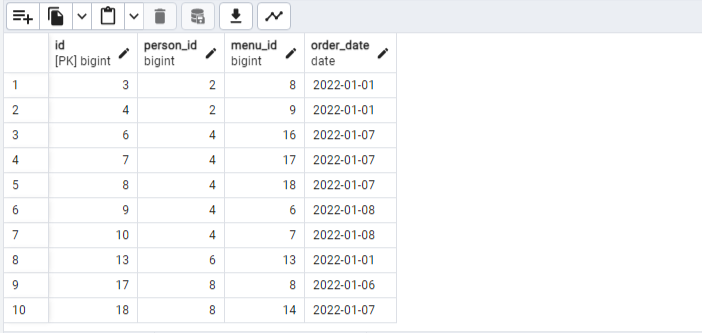

</p>
</details>


## Упражнение 09

| Упражнение 09: Первые шаги в мир SQL | |
|---------------------------------------|--------------------------------------------------------------------------------------------------------------------------|
| Каталог для сдачи | ex09 |
| Файлы для сдачи | `day00_ex09.sql` |
| **Разрешено** | |
| Язык | ANSI SQL |
| **Отказано** |
| Построение синтаксиса SQL | любые типы `JOINs` |

Сделайте запрос select, который возвращает имена пользователей и названия пиццерий на основе таблицы `person_visits` с указанием даты посещения в период с 07 по 09 января 2022 года (включая все дни) (на основе внутреннего запроса в предложении `FROM`).


Взгляните на шаблон окончательного запроса.

```sql
    SELECT (...) AS person_name ,  -- this is an internal query in a main SELECT clause
            (...) AS pizzeria_name  -- this is an internal query in a main SELECT clause
    FROM (SELECT … FROM person_visits WHERE …) AS pv -- this is an internal query in a main FROM clause
    ORDER BY ...
```

Добавьте предложение о заказе по имени человека в порядке возрастания и по названию пиццерии в порядке убывания

<details>
  <summary>Решение</summary>
</p>

```sql
	SELECT 
			(SELECT person.name FROM person WHERE person.id = pv.person_id) AS person_name,
			(SELECT pizzeria.name FROM pizzeria WHERE pizzeria.id = pv.pizzeria_id) AS pizzeria_name
	  FROM 
			(SELECT * FROM person_visits WHERE person_visits.visit_date BETWEEN '2022-01-07' AND '2022-01-09') AS pv
  ORDER BY 
			person_name, 
			pizzeria_name DESC;
```

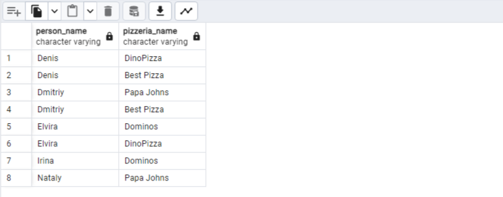

</p>
</details>
