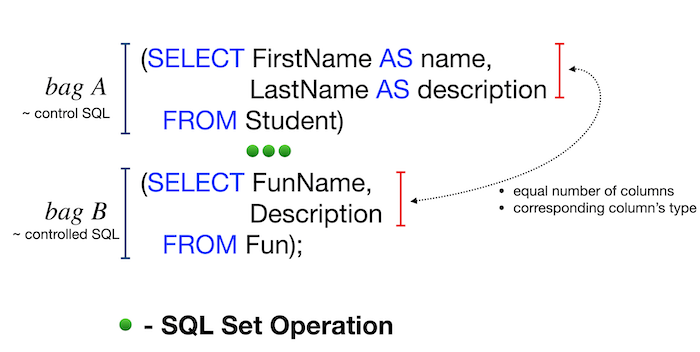
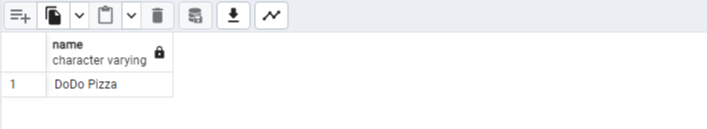

 

# Day 01 - Piscine SQL

## _Первые шаги по работе с наборами и объединениями в SQL_

В этом проекте вы научитесь получать необходимые данные на основе конструкций наборов и простых объединений

## Содержание

[Преамбула](#преамбула)  
[Общие правила](#общие-правила)   
[Пояснения к таблицам](#пояснения-к-таблицам)     
[Упражнение 00 - Давайте танцевать ВМЕСТЕ](#упражнение-00)  
[Упражнение 01 - ОБЪЕДИНЯЮЩИЙ танец с подзапросом](#упражнение-01)  
[Упражнение 02 - Дублирует или не дублирует](#упражнение-02)  
[Упражнение 03 - “Скрытые” идеи](#упражнение-03)  
[Упражнение 04 - Разница? Да, давайте найдем разницу между мультимножествами](#упражнение-04)  
[Упражнение 05 - Слышали ли вы о декартовом произведении?](#упражнение-05)  
[Упражнение 06 - Давайте посмотрим на “скрытые” идеи](#упражнение-06)  
[Упражнение 07 - Просто присоединяйтесь](#упражнение-07)  
[Упражнение 08 - Переход от СОЕДИНЕНИЯ к ЕСТЕСТВЕННОМУ СОЕДИНЕНИЮ](#упражнение-08)  
[Упражнение 09 - В сравнении с СУЩЕСТВУЮЩИМ](#упражнение-09)  
[Упражнение 10 - Глобальное ОБЪЕДИНЕНИЕ](#упражнение-10)  


## Преамбула


Во многих аспектах наборы используются в реляционных базах данных. Наборы также являются хорошими кандидатами для выполнения рекурсивных запросов.

В PostgreSQL есть операторы следующего набора.
- UNION [ALL]
- EXCEPT [ALL]
- INTERSECT [ALL]

Ключевое слово “ALL” означает сохранение дубликатов строк в результате.
Основные правила работы с наборами приведены ниже
- Основной SQL предоставляет окончательные имена атрибутов для всего запроса
- Атрибуты управляемого SQL должны удовлетворять количеству столбцов и соответствующим типам семейства основного SQL



Кроме того, наборы SQL полезны для вычисления некоторых специфических показателей науки о данных, например расстояния по Жаккарду между двумя объектами на основе существующих характеристик данных.


## Общие правила

- Убедитесь, что используете последнюю версию PostgreSQL.  
- Для оценки ваше решение должно находиться в репозитории git, в ветке develop и папке src.  
- Вы не должны оставлять в своей директории никаких других файлов, кроме тех, которые явно указаны в инструкциях по упражнению.   
- Убедитесь, что у вас есть собственная база данных и доступ к ней в вашем кластере PostgreSQL.
- Скачайте [script](materials/model.sql) с моделью базы данных здесь и примените скрипт к своей базе данных (вы можете использовать командную строку с psql или просто запустить его через любую среду IDE, например DataGrip от JetBrains или pgAdmin от PostgreSQL community).
- Все задачи содержат список разрешенных и запрещенных разделов с перечисленными параметрами базы данных, типами баз данных, конструкциями SQL и т.д.  
- И да пребудет с вами SQL-сила!
- Абсолютно все может быть представлено в SQL! Давайте начнем и повеселимся!


## Пояснения к таблицам

- Пожалуйста, убедитесь, что у вас есть собственная база данных и доступ к ней в вашем кластере PostgreSQL.
- Пожалуйста, скачайте [скрипт] (materials/model.sql) с моделью базы данных здесь и примените скрипт к своей базе данных (вы можете использовать командную строку с psql или просто запустить его через любую среду IDE, например DataGrip от JetBrains или pgAdmin от PostgreSQL community).
- Все задачи содержат список разрешенных и запрещенных разделов с перечисленными параметрами базы данных, типами баз данных, конструкциями SQL и т.д. Пожалуйста, ознакомьтесь с разделом перед началом.
- Пожалуйста, взгляните на логический вид нашей модели базы данных.


1. Таблица **pizzeria** (таблица-справочник с доступными пиццериями)
- id - первичный ключ
- name - название пиццерии
- rating - средняя оценка пиццерии (от 0 до 5 баллов)
2. Таблица **person** (таблица словаря с лицами, которые любят пиццу)
- id - первичный ключ
- name - имя человека
- age - возраст человека
- gender - пол человека
- address - адрес человека
3. Таблица **menu** (таблица-словарь с доступным меню и ценой на конкретную пиццу)
- id - первичный ключ
- pizzeria_id - внешний ключ для пиццерии
- pizza_name - название пиццы в пиццерии
- price - цена конкретной пиццы
4. Таблица **person_visits** (оперативная таблица с информацией о посещениях пиццерии)
- id - первичный ключ
- person_id - внешний ключ для человека
- pizzeria_id - внешний ключ для пиццерии
- visit_date - дата (например, 2022-01-01) посещения человека
5. Таблица **person_order** (Оперативная таблица с информацией о заказах людей)
- id - первичный ключ
- person_id - внешний ключ к person
- menu_id - внешний ключ к меню
- order_date - дата (например, 2022-01-01) заказа человека

Посещение человека и заказ человека являются разными объектами и не содержат никакой корреляции между данными.   
Например, клиент может находиться в одном ресторане (просто просматривая меню) и в это время сделать заказ в другом по телефону или с помощью мобильного приложения.   
Или в другом случае просто быть дома и снова позвонить с заказом без каких-либо посещений.  


## Упражнение 00

| Упражнение 00: Давайте заставим ЮНИОН танцевать | |
|---------------------------------------|--------------------------------------------------------------------------------------------------------------------------|
| Каталог для сдачи в эксплуатацию | ex00 |
| Файлы для передачи | `day01_ex00.sql` |
| **Разрешено** | |
| Язык | ANSI SQL |

Напишите SQL-запрос, который возвращает:  
- id и pizza_name из таблицы "menu"  
- id и name из таблицы "person" в одном глобальном списке (с именами столбцов, как показано в примере ниже)  
- сортировка по object_id, затем по столбцам object_name  

<!-- ```sql -->

| object_id | object_name |
| ------ | ------ |
| 1 | Anna |
| 1 | cheese pizza |
| ... | ... |


<details>
  <summary>Решение</summary>
</p>

```sql
	SELECT 	id AS object_id, pizza_name AS object_name FROM menu
	 UNION
	SELECT 	id, name FROM person
	 ORDER 	BY 1, 2;
```


</p>
</details>


## Упражнение 01

| Упражнение 01: ОБЪЕДИНЯЮЩИЙ танец с подзапросом| |
|---------------------------------------|--------------------------------------------------------------------------------------------------------------------------|
| Каталог для сдачи в эксплуатацию | ex01 |
| Файлы для передачи | `day01_ex01.sql` |
| **Разрешено** | |
| Язык | ANSI SQL |

- измените запрос из предыдущего, удалив столбец object_id   
- сортировка по object_name для части данных из таблицы "person", а затем из таблицы "menu" (как показано в примере ниже)  
- сохраните дубликаты  

| object_name |
| ------ |
| Andrey |
| Anna |
| ... |
| cheese pizza |
| cheese pizza |
| ... |

<details>
  <summary>Решение</summary>
</p>

```sql
-- каждый подзапрос сортируется отдельно, и только потом они объединяются
	(SELECT name AS object_name FROM person
   ORDER BY object_name)
  UNION ALL
	(SELECT pizza_name AS object_name FROM menu
   ORDER BY object_name)
```


</p>
</details>


## Упражнение 02

| Упражнение 02: Дублирует или не дублирует| |
|---------------------------------------|--------------------------------------------------------------------------------------------------------------------------|
| Каталог для сдачи в эксплуатацию | ex02 |
| Файлы для передачи | `day01_ex02.sql` |
| **Разрешено** | |
| Язык | ANSI SQL |
| **Отказано** | |
| Синтаксическая конструкция SQL | `DISTINCT`, `GROUP BY`, `HAVING`, любой тип `JOINs' |

Напишите SQL-инструкцию, которая возвращает:
- уникальные pizza_name из таблицы "menu"  
- упорядочивает их по столбцу pizza_name в порядке убывания  

<details>
  <summary>Решение</summary>
</p>

```sql
-- подходит как union без all, так и intersect
	SELECT pizza_name FROM menu
 INTERSECT 
-- 	UNION
	SELECT pizza_name FROM menu
  ORDER BY 1 DESC
```


</p>
</details>


## Упражнение 03

| Упражнение 03: “Скрытые” инсайты | |
|---------------------------------------|--------------------------------------------------------------------------------------------------------------------------|
| Каталог для сдачи в эксплуатацию | ex03 |
| Файлы для передачи | `day01_ex03.sql` |
| **Разрешено** | |
| Язык | ANSI SQL |
| **Отказано** | |
| Синтаксическая конструкция SQL | любой тип `соединений` |

Пожалуйста, напишите инструкцию SQL, которая возвращает:
- общие строки для атрибутов order_date, person_id из таблицы `person_order` с одной стороны
- и visit_date, person_id из таблицы `person_visits` с другой стороны (пожалуйста, смотрите пример ниже)  
- сортировка по action_date в режиме возрастания, а затем по person_id в режиме убывания  

| action_date | person_id |
| ------ | ------ |
| 2022-01-01 | 6 |
| 2022-01-01 | 2 |
| 2022-01-01 | 1 |
| 2022-01-03 | 7 |
| 2022-01-04 | 3 |
| ... | ... |

Нужно получить идентификаторы людей, которые посетили и заказали пиццу в один и тот же день. 

<details>
  <summary>Решение</summary>
</p>

```sql
	SELECT order_date AS action_date, person_id FROM person_order
 INTERSECT 
	SELECT visit_date, person_id FROM person_visits
  ORDER BY 1, 2 DESC
```


</p>
</details>


## Упражнение 04

| Упражнение 04: Разница? Да, давайте найдем разницу между мультимножествами. | |
|---------------------------------------|--------------------------------------------------------------------------------------------------------------------------|
| Каталог для сдачи | ex04 |
| Файлы для сдачи | `day01_ex04.sql` |
| **Разрешено** | |
| Язык | ANSI SQL |
| **Отказано** | |
| Синтаксическая конструкция SQL | любой тип `соединений` |

Напишите SQL-инструкцию, которая возвращает:
- разницу (минус) значений столбца person_id между таблицами `person_order` и `person_visits` для order_date и visit_date 
- для даты 7 января 2022 года
- с сохранением дубликатов

<details>
  <summary>Решение</summary>
</p>

```sql
-- EXCEPT ALL возвращает все значения из первого запроса, которые отсутствуют во втором запросе, без удаления дубликатов
	SELECT person_id
  	  FROM person_order
 	 WHERE order_date = '2022-01-07'
EXCEPT ALL
	SELECT person_id
	  FROM person_visits
	 WHERE visit_date='2022-01-07'
```


</p>
</details>


## Упражнение 05

| Упражнение 05: Слышали ли вы о декартовом произведении? | |
|---------------------------------------|--------------------------------------------------------------------------------------------------------------------------|
| Каталог для сдачи в эксплуатацию | ex05 |
| Файлы для передачи | `day01_ex05.sql` |
| **Разрешено** | |
| Язык | ANSI SQL |

Напишите SQL-инструкцию, которая возвращает:  
- все возможные комбинации между таблицами "person" и "pizzeria"  
- сортировка по person.id, а затем по столбцам pizzeria.id  

| person.id | person.name | age | gender | address | pizzeria.id | pizzeria.name | rating |
| ------ | ------ | ------ | ------ | ------ | ------ | ------ | ------ |
| 1 | Anna | 16 | female | Moscow | 1 | Pizza Hut | 4.6 |
| 1 | Anna | 16 | female | Moscow | 2 | Dominos | 4.3 |
| ... | ... | ... | ... | ... | ... | ... | ... |

<details>
  <summary>Решение</summary>
</p>

```sql
-- CROSS JOIN в SQL используется для декартова произведения двух таблиц, или объединения каждой строки из одной таблицы со всеми строками другой таблицы 
	SELECT t_1.id AS person_id, t_1.name AS person_name, t_1.age, t_1.gender, t_1.address,
		   t_2.id AS pizzeria_id, t_2.name AS pizzeria_name, t_2.rating
  	  FROM person AS t_1
CROSS JOIN pizzeria AS t_2
  ORDER BY t_1.id, t_2.id
```


</p>
</details>


## Упражнение 06

| Упражнение 06: Давайте посмотрим на “Скрытые” идеи | |
|---------------------------------------|--------------------------------------------------------------------------------------------------------------------------|
| Каталог для сдачи в эксплуатацию | ex06 |
| Файлы для передачи | `day01_ex06.sql` |
| **Разрешено** | |
| Язык | ANSI SQL |

Давайте мысленно вернемся к упражнению № 03 и изменим нашу инструкцию SQL, чтобы она возвращала:
- имена пользователей вместо идентификаторов лиц
- сортировка по action_date в режиме возрастания, а затем по person_name в режиме убывания  

| action_date | person_name |
| ------ | ------ |
| 2022-01-01 | Irina |
| 2022-01-01 | Anna |
| 2022-01-01 | Andrey |
| ... | ... |

<details>
  <summary>Решение</summary>
</p>

```sql
	SELECT 	DISTINCT orders.order_date 	AS action_date, persons.name AS person_name
	  FROM 	person_order 		AS orders
 LEFT JOIN 	person_visits 		AS visits 					ON orders.order_date = visits.visit_date 
 LEFT JOIN 	person 				AS persons 					ON visits.person_id = persons.id
  ORDER BY 	1, 2 DESC
```


</p>
</details>


## Упражнение 07

| Упражнение 07: Просто присоединяйтесь | |
|---------------------------------------|--------------------------------------------------------------------------------------------------------------------------|
| Каталог для сдачи в эксплуатацию | ex07 |
| Файлы для передачи | `day01_ex07.sql` |
| **Разрешено** | |
| Язык | ANSI SQL |

Напишите SQL-инструкцию, которая возвращает:
- дату заказа из таблицы `person_order` и 
- соответствующее имя человека (имя и возраст отформатированы, как в примере ниже), который сделал заказ из таблицы `person`. 
- сортировка по обоим столбцам в режиме возрастания  

| order_date | person_information |
| ------ | ------ |
| 2022-01-01 | Andrey (age:21) |
| 2022-01-01 | Andrey (age:21) |
| 2022-01-01 | Anna (age:16) |
| ... | ... |

<details>
  <summary>Решение</summary>
</p>

```sql
-- склеиваем колонки с помощью CONCAT
	SELECT 	orders.order_date,
			CONCAT(persons.name, ' (age:', persons.age, ')') AS person_information
	  FROM 	person_order 		AS orders
 LEFT JOIN 	person 				AS persons 					ON orders.person_id = persons.id
  ORDER BY 	1, 2
```


</p>
</details>


## Упражнение 08
| Упражнение 08: Переход от СОЕДИНЕНИЯ к ЕСТЕСТВЕННОМУ СОЕДИНЕНИЮ | |
|---------------------------------------|--------------------------------------------------------------------------------------------------------------------------|
| Каталог для сдачи в эксплуатацию | ex08 |
| Файлы для передачи | `day01_ex08.sql` |
| **Разрешено** | |
| Язык | ANSI SQL |
| Построение синтаксиса SQL | `NATURAL JOIN` |
| **Отказано** | |
| Синтаксическая конструкция SQL | другой тип `JOINs` |

Перепишите запрос из упражнения #07, используя конструкцию `NATURAL JOIN`.   
Результат должен быть таким же, как в упражнении #07.

<details>
  <summary>Решение</summary>
</p>

```sql
-- задаем id как primary_id, a person_id превращаем в id чтобы NATURAL JOIN сработал
-- бред конечно, могли бы и нормальный пример подобрать, где NATURAL JOIN уместен
	  SELECT 	orders.order_date,
				CONCAT(persons.name, ' (age:', persons.age, ')') AS person_information
	    FROM 	person_order AS orders (primary_id, id, menu_id, order_date)
NATURAL JOIN 	person AS persons 
    ORDER BY 	1, 2
```


</p>
</details>


## Упражнение 09
| Упражнение 09: В сравнении с СУЩЕСТВУЮЩИМ | |
|---------------------------------------|--------------------------------------------------------------------------------------------------------------------------|
| Каталог для сдачи в эксплуатацию | ex09 |
| Файлы для передачи | `day01_ex09.sql` |
| **Разрешено** | |
| Язык | ANSI SQL |

Напишите 2 инструкции SQL, которые возвращают:
-  список названий пиццерий, которые не посещались людьми, используя IN для 1-й 
- и EXISTS для 2-й.

<details>
  <summary>Решение</summary>
</p>

```sql
SELECT name
FROM pizzeria
WHERE id NOT IN (SELECT DISTINCT pizzeria_id FROM person_visits);

-- Первый запрос использует оператор NOT IN для сравнения значений в столбце id из таблицы pizzeria с результатами подзапроса,   
-- который возвращает уникальные значения столбца pizzeria_id из таблицы person_visits. 
-- Этот подзапрос может вернуть набор уникальных идентификаторов пиццерий, которые связаны с записями в таблице person_visits.   
-- Затем оператор NOT IN возвращает названия пиццерий, чьи идентификаторы не содержатся в этом подзапросе.
```



```sql
SELECT name
FROM pizzeria
WHERE NOT EXISTS (SELECT 1 FROM person_visits WHERE person_visits.pizzeria_id = pizzeria.id);

-- Второй запрос использует оператор NOT EXISTS, который проверяет, существуют ли записи в таблице person_visits, связанные с конкретной пиццерией.   
-- Подзапрос возвращает единицу для каждой записи в person_visits, связанной с пиццерией из главного запроса.   
-- Если подзапрос не вернет ни одной записи, значит, такая пиццерия не содержится в person_visits, и она возвращается в результате.
```


</p>
</details>


## Упражнение 10

| Упражнение 10: Глобальное ПРИСОЕДИНЕНИЕ | |
|---------------------------------------|--------------------------------------------------------------------------------------------------------------------------|
| Каталог для сдачи в эксплуатацию | ex10 |
| Файлы для передачи | `day01_ex10.sql` |
| **Разрешено** | |
| Язык | ANSI SQL |

Напишите SQL-инструкцию, которая возвращает:
- список имён людей, сделавших заказ на пиццу в соответствующей пиццерии
- сортировка по 3 столбцам (`person_name`, `pizza_name`, `pizzeria_name`) в порядке возрастания

Пример результата (с именованными столбцами) приведен ниже
| person_name | pizza_name | pizzeria_name | 
| ------ | ------ | ------ |
| Andrey | cheese pizza | Dominos |
| Andrey | mushroom pizza | Dominos |
| Anna | cheese pizza | Pizza Hut |
| ... | ... | ... |

<details>
  <summary>Решение</summary>
</p>

```sql
	SELECT 
			person.name AS person_name,
			menu.pizza_name,
			pizzeria.name AS pizzeria_name
	 FROM	person
LEFT JOIN	person_order ON person.id = person_order.person_id
LEFT JOIN	menu ON person_order.menu_id = menu.id
LEFT JOIN	pizzeria ON menu.pizzeria_id = pizzeria.id
ORDER BY	person_name, pizza_name, pizzeria_name
```


</p>
</details>