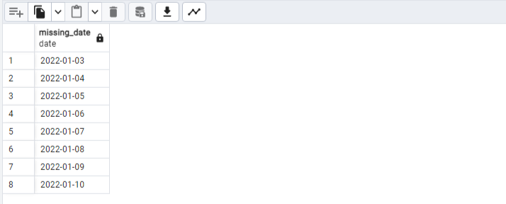

  


## Содержание

[Преамбула](#преамбула)  
[Общие правила](#общие-правила)   
[Пояснения к таблицам](#пояснения-к-таблицам)  
[Упражнение 00 - Движение ВЛЕВО, движение ВПРАВО](#exercise-00)  
[Упражнение 01 - Поиск пробелов в данных](#exercise-01)  
[Упражнение 02 - "ПОЛНЫЙ" означает "полностью заполненный"](#exercise-02)  
[Упражнение 03 - Переформатировать в CTE](#exercise-03)  
[Упражнение 04 - Найдите любимую пиццу](#exercise-04)  
[Упражнение 05 - Исследование персональных данных](#exercise-05)  
[Упражнение 06 - любимые пиццы Дениса и Анны](#exercise-06)  
[Упражнение 07 - Самая дешевая пиццерия для Дмитрия](#exercise-07)  
[Упражнение 08 - Продолжение исследования данных](#exercise-08)  
[Упражнение 09 - Кто любит сыр и пепперони?](#exercise-09)  
[Упражнение 10 - Найти людей из одного города](#exercise-10)  


## Преамбула


На рисунке вы можете увидеть реляционное выражение в виде дерева. Это выражение соответствует следующему SQL-запросу

```sql
    SELECT *
        FROM R CROSS JOIN S
    WHERE clause
```


Итак, другими словами, мы можем описать любой SQL в математических терминах реляционной алгебры.

Главный вопрос (который я слышу от своих студентов) заключается в том, зачем нам изучать реляционную алгебру в рамках курса, если мы можем написать SQL с первой попытки? Мой ответ - "да" и "нет" одновременно. “Да” означает, что вы можете написать SQL с первой попытки, это верно, “Нет” означает, что вы должны знать основные аспекты реляционной алгебры, потому что эти знания используются для планов оптимизации и для семантических запросов.
Какие типы соединений существуют в реляционной алгебре?
На самом деле, “Перекрестное соединение” является примитивным оператором и является предком для других типов соединений.

- Natural Join или Естественное соединение
- Theta Join или Тэта-соединение
- Semi Join или Полуобъединение
- Anti Join или Антиобъединение
- Left / Right / Full Joins или Левое / Правое / Полное объединение

Но что означает операция объединения между двумя таблицами? Позвольте мне представить часть псевдокода, как работает операция объединения без индексации.

```sql
    FOR r in R LOOP
        FOR s in S LOOP
        if r.id = s.r_id then add(r,s)
        …
        END;
    END;
```

Это просто набор петель... Никакой магии


## Общие правила

- Убедитесь, что используете последнюю версию PostgreSQL.  
- Для оценки ваше решение должно находиться в репозитории git, в ветке develop и папке src.  
- Вы не должны оставлять в своей директории никаких других файлов, кроме тех, которые явно указаны в инструкциях по упражнению.   
- Убедитесь, что у вас есть собственная база данных и доступ к ней в вашем кластере PostgreSQL.
- Скачайте [script](materials/model.sql) с моделью базы данных здесь и примените скрипт к своей базе данных (вы можете использовать командную строку с psql или просто запустить его через любую среду IDE, например DataGrip от JetBrains или pgAdmin от PostgreSQL community).
- Все задачи содержат список разрешенных и запрещенных разделов с перечисленными параметрами базы данных, типами баз данных, конструкциями SQL и т.д.  
- И да пребудет с вами SQL-сила!
- Абсолютно все может быть представлено в SQL! Давайте начнем и повеселимся!


## Пояснения к таблицам

- Пожалуйста, убедитесь, что у вас есть собственная база данных и доступ к ней в вашем кластере PostgreSQL.
- Пожалуйста, скачайте [скрипт] (materials/model.sql) с моделью базы данных здесь и примените скрипт к своей базе данных (вы можете использовать командную строку с psql или просто запустить его через любую среду IDE, например DataGrip от JetBrains или pgAdmin от PostgreSQL community).
- Все задачи содержат список разрешенных и запрещенных разделов с перечисленными параметрами базы данных, типами баз данных, конструкциями SQL и т.д. Пожалуйста, ознакомьтесь с разделом перед началом.
- Пожалуйста, взгляните на логический вид нашей модели базы данных.


1. Таблица **pizzeria** (таблица-справочник с доступными пиццериями)
- id - первичный ключ
- name - название пиццерии
- rating - средняя оценка пиццерии (от 0 до 5 баллов)
2. Таблица **person** (таблица словаря с лицами, которые любят пиццу)
- id - первичный ключ
- name - имя человека
- age - возраст человека
- gender - пол человека
- address - адрес человека
3. Таблица **menu** (таблица-словарь с доступным меню и ценой на конкретную пиццу)
- id - первичный ключ
- pizzeria_id - внешний ключ для пиццерии
- pizza_name - название пиццы в пиццерии
- price - цена конкретной пиццы
4. Таблица **person_visits** (оперативная таблица с информацией о посещениях пиццерии)
- id - первичный ключ
- person_id - внешний ключ для человека
- pizzeria_id - внешний ключ для пиццерии
- visit_date - дата (например, 2022-01-01) посещения человека
5. Таблица **person_order** (Оперативная таблица с информацией о заказах людей)
- id - первичный ключ
- person_id - внешний ключ к person
- menu_id - внешний ключ к меню
- order_date - дата (например, 2022-01-01) заказа человека

Посещение человека и заказ человека являются разными объектами и не содержат никакой корреляции между данными.   
Например, клиент может находиться в одном ресторане (просто просматривая меню) и в это время сделать заказ в другом по телефону или с помощью мобильного приложения.   
Или в другом случае просто быть дома и снова позвонить с заказом без каких-либо посещений.  


## Exercise 00

| Exercise 00: Move to the LEFT, move to the RIGHT |                                                                                                                          |
|---------------------------------------|--------------------------------------------------------------------------------------------------------------------------|
| Turn-in directory                     | ex00                                                                                                                     |
| Files to turn-in                      | `day02_ex00.sql`                                                                                 |
| **Allowed**                               |                                                                                                                          |
| Language                        | ANSI SQL                                                                                              |
| **Denied**                               |                                                                                                                          |
| SQL Syntax Construction                        | `NOT IN`, `IN`, `NOT EXISTS`, `EXISTS`, `UNION`, `EXCEPT`, `INTERSECT`                                                                                              |

Напишите SQL-инструкцию, которая возвращает:  
- список названий пиццерий с соответствующим значением рейтинга, которые не посещались людьми.


<details>
  <summary>Решение</summary>
</p>

```sql
	SELECT 	
			name, 
			rating
	  FROM 	pizzeria AS p
 LEFT JOIN	person_visits  AS pv ON p.id = pv.pizzeria_id
	 WHERE 	pv.pizzeria_id IS NULL;
```


</p>
</details>


## Exercise 01

| Exercise 01: Find data gaps|                                                                                                                          |
|---------------------------------------|--------------------------------------------------------------------------------------------------------------------------|
| Turn-in directory                     | ex01                                                                                                                     |
| Files to turn-in                      | `day02_ex01.sql`                                                                                 |
| **Allowed**                               |                                                                                                                          |
| Language                        | ANSI SQL                                                                                              |
| SQL Syntax Construction                        | `generate_series(...)`                                                                                              |
| **Denied**                               |                                                                                                                          |
| SQL Syntax Construction                        | `NOT IN`, `IN`, `NOT EXISTS`, `EXISTS`, `UNION`, `EXCEPT`, `INTERSECT`                                                                                              |

Напишите SQL-запрос, который возвращает:  
- пропущенные дни для лиц с идентификаторами 1 и 2 (пропущенные обоими)
- с 1 по 10 января 2022 года (включая все дни)    
- сортировка по дням посещения в порядке возрастания     

Образец данных с названием столбца  

| missing_date |
| ------ |
| 2022-01-03 |
| 2022-01-04 |
| 2022-01-05 |
| ... |

<details>
  <summary>Решение</summary>
</p>

```sql
-- создаём список дат, присоединяем таблицу person_visits
   SELECT missing_date::date
	 FROM GENERATE_SERIES(date '2022-01-01', '2022-01-10', '1 day') AS missing_date
LEFT JOIN person_visits AS pv
-- проводим связи и заполняем даты, когда были лица с id 1 или 2
	   ON missing_date = pv.visit_date
	  AND (pv.person_id = 1 OR pv.person_id = 2)
-- и выбираем только те даты, которые не заполнились
	WHERE pv.visit_date IS NULL
 ORDER BY missing_date;
```



</p>
</details>


## Exercise 02

| Exercise 02: FULL means ‘completely filled’|                                                                                                                          |
|---------------------------------------|--------------------------------------------------------------------------------------------------------------------------|
| Turn-in directory                     | ex02                                                                                                                     |
| Files to turn-in                      | `day02_ex02.sql`                                                                                 |
| **Allowed**                               |                                                                                                                          |
| Language                        | ANSI SQL                                                                                              |
| **Denied**                               |                                                                                                                          |
| SQL Syntax Construction                        | `NOT IN`, `IN`, `NOT EXISTS`, `EXISTS`, `UNION`, `EXCEPT`, `INTERSECT`                                                                                              |

Напишите SQL-инструкцию, которая возвращает:  
- полный список имен людей, посетивших (или не посетивших) пиццерии в период с 1 по 3 января 2022 года, с одной стороны  
- и полный список названий пиццерий, которые были посещены (или не посещались), с другой стороны   
- сортировка по возрастанию для всех 3 столбцов  

Нужен полный список имен людей и от него танцевать: добавить пиццерии, которые они посещали и даты когда  
Если лицо не посещало пиццерию, это должно быть видно в выводе запроса  
Суть в получении полной картины посещений по списку имен людей за выделенный период времени  

Обратите внимание на подстановку значения ‘-’ для значений `NULL` в столбцах `person_name` и `pizzeria_name`. 

Образец данных с нужными названиями столбцов представлен ниже   

| person_name | visit_date | pizzeria_name |
| ------ | ------ | ------ |
| - | null | DinoPizza |
| - | null | DoDo Pizza |
| Andrey | 2022-01-01 | Dominos |
| Andrey | 2022-01-02 | Pizza Hut |
| Anna | 2022-01-01 | Pizza Hut |
| Denis | null | - |
| Dmitriy | null | - |
| ... | ... | ... |

<details>
  <summary>Решение</summary>
</p>

```sql
--  COALESCE для замены NULL на '-'
	SELECT 	COALESCE(p.name, '-') AS person_name,
		   	sub_1.visit_date AS visit_date,
		   	COALESCE(piz.name, '-') AS pizzeria_name
	  FROM 	person AS p
-- FULL JOIN для объединения таблиц "person" и "pizzeria" со всеми записями из подзапроса "sub_1"
-- FULL JOIN сохраняет все данные из обеих таблиц, и если нет совпадающих записей, то заполняет соответствующие значения NULL
-- Это позволяет получить полную картину посещений включая случаи, когда информация отсутствует в одной из таблиц	  
 FULL JOIN	(
			 SELECT *
	   		   FROM person_visits AS pv
	   		  WHERE pv.visit_date BETWEEN '2022-01-01' AND '2022-01-03'
 	  		) AS sub_1 ON p.id = sub_1.person_id 
 FULL JOIN pizzeria AS piz ON sub_1.pizzeria_id = piz.id
  ORDER BY person_name, visit_date, pizzeria_name;
```


</p>
</details>


## Exercise 03

| Exercise 03: Reformat to CTE |                                                                                                                          |
|---------------------------------------|--------------------------------------------------------------------------------------------------------------------------|
| Turn-in directory                     | ex03                                                                                                                     |
| Files to turn-in                      | `day02_ex03.sql`                                                                                 |
| **Allowed**                               |                                                                                                                          |
| Language                        | ANSI SQL                                                                                              |
| SQL Syntax Construction                        | `generate_series(...)`                                                                                              |
| **Denied**                               |                                                                                                                          |
| SQL Syntax Construction                        | `NOT IN`, `IN`, `NOT EXISTS`, `EXISTS`, `UNION`, `EXCEPT`, `INTERSECT`                                                                                              |

Давайте вернемся к Exercise #01    
- перепишите свой SQL запрос, используя шаблон CTE (Common Table Expression).   
- перейдите к части CTE вашего "day generator".   
- результат должен быть таким же, как в Exercise #01    

| missing_date | 
| ------ | 
| 2022-01-03 | 
| 2022-01-04 | 
| 2022-01-05 | 
| ... |

<details>
  <summary>Решение</summary>
</p>

> WITH (или Common Table Expression, CTE) позволяет создавать временные наборы данных, использование которых возможно в пределах одного запроса.   
CTE обеспечивает модульность и удобство чтения SQL запросов за счёт выделения частей запроса в отдельные блоки, которые могут быть затем использованы в главном запросе.

```sql
	 WITH	date_list AS (
			-- Создаем временную таблицу с датами
			SELECT missing_date::date
			FROM GENERATE_SERIES(date '2022-01-01', '2022-01-10', interval '1 day') AS missing_date
	      )
   SELECT	missing_date -- Выбираем даты, которые не связаны с посещениями лиц с ID 1 или 2
	 FROM 	date_list
LEFT JOIN (
			-- Выбираем уникальные даты посещений для лиц с ID 1 или 2
			SELECT DISTINCT visit_date
			FROM person_visits
			WHERE person_id IN (1, 2)
		  ) AS pv ON date_list.missing_date = pv.visit_date
	WHERE	pv.visit_date IS NULL -- Оставляем только даты, которые не связаны с посещениями лиц с ID 1 или 2
 ORDER BY 	missing_date;
```


</p>
</details>


## Exercise 04

| Exercise 04: Find favourite pizzas |                                                                                                                          |
|---------------------------------------|--------------------------------------------------------------------------------------------------------------------------|
| Turn-in directory                     | ex04                                                                                                                     |
| Files to turn-in                      | `day02_ex04.sql`                                                                                 |
| **Allowed**                               |                                                                                                                          |
| Language                        | ANSI SQL                                                                                              |

- найдите полную информацию обо всех возможных названиях пиццерий и ценах на пиццу с грибами или пепперони. 
- отсортируйте результат по названию пиццы и названию пиццерии. 

Ниже приведены результаты выборки данных (используйте те же названия столбцов в вашей инструкции SQL).

| pizza_name | pizzeria_name | price |
| ------ | ------ | ------ |
| mushroom pizza | Dominos | 1100 |
| mushroom pizza | Papa Johns | 950 |
| pepperoni pizza | Best Pizza | 800 |
| ... | ... | ... |

<details>
  <summary>Решение</summary>
</p>

```sql
	SELECT	
			menu.pizza_name,
			pizzeria.name AS pizzeria_name,
			menu.price
	  FROM	menu
 LEFT JOIN	pizzeria ON pizzeria.id = menu.pizzeria_id
 	 WHERE	menu.pizza_name = 'pepperoni pizza' OR menu.pizza_name = 'mushroom pizza'
  ORDER BY	1, 2
```


</p>
</details>


## Exercise 05

| Exercise 05: Investigate Person Data |                                                                                                                          |
|---------------------------------------|--------------------------------------------------------------------------------------------------------------------------|
| Turn-in directory                     | ex05                                                                                                                     |
| Files to turn-in                      | `day02_ex05.sql`                                                                                 |
| **Allowed**                               |                                                                                                                          |
| Language                        | ANSI SQL                                                                                              |

- найдите имена всех женщин старше 25 лет и упорядочите результат по имени   

Образец выходных данных представлен ниже  

| name | 
| ------ | 
| Elvira | 
| ... |

<details>
  <summary>Решение</summary>
</p>

```sql
	SELECT	
			person.name
	  FROM	person
	 WHERE	person.age > 25
  ORDER BY	1
```


</p>
</details>


## Exercise 06

| Exercise 06: favourite pizzas for Denis and Anna |                                                                                                                          |
|---------------------------------------|--------------------------------------------------------------------------------------------------------------------------|
| Turn-in directory                     | ex06                                                                                                                     |
| Files to turn-in                      | `day02_ex06.sql`                                                                                 |
| **Allowed**                               |                                                                                                                          |
| Language                        | ANSI SQL                                                                                              |

- найдите все названия пиццы (и соответствующие названия пиццерий, используя таблицу "menu"), которые заказывали Денис или Анна  
- отсортируйте результат по обоим столбцам   

Пример вывода  

| pizza_name | pizzeria_name |
| ------ | ------ |
| cheese pizza | Best Pizza |
| cheese pizza | Pizza Hut |
| ... | ... |

<details>
  <summary>Решение</summary>
</p>

```sql
	SELECT
    		menu.pizza_name,
    		piz.name AS pizzeria_name
	  FROM	person_order AS po
			-- Использование INNER JOIN позволяет выбирать только те заказы, 
			-- у которых есть соответствующие записи в таблице меню и пиццерии
INNER JOIN  menu ON po.menu_id = menu.id
INNER JOIN  pizzeria AS piz ON menu.pizzeria_id = piz.id
			-- Оставляем только заказы, сделанные Денисом или Анной
  	 WHERE	po.person_id IN ( SELECT id FROM person WHERE name IN ('Denis', 'Anna') )
  ORDER BY	1, 2;
```


</p>
</details>


## Exercise 07

| Exercise 07: Cheapest pizzeria for Dmitriy |                                                                                                                          |
|---------------------------------------|--------------------------------------------------------------------------------------------------------------------------|
| Turn-in directory                     | ex07                                                                                                                     |
| Files to turn-in                      | `day02_ex07.sql`                                                                                 |
| **Allowed**                               |                                                                                                                          |
| Language                        | ANSI SQL                                                                                              |

Найдите: 
- название пиццерии, которую 
- Дмитрий посетил 
- 8 января 2022 года (и где купил пиццу дешевле 800р)  
***вот момент про 800р вообще нифига не понятен: зачем тут это, если правильный вывод просто название пиццерии?***

<details>
  <summary>Решение</summary>
</p>

```sql
	SELECT
    		pizzeria.name
	  FROM	pizzeria
INNER JOIN  person_visits AS pv ON pv.pizzeria_id = pizzeria.id
INNER JOIN  person ON person.id = pv.person_id
	 WHERE	pv.visit_date = '2022-01-08'
	   AND	person.name = 'Dmitriy'
-- проверка сделок на дату
	-- SELECT
    -- 		person_order.order_date,
	-- 		person.name
	--   FROM	person_order
	--   JOIN	person ON person.id = person_order.person_id
	--  WHERE	person_order.order_date = '2022-01-08'
-- то есть Денис пришёл в пиццерию, походил там, но ничего не заказывал
```

 

</p>
</details>


## Exercise 08

| Exercise 08: Continuing to research data |                                                                                                                          |
|---------------------------------------|--------------------------------------------------------------------------------------------------------------------------|
| Turn-in directory                     | ex08                                                                                                                     |
| Files to turn-in                      | `day02_ex08.sql`                                                                                 |
| **Allowed**                               |                                                                                                                          |
| Language                        | ANSI SQL                                                                                              |           


- найдите имена всех мужчин из Москвы или Самары
- которые заказывают пиццу с пепперони или грибами      
- упорядочьте результат по имени человека в порядке убывания  

Пример выходных данных    

| name | 
| ------ | 
| Dmitriy | 
| ... |

<details>
  <summary>Решение</summary>
</p>

```sql
	SELECT	person.name
	  FROM	person
 	  JOIN	person_order AS p_o ON p_o.person_id = person.id
 	  JOIN	menu ON menu.id = p_o.menu_id
	 WHERE	person.gender = 'male'
	   AND	person.address IN ('Moscow', 'Samara')
	   AND	menu.pizza_name IN ('pepperoni pizza', 'mushroom pizza')
  ORDER BY	1 DESC
```


</p>
</details>


## Exercise 09

| Exercise 09: Who loves cheese and pepperoni? |                                                                                                                          |
|---------------------------------------|--------------------------------------------------------------------------------------------------------------------------|
| Turn-in directory                     | ex09                                                                                                                     |
| Files to turn-in                      | `day02_ex09.sql`                                                                                 |
| **Allowed**                               |                                                                                                                          |
| Language                        | ANSI SQL                                                                                              |

- найдите имена всех женщин, которые заказывали пиццу с пепперони или сыром (в любое время и в любых пиццериях) 
- сортировка по person_name. 

Пример выходных данных  

| name | 
| ------ | 
| Anna | 
| ... |

<details>
  <summary>Решение</summary>
</p>

```sql
	SELECT	name
	  FROM	person
	 WHERE	gender = 'female'
	 		-- EXISTS используется для проверки наличия хотя бы одной строки, удовлетворяющей условиям подзапроса 
	   		-- проверяем, существует ли заказ пиццы пепперони для каждой женщины
	   AND	EXISTS (
		   		SELECT 1 FROM person_order AS p_o 
				JOIN menu ON p_o.menu_id = menu.id 
				WHERE p_o.person_id = person.id 
				AND menu.pizza_name = 'pepperoni pizza'
	   		)
			-- аналогично проверяем заказ сырной пиццы 
	   AND	EXISTS (
				SELECT 1 FROM person_order AS p_o 
				JOIN menu ON p_o.menu_id = menu.id 
				WHERE p_o.person_id = person.id 
				AND menu.pizza_name = 'cheese pizza'
			)
  ORDER BY	1

```


</p>
</details>


## Exercise 10

| Exercise 10: Find persons from one city |                                                                                                                          |
|---------------------------------------|--------------------------------------------------------------------------------------------------------------------------|
| Turn-in directory                     | ex10                                                                                                                     |
| Files to turn-in                      | `day02_ex10.sql`                                                                                 |
| **Allowed**                               |                                                                                                                          |
| Language                        | ANSI SQL                                                                                              |

- найдите имена людей, проживающих по одному и тому же адресу  
- сортировка по имени 1-го человека, имени 2-го человека и общему адресу  
- названия ваших столбцов должны соответствовать названиям столбцов ниже

Пример выходных данных  

| person_name1 | person_name2 | common_address | 
| ------ | ------ | ------ |
| Andrey | Anna | Moscow |
| Denis | Kate | Kazan |
| Elvira | Denis | Kazan |
| ... | ... | ... |

<details>
  <summary>Решение</summary>
</p>

```sql
	  SELECT	
				DISTINCT p1.name AS person_name1,
				p2.name AS person_name2,
				p1.address AS common_address
		FROM	person AS p1
				-- p1.id > p2.id чтобы исключить дублирование строк , ограничив выборку уникальными сочетаниями
		JOIN	person AS p2 ON p1.address = p2.address AND p1.id > p2.id
	ORDER BY	1, 2, 3;
```


</p>
</details>
