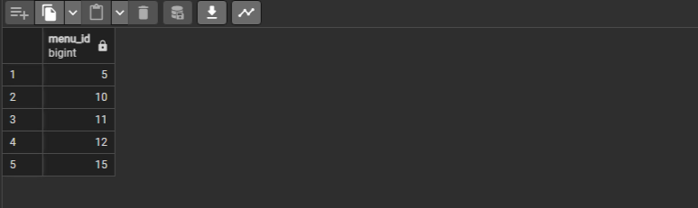

  

## Содержимое

[Преамбула](#преамбула)  
[Общие правила](#общие-правила)   
[Пояснения к таблицам](#пояснения-к-таблицам)   
[Упражнение 00 - Давайте найдем подходящие цены для Кейт](#exercise-00)  
[Упражнение 01 - Давайте найдем забытые меню](#exercise-01)  
[Упражнение 02 - Давайте найдем забытую пиццу и пиццерии](#exercise-02)  
[Упражнение 03 - Давайте сравним посещения](#exercise-03)  
[Упражнение 04 - Давайте-сравним-заказы](#exercise-04)  
[Упражнение 05 - Посетил, но не сделал никакого заказа](#exercise-05)  
[Упражнение 06 - Найдите пиццу, похожую по цене](#exercise-06)  
[Упражнение 07 - Давайте приготовим новый вид пиццы](#exercise-07)  
[Упражнение 08 - Давайте приготовим новый вид пиццы с большей динамикой](#exercise-08)  
[Упражнение 09 - Новая пицца означает новые визиты](#exercise-09)  
[Упражнение 10 - Новые визиты означают новые заказы](#exercise-10)  
[Упражнение 11 - “Повысить” цену для клиентов](#exercise-11)  
[Упражнение 12 - Поступают новые заказы!](#exercise-12)  
[Упражнение 13 - Возврат денег нашим клиентам](#exercise-13)  


## Преамбула


  
Эдгар Фрэнк Кодд - отец модели реляционной базы данных  

Теория отношений является математической основой для современных реляционных баз данных.   
Каждый аспект баз данных имеет соответствующее математическое и логическое обоснование.   
Включая операторы INSERT / UPDATE / DELETE.  

Как работает оператор INSERT с математической точки зрения.

|  |  |
| ------ | ------ |
|`INSERT rel RELATION {TUPLE {A INTEGER(4),B INTEGER(4),C STRING ('Hello') }};` | Вы можете использовать математические операторы INSERT и интегрировать конструкцию “кортеж” для преобразования входящих данных в строку. |
| С другой стороны, вы можете использовать явное присваивание с помощью оператора UNION. | `rel:=rel UNION RELATION {TUPLE {A INTEGER(4), B INTEGER (7), C STRING ('Hello')}};` |

Что насчет инструкции DELETE?

|  |  |
| ------ | ------ |
|`DELETE rel WHERE A = 1;` | Если вы хотите удалить строку для A = 1, вы можете сделать это прямым способом. |
| ... или используя новое назначение без ключа A = 1 | `rel:=rel WHERE NOT (A = 1);` |

... наконец, UPDATE запрос. Также есть 2 случая.

|  |  |
| ------ | ------ |
|`UPDATE rel WHERE A = 1 {B:= 23*A, C:='String #4'};` | UPDATE с математической точки зрения |
| Новое назначение для переменной отношения rel, основанное на CTE и работающее с наборами | `rel:=WITH (rel WHERE A = 1) AS T1, (EXTEND T1 ADD (23*A AS NEW_B, 'String #4' AS NEW_C)) AS T2, T2 {ALL BUT B,C} AS T3, (T3 RENAME (NEW _B AS B, NEW _C AS C)) AS T4: (S MINUS T1) UNION T4;` |

Последний случай с оператором UPDATE действительно интересен, потому что, другими словами, вы добавляете новый кортеж и после этого делаете МИНУС старой строки. То же самое поведение в физической реализации! На самом деле, `UPDATE = DELETE + INSERT` и есть специальный термин “Tombstone или надгробие” для конкретной удаленной/обновленной строки. Тогда, если у вас много "надгробий", значит, у вас плохой показатель TPS, и вам нужно контролировать свои мертвые данные!


### Общие правила

- Убедитесь, что используете последнюю версию PostgreSQL.  
- Для оценки ваше решение должно находиться в репозитории git, в ветке develop и папке src.  
- Вы не должны оставлять в своей директории никаких других файлов, кроме тех, которые явно указаны в инструкциях по упражнению.   
- Убедитесь, что у вас есть собственная база данных и доступ к ней в вашем кластере PostgreSQL.
- Скачайте [script](materials/model.sql) с моделью базы данных здесь и примените скрипт к своей базе данных (вы можете использовать командную строку с psql или просто запустить его через любую среду IDE, например DataGrip от JetBrains или pgAdmin от PostgreSQL community).
- Все задачи содержат список разрешенных и запрещенных разделов с перечисленными параметрами базы данных, типами баз данных, конструкциями SQL и т.д.  
- И да пребудет с вами SQL-сила!
- Абсолютно все может быть представлено в SQL! Давайте начнем и повеселимся!


## Пояснения к таблицам

- Пожалуйста, убедитесь, что у вас есть собственная база данных и доступ к ней в вашем кластере PostgreSQL.
- Пожалуйста, скачайте [скрипт] (materials/model.sql) с моделью базы данных здесь и примените скрипт к своей базе данных (вы можете использовать командную строку с psql или просто запустить его через любую среду IDE, например DataGrip от JetBrains или pgAdmin от PostgreSQL community).
- Все задачи содержат список разрешенных и запрещенных разделов с перечисленными параметрами базы данных, типами баз данных, конструкциями SQL и т.д. Пожалуйста, ознакомьтесь с разделом перед началом.
- Пожалуйста, взгляните на логический вид нашей модели базы данных.


1. Таблица **pizzeria** (таблица-справочник с доступными пиццериями)
- id - первичный ключ
- name - название пиццерии
- rating - средняя оценка пиццерии (от 0 до 5 баллов)
2. Таблица **person** (таблица словаря с лицами, которые любят пиццу)
- id - первичный ключ
- name - имя человека
- age - возраст человека
- gender - пол человека
- address - адрес человека
3. Таблица **menu** (таблица-словарь с доступным меню и ценой на конкретную пиццу)
- id - первичный ключ
- pizzeria_id - внешний ключ для пиццерии
- pizza_name - название пиццы в пиццерии
- price - цена конкретной пиццы
4. Таблица **person_visits** (оперативная таблица с информацией о посещениях пиццерии)
- id - первичный ключ
- person_id - внешний ключ для человека
- pizzeria_id - внешний ключ для пиццерии
- visit_date - дата (например, 2022-01-01) посещения человека
5. Таблица **person_order** (Оперативная таблица с информацией о заказах людей)
- id - первичный ключ
- person_id - внешний ключ к person
- menu_id - внешний ключ к меню
- order_date - дата (например, 2022-01-01) заказа человека

Посещение человека и заказ человека являются разными объектами и не содержат никакой корреляции между данными.   
Например, клиент может находиться в одном ресторане (просто просматривая меню) и в это время сделать заказ в другом по телефону или с помощью мобильного приложения.   
Или в другом случае просто быть дома и снова позвонить с заказом без каких-либо посещений.  


## Exercise 00

| Exercise 00: Let’s find appropriate prices for Kate |                                                                                                                          |
|---------------------------------------|--------------------------------------------------------------------------------------------------------------------------|
| Turn-in directory                     | ex00                                                                                                                     |
| Files to turn-in                      | `day03_ex00.sql`                                                                                 |
| **Allowed**                               |                                                                                                                          |
| Language                        | ANSI SQL                                                                                              |

Напишите SQL-инструкцию, которая возвращает список:  
- названий пиццы
- цен пиццы
- названий пиццерий
- и дат посещения для Кейт
- и для цен в диапазоне от 800 до 1000 рублей   
- отсортируйте по пицце, цене и названиям пиццерий  

Пример вывода  

| pizza_name | price | pizzeria_name | visit_date |
| ------ | ------ | ------ | ------ |
| cheese pizza | 950 | DinoPizza | 2022-01-04 |
| pepperoni pizza | 800 | Best Pizza | 2022-01-03 |
| pepperoni pizza | 800 | DinoPizza | 2022-01-04 |
| ... | ... | ... | ... |

<details>
  <summary>Решение</summary>
</p>

```sql
		SELECT	
				menu.pizza_name,
				menu.price,
				pizzeria.name AS pizzeria_name, 
				person_visits.visit_date
		  FROM	menu
		  JOIN	pizzeria	ON	pizzeria.id = menu.pizzeria_id
		  JOIN	person_visits	ON	person_visits.pizzeria_id = pizzeria.id
		  JOIN	person 	ON	person.id = person_visits.person_id
		 WHERE	person.name = 'Kate' AND menu.price BETWEEN 800 AND 1000
	  ORDER BY	1, 2, 3;
```


</p>
</details>


## Exercise 01

| Exercise 01: Let’s find forgotten menus|                                                                                                                          |
|---------------------------------------|--------------------------------------------------------------------------------------------------------------------------|
| Turn-in directory                     | ex01                                                                                                                     |
| Files to turn-in                      | `day03_ex01.sql`                                                                                 |
| **Allowed**                               |                                                                                                                          |
| Language                        | ANSI SQL                                                                                              |
| **Denied**                               |                                                                                                                          |
| SQL Syntax Construction                        | any type of `JOINs`                                                                                              |

- найдите все идентификаторы меню, которые никем не заказаны
- сортировка по идентификаторам  

Образец выходных данных  

| menu_id |
| ------ |
| 5 |
| 10 |
| ... |

<details>
  <summary>Решение</summary>
</p>

```sql
		SELECT	menu.id AS menu_id
		  FROM	menu
		 WHERE	menu.id NOT IN (SELECT menu_id FROM person_order)
	  ORDER BY	1;
```



</p>
</details>


## Exercise 02

| Exercise 02: Let’s find forgotten pizza and pizzerias|                                                                                                                          |
|---------------------------------------|--------------------------------------------------------------------------------------------------------------------------|
| Turn-in directory                     | ex02                                                                                                                     |
| Files to turn-in                      | `day03_ex02.sql`                                                                                 |
| **Allowed**                               |                                                                                                                          |
| Language                        | ANSI SQL                                                                                              |

Используйте SQL-инструкцию из упражнения №01 и:
- покажите названия пиццерий, которые никто не заказывал, а также соответствующие цены  
- сортировка по названию пиццы и цене  

Образец выходных данных   

| pizza_name | price | pizzeria_name |
| ------ | ------ | ------ |
| cheese pizza | 700 | Papa Johns |
| cheese pizza | 780 | DoDo Pizza |
| ... | ... | ... |

<details>
  <summary>Решение</summary>
</p>

```sql
		SELECT	
				menu.pizza_name,
				menu.price,
				pizzeria.name AS pizzeria_name
		 FROM	menu
		 JOIN	pizzeria	ON	pizzeria.id = menu.pizzeria_id
		 WHERE	menu.id NOT IN (SELECT menu_id FROM person_order)
	  ORDER BY	1, 2;
```


</p>
</details>


## Exercise 03

| Exercise 03: Let’s compare visits |                                                                                                                          |
|---------------------------------------|--------------------------------------------------------------------------------------------------------------------------|
| Turn-in directory                     | ex03                                                                                                                     |
| Files to turn-in                      | `day03_ex03.sql`                                                                                 |
| **Allowed**                               |                                                                                                                          |
| Language                        | ANSI SQL                                                                                              |

Найдите две пиццерии:
- в какую пиццерию чаще ходят женщины,
- а в какую - мужчиины
- для любых SQL-операторов сохраняйте дубликаты  
- отсортируйте результат по названию пиццерии  

Образец выходных данных   

| pizzeria_name | 
| ------ | 
| Best Pizza | 
| Dominos |
| ... |

<details>
  <summary>Решение</summary>
</p>

```sql
		SELECT	pizzeria.name AS pizzeria_name
		  FROM	pizzeria
		 WHERE	pizzeria.id IN (
				SELECT female_choice.pizzeria_id
				FROM (
					-- выбираем посещения только женщин
					SELECT COUNT(person_id) AS count, pizzeria_id
					FROM person_visits
					WHERE person_id IN (SELECT id FROM person WHERE gender = 'female')
					GROUP BY pizzeria_id
				)	AS female_choice
				INNER JOIN (
					-- аналогично для мужчин
					SELECT COUNT(person_id) AS count, pizzeria_id
					FROM person_visits
					WHERE person_id IN (SELECT id FROM person WHERE gender = 'male')
					GROUP BY pizzeria_id
					-- соединяем результаты посещений мужчин и женщин по идентификатору пиццерии
				)	AS male_choice ON female_choice.pizzeria_id = male_choice.pizzeria_id 
			 	-- выбираем только пиццерии, где количество посещений мужчин и женщин отличается
				WHERE female_choice.count <> male_choice.count
			)
	 ORDER BY	1;
```


</p>
</details>


## Exercise 04

| Exercise 04: Let’s compare orders |                                                                                                                          |
|---------------------------------------|--------------------------------------------------------------------------------------------------------------------------|
| Turn-in directory                     | ex04                                                                                                                     |
| Files to turn-in                      | `day03_ex04.sql`                                                                                 |
| **Allowed**                               |                                                                                                                          |
| Language                        | ANSI SQL                                                                                              |

Please find a union of pizzerias that have orders either from women or  from men. Other words, you should find a set of pizzerias names have been ordered by females only and make "UNION" operation with set of pizzerias names have been ordered by males only. Please be aware with word “only” for both genders. 

- найти пиццерию, которая имеет заказы только от мужчин, но не имеет заказов от женщин
- также найти пиццерию, которая имеет заказы только от женщин, но не имеет заказов от мужчин
- совместите эти запросы через UNION   
- исключите дубликаты  
- отсортируйте результат по названию пиццерии  

> Нужно найти пиццерию, в которой заказы были сделаны только лицами одного пола (только мужчинами или только женщинами)

Образец выходных данных   

| pizzeria_name | 
| ------ | 
| Papa Johns | 

<details>
  <summary>Решение</summary>
</p>

```sql
	  WITH 	male_pizzerias AS (
		  		-- выбор уникальных pizzeria_id, в которых делали заказы только мужчины
				SELECT DISTINCT pizzeria_id
				FROM menu
				JOIN person_order ON menu_id = menu.id
				JOIN person ON person_order.person_id = person.id
				WHERE person.gender = 'male'
			),
			female_pizzerias AS (
				-- аналогично для женщин
				SELECT DISTINCT pizzeria_id
				FROM menu
				JOIN person_order ON menu_id = menu.id
				JOIN person ON person_order.person_id = person.id
				WHERE person.gender = 'female'
			)

	-- Основной запрос для выбора названий пиццерий, удовлетворяющих условиям
	SELECT	pizzeria.name AS pizzeria_name
	  FROM	pizzeria
	 WHERE	pizzeria.id IN (
		 		-- Выбрать названия пиццерий, в которых только мужчины делали заказы
				SELECT pizzeria_id
				FROM male_pizzerias
				EXCEPT -- чтобы исключить из male_pizzerias те пиццерии, где заказы делали и женщины
				SELECT pizzeria_id
				FROM female_pizzerias
			)
		OR	pizzeria.id IN (
				-- аналогично для женщин
				SELECT pizzeria_id
				FROM female_pizzerias
				EXCEPT -- чтобы исключить из female_pizzerias те пиццерии, где заказы делали и мужчины
				SELECT pizzeria_id
				FROM male_pizzerias
			)
  ORDER BY	pizzeria_name;
```


</p>
</details>


## Exercise 05

| Exercise 05: Visited but did not make any order |                                                                                                                          |
|---------------------------------------|--------------------------------------------------------------------------------------------------------------------------|
| Turn-in directory                     | ex05                                                                                                                     |
| Files to turn-in                      | `day03_ex05.sql`                                                                                 |
| **Allowed**                               |                                                                                                                          |
| Language                        | ANSI SQL                                                                                              |

- напишите SQL-запрос, который возвращает:  
- список пиццерий
- которые Андрей посещал
- но не делал никаких заказов  
- отсортируйте результат по названию пиццерии   

Образец выходных данных  

| pizzeria_name | 
| ------ | 
| Pizza Hut | 

<details>
  <summary>Решение</summary>
</p>

```sql
	SELECT	pizzeria.name AS pizzeria_name
	  FROM	pizzeria
	  JOIN	person_visits AS p_v	ON	p_v.pizzeria_id = pizzeria.id
	  JOIN	person	ON person.id = p_v.person_id
	 WHERE	person.name = 'Andrey' 
	   -- выбираем все пиццерии, в которых нет заказа от нашего person.id отфильтрованного по Андрею
	   AND	person.id NOT IN (
				SELECT pizzeria_id
				  FROM person_order
				 WHERE person_id = person.id
    		)
  ORDER BY	1;
```


</p>
</details>


## Exercise 06

| Exercise 06: Find price-similarity pizzas |                                                                                                                          |
|---------------------------------------|--------------------------------------------------------------------------------------------------------------------------|
| Turn-in directory                     | ex06                                                                                                                     |
| Files to turn-in                      | `day03_ex06.sql`                                                                                 |
| **Allowed**                               |                                                                                                                          |
| Language                        | ANSI SQL                                                                                              |

Please find the same pizza names who have the same price, but from different pizzerias. Make sure that the result is ordered by pizza name. The sample of data is presented below. Please make sure your column names are corresponding column names below.

- найдите одинаковые названия пиццы с одинаковой ценой, но из разных пиццерий   
- сортировка по названию пиццы  
- убедитесь, что названия ваших столбцов соответствуют названиям столбцов образца  

Образец выходных данных  

| pizza_name | pizzeria_name_1 | pizzeria_name_2 | price |
| ------ | ------ | ------ | ------ |
| cheese pizza | Best Pizza | Papa Johns | 700 |
| ... | ... | ... | ... |

<details>
  <summary>Решение</summary>
</p>

```sql
WITH pizzas AS (
	SELECT  -- временная таблица "pizzas" с информацией о названии пиццы, пиццерии и цене
			menu.pizza_name,
			pizzeria.name AS pizzeria_name,
			menu.price
	  FROM 	menu
	  JOIN 	pizzeria ON pizzeria.id = menu.pizzeria_id
)

	SELECT  -- основной запрос
			p1.pizza_name,
			p1.pizzeria_name AS pizzeria_name_1,
			p2.pizzeria_name AS pizzeria_name_2,
			p1.price
	FROM	pizzas AS p1
	JOIN	pizzas AS p2 ON p1.price = p2.price -- Соединение по цене
	 AND	p1.pizza_name = p2.pizza_name -- Соединение по названию пиццы
	 AND	p1.pizzeria_name < p2.pizzeria_name -- Исключение повторяющихся комбинаций
ORDER BY	1;
```


</p>
</details>


## Exercise 07

| Exercise 07: Let’s cook a new type of pizza |                                                                                                                          |
|---------------------------------------|--------------------------------------------------------------------------------------------------------------------------|
| Turn-in directory                     | ex07                                                                                                                     |
| Files to turn-in                      | `day03_ex07.sql`                                                                                 |
| **Allowed**                               |                                                                                                                          |
| Language                        | ANSI SQL                                                                                              |

- зарегистрируйте новую пиццу с названием “greek pizza” 
- используйте id = 19
- по цене 800 рублей 
- в ресторане “Dominos” (pizzeria_id = 2)


**Внимание**: это упражнение приведет к изменению начальных данных.   
Вы можете восстановить исходную модель базы данных с помощью скрипта по ссылке в разделе “Пояснения к таблицам”.

<details>
  <summary>Решение</summary>
</p>

```sql
INSERT INTO	menu (id, pizzeria_id, pizza_name, price)
	 VALUES	(19, 2, 'greek pizza', 800);

-- проверяем, что добавление успешно
	 SELECT	*
	   FROM	menu
	  WHERE	pizza_name = 'greek pizza';
```


</p>
</details>


## Exercise 08

| Exercise 08: Let’s cook a new type of pizza with more dynamics |                                                                                                                          |
|---------------------------------------|--------------------------------------------------------------------------------------------------------------------------|
| Turn-in directory                     | ex08                                                                                                                     |
| Files to turn-in                      | `day03_ex08.sql`                                                                                 |
| **Allowed**                               |                                                                                                                          |
| Language                        | ANSI SQL                                                                                              |           
| **Denied**                               |                                                                                                                          |
| SQL Syntax Pattern                        | Don’t use direct numbers for identifiers of Primary Key and pizzeria                                                                                               |       

- зарегистрируйте новую пиццу с названием “sicilian pizza” 
- идентификатор которой должен быть рассчитан по формуле “maximum id value + 1” 
- стоимостью 900 рублей 
- в ресторане “Dominos” 
- используйте внутренний запрос, чтобы получить идентификатор пиццерии


**Внимание**: это упражнение приведет к изменению начальных данных.   
Вы можете восстановить исходную модель базы данных с помощью скрипта по ссылке в разделе “Пояснения к таблицам”.

<details>
  <summary>Решение</summary>
</p>

```sql
INSERT INTO	menu (id, pizzeria_id, pizza_name, price)
	 -- находим максимальное значение id в таблице menu и ++ его
	 VALUES ((SELECT MAX(id) FROM menu) + 1,
	 -- извлекаем идентификатор ресторана "Dominos" из таблицы pizzeria для записи
	(SELECT id FROM pizzeria WHERE name = 'Dominos'), 'sicilian pizza', 900);

-- проверяем, что добавление успешно
	 SELECT	*
	   FROM	menu
	  WHERE	pizza_name = 'sicilian pizza';
```


</p>
</details>


## Exercise 09

| Exercise 09: New pizza means new visits |                                                                                                                          |
|---------------------------------------|--------------------------------------------------------------------------------------------------------------------------|
| Turn-in directory                     | ex09                                                                                                                     |
| Files to turn-in                      | `day03_ex09.sql`                                                                                 |
| **Allowed**                               |                                                                                                                          |
| Language                        | ANSI SQL                                                                                              |
| **Denied**                               |                                                                                                                          |
| SQL Syntax Pattern                        | Don’t use direct numbers for identifiers of Primary Key and pizzeria                                                                                               |       


- зарегистрируйте новые визиты для Denis и Irina в ресторане Dominos на 24 февраля 2022 года  

**Внимание**: это упражнение приведет к изменению начальных данных.   
Вы можете восстановить исходную модель базы данных с помощью скрипта по ссылке в разделе “Пояснения к таблицам”.

<details>
  <summary>Решение</summary>
</p>

```sql
-- визит Дениса
INSERT INTO person_visits (id, person_id, pizzeria_id, visit_date)
	 VALUES	((SELECT MAX(id) FROM menu) + 1,
			(SELECT id FROM person WHERE name = 'Denis'), 
			(SELECT id FROM pizzeria WHERE name = 'Dominos'), '2022-02-24');

-- визит Ирины
INSERT INTO person_visits (id, person_id, pizzeria_id, visit_date)
	 VALUES ((SELECT MAX(id) FROM menu) + 2,
			(SELECT id FROM person WHERE name = 'Irina'), 
			(SELECT id FROM pizzeria WHERE name = 'Dominos'), '2022-02-24');

-- проверяем, что добавление успешно
SELECT *
  FROM person_visits
 WHERE visit_date = '2022-02-24';
```


</p>
</details>


## Exercise 10

| Exercise 10: New visits means new orders |                                                                                                                          |
|---------------------------------------|--------------------------------------------------------------------------------------------------------------------------|
| Turn-in directory                     | ex10                                                                                                                     |
| Files to turn-in                      | `day03_ex10.sql`                                                                                 |
| **Allowed**                               |                                                                                                                          |
| Language                        | ANSI SQL                                                                                              |
| **Denied**                               |                                                                                                                          |
| SQL Syntax Pattern                        | Don’t use direct numbers for identifiers of Primary Key and pizzeria                                                                                               |     


- оформите новые заказы от Дениса и Ирины на 24 февраля 2022 года для нового меню с “sicilian pizza”


**Внимание**: это упражнение приведет к изменению начальных данных.   
Вы можете восстановить исходную модель базы данных с помощью скрипта по ссылке в разделе “Пояснения к таблицам”.

<details>
  <summary>Решение</summary>
</p>

```sql
-- Заказ Дениса
INSERT INTO person_order (id, person_id, menu_id, order_date)
	 VALUES (
		 	(SELECT MAX(id) FROM person_order) + 1,
	 		(SELECT id FROM person WHERE name = 'Denis'), 
			(SELECT id FROM menu WHERE pizza_name = 'sicilian pizza'), 
			'2022-02-24');
-- Заказ Ирины
INSERT INTO person_order (id, person_id, menu_id, order_date)
	 VALUES (
				(SELECT MAX(id) FROM person_order) + 2,
				(SELECT id FROM person WHERE name = 'Irina'), 
				(SELECT id FROM menu WHERE pizza_name = 'sicilian pizza'), 
				'2022-02-24'
			);
-- проверяем, что добавление успешно
SELECT *
  FROM person_order
 WHERE order_date = '2022-02-24';
```


</p>
</details>


## Exercise 11

| Exercise 11: “Improve” a price for clients|                                                                                                                          |
|---------------------------------------|--------------------------------------------------------------------------------------------------------------------------|
| Turn-in directory                     | ex11                                                                                                                     |
| Files to turn-in                      | `day03_ex11.sql`                                                                                 |
| **Allowed**                               |                                                                                                                          |
| Language                        | ANSI SQL                                                                                              |
    

- измените цену на “greek pizza” на -10% от текущей стоимости

**Внимание**: это упражнение приведет к изменению начальных данных.   
Вы можете восстановить исходную модель базы данных с помощью скрипта по ссылке в разделе “Пояснения к таблицам”.

<details>
  <summary>Решение</summary>
</p>

```sql
	UPDATE	menu
	   SET	price = price * 0.9
	 WHERE	pizza_name = 'greek pizza';

-- проверяем, что обновление успешно
	--  SELECT	*
	--    FROM	menu
	--   WHERE	pizza_name = 'greek pizza';
```


</p>
</details>


## Exercise 12

| Exercise 12: New orders are coming!|                                                                                                                          |
|---------------------------------------|--------------------------------------------------------------------------------------------------------------------------|
| Turn-in directory                     | ex12                                                                                                                     |
| Files to turn-in                      | `day03_ex12.sql`                                                                                 |
| **Allowed**                               |                                                                                                                          |
| Language                        | ANSI SQL                                                                                              |
| SQL Syntax Construction                        | `generate_series(...)`                                                                                              |
| SQL Syntax Patten                        | Please use “insert-select” pattern
`INSERT INTO ... SELECT ...`|
| **Denied**                               |                                                                                                                          |
| SQL Syntax Patten                        | - Don’t use direct numbers for identifiers of Primary Key, and menu 
- Don’t use window functions like `ROW_NUMBER( )`
- Don’t use atomic `INSERT` statements |

- зарегистрируйте новые заказы от всех персон на “greek pizza” 25 февраля 2022 года.

**Внимание**: это упражнение приведет к изменению начальных данных.   
Вы можете восстановить исходную модель базы данных с помощью скрипта по ссылке в разделе “Пояснения к таблицам”.

<details>
  <summary>Решение</summary>
</p>

```sql
WITH new_ids AS (
  SELECT 
	-- Генерируем уникальные id
	-- для генерации id мы используем функцию GENERATE_SERIES для создания последовательности чисел от (MAX(id) + 1) в таблице person_order 
	-- до (MAX(id) + COUNT()), где COUNT() подсчитывает общее количество записей в таблице person_order 
	-- так мы получаем уникальные значения id для вставки новых записей  
	GENERATE_SERIES(
		-- 
		(SELECT MAX(id) + 1 FROM person_order),
		(SELECT MAX(id) + (SELECT COUNT(*) FROM person) FROM person_order)
	) AS id,
	-- Генерируем уникальные значения person_id
	-- в диапазоне от минимального id в person до (MIN(id) + COUNT())
	GENERATE_SERIES(
		(SELECT MIN(id) FROM person),
		-- '-1' используется для указание последнего значения в этой последовательности
		(SELECT MIN(id) + (SELECT COUNT(*) FROM person) - 1 FROM person)
	) AS person_id
)
-- вставляем новые записи в таблицу person_order с использованием сгенерированных значений id и person_id
INSERT INTO person_order (id, person_id, menu_id, order_date)
	 SELECT 
  			n.id, -- Выбираем сгенерированные уникальные значения id
  			n.person_id, -- Выбираем сгенерированные уникальные значения person_id
  			(SELECT id FROM menu WHERE pizza_name = 'greek pizza'),
  			'2022-02-25'
	   FROM new_ids AS n;  -- Используем временную таблицу new_ids для вставки

-- проверяем, что добавление успешно
-- SELECT *
--   FROM person_order
--  WHERE order_date = '2022-02-25';
```


</p>
</details>


## Exercise 13

| Exercise 13: Money back to our customers|                                                                                                                          |
|---------------------------------------|--------------------------------------------------------------------------------------------------------------------------|
| Turn-in directory                     | ex13                                                                                                                     |
| Files to turn-in                      | `day03_ex13.sql`                                                                                 |
| **Allowed**                               |                                                                                                                          |
| Language                        | ANSI SQL                                                                                              |
    
> DML (Data Manipulation Language) - это язык манипулирования данными, который включает команды SQL для добавления, обновления, удаления и извлечения данных из базы данных. В SQL DML используется для изменения данных в таблицах, а также для управления данными внутри них.
> 
> Например:
> 
> INSERT INTO - используется для добавления новых строк в таблицу.  
> UPDATE - используется для изменения существующих записей в таблице.  
> DELETE FROM - используется для удаления данных из таблицы.  
> Таким образом, DML инструкции в SQL позволяют изменять данные в базе данных с помощью различных операций вставки, обновления и удаления.  

Напишите 2 инструкции:   
- SQL запрос, который удаляет все новые заказы из упражнения № 12 на основе даты заказа. 
- DML инструкция для удаления “greek pizza” из меню.

**Внимание**: это упражнение приведет к изменению начальных данных.   
Вы можете восстановить исходную модель базы данных с помощью скрипта по ссылке в разделе “Пояснения к таблицам”.

<details>
  <summary>Решение</summary>
</p>

```sql
DELETE FROM person_order
 WHERE order_date = '2022-02-25';

DELETE	FROM menu
 WHERE	pizza_name = 'greek pizza';
```

</p>
</details>
