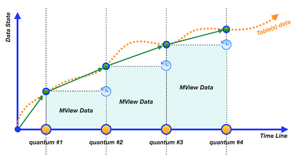
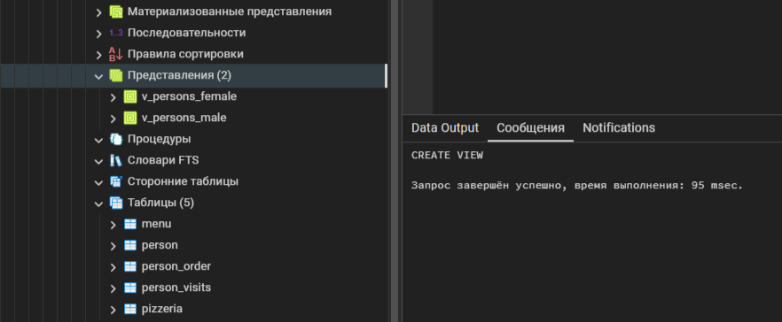
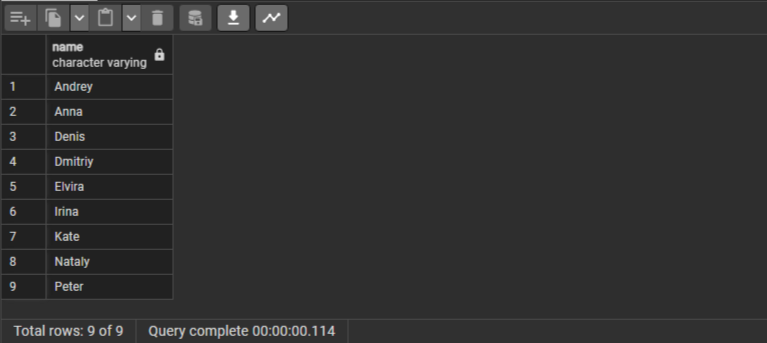
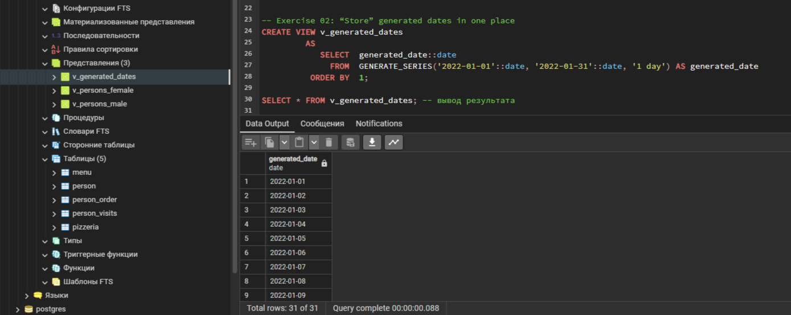
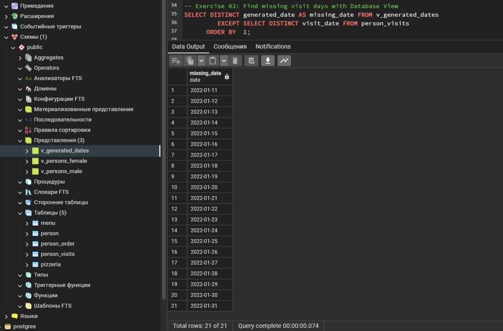
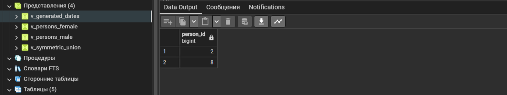
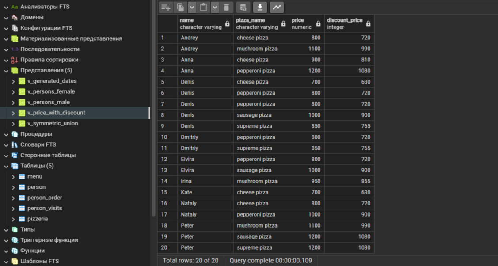
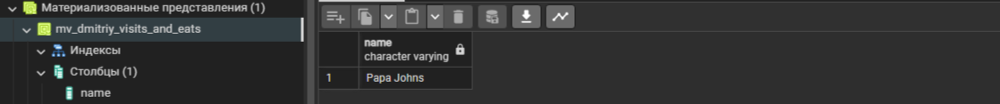
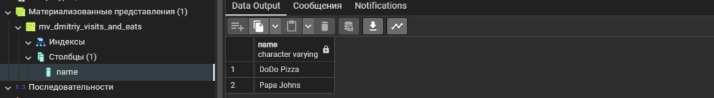

  

Учимся использовать виртуальное представление и физический снимок данных

## Содержимое


[Преамбула](#преамбула)  
[Общие правила](#общие-правила)   
[Пояснения к таблицам](#пояснения-к-таблицам)   
[Exercise 00 - Let’s create separated views for persons](#exercise-00)  
[Exercise 01 - From parts to common view](#exercise-01)  
[Exercise 02 - “Store” generated dates in one place](#exercise-02)  
[Exercise 03 - Find missing visit days with Database View](#exercise-03)  
[Exercise 04 - Let’s find something from Set Theory](#exercise-04)  
[Exercise 05 - Let’s calculate a discount price for each person](#exercise-05)  
[Exercise 06 - Materialization from virtualization](#exercise-06)  
[Exercise 07 - Refresh our state](#exercise-07)  
[Exercise 08 - Just clear our database](#exercise-08)  


## Преамбула


Представьте базу данных как большую библиотеку, где каждая таблица похожа на отдельную книгу.   
Теперь давайте поговорим о виртуальных таблицах и материализованных представлениях.   
Виртуальные таблицы и материализованные представления - это как перекресток, который предоставляет доступ к данным в таблицах для пользователей или приложений.  

Виртуальные таблицы - это непрерывные объекты, которые постоянно обновляются, чтобы отражать данные из базовых таблиц.   
Они позволяют нам получать доступ к данным, не зная, как они хранятся на самом деле.  

Материализованные представления - это дискретные объекты, которые не обновляются непрерывно, а обновляются по расписанию или по событиям.   
Они всегда отстают от фактических данных в базовых таблицах.  

Важно понять, что виртуальные таблицы и материализованные представления помогают нам работать с данными более эффективно, предоставляя различные способы доступа и управления информацией.  

У виртуальных таблиц есть некоторые ограничения в отношении работы с операциями вставки, обновления и удаления данных, но они могут использовать триггеры для более точного контроля этих операций.   
Материализованные представления, с другой стороны, предназначены только для чтения и могут иметь пользовательские индексы для ускорения запросов.  

Зачем нам нужны виртуальные таблицы и материализованные представления в базах данных?   
Базы данных - это просто таблицы, не так ли? Нет, на самом деле нет.   
Базы данных аналогичны объектно-ориентированному языку.   
Нам нужна абстракция, чтобы достичь “чистой архитектуры” и изменять объекты с минимальным воздействием на зависимости (иногда это работает :-). 

Более того, в реляционной базе данных существует определенный шаблон архитектуры с именем ANSI/SPARK.
Этот шаблон разбивает объекты на три уровня: 
- внешний уровень
- концептуальный уровень
- внутренний уровень

Таким образом, мы можем сказать, что виртуальные таблицы и материализованные представления являются физическими интерфейсами между таблицами с данными и пользователем/приложением.
Итак, в чем же тогда разница между двумя объектами? Основное различие заключается в “свежести данных”. Ниже вы можете увидеть поведение этих объектов в графическом представлении.

|  |  |
| ------ | ------ |
| View - это непрерывный объект с теми же данными, что и в базовых таблицах, которые используются для создания этого представления. Другими словами, если мы выбираем данные из view, view перенаправляет наш запрос к базовым объектам, а затем возвращает результаты для нас. |  |
|  |Материализованное представление является дискретным объектом. Другими словами, нам нужно дождаться, когда материализованное представление будет обновлено на основе “триггера события” (например, расписания). Этот объект всегда находится за фактическими данными в базовых таблицах. |


Кроме того, есть несколько дополнительных различий между представлением и материализованным представлением.
- Виртуальная таблица может работать с трафиком `INSERT/UPDATE/DELETE`, но с некоторыми ограничениями. 
- Виртуальные таблицы могут иметь триггеры “Вместо”, чтобы лучше контролировать входящий трафик `INSERT/UPDATE/DELETE`.
- Материализованное представление является объектом только для чтения для трафика `INSERT/UPDATE/DELETE`
- Материализованные представления могут иметь определенные пользователем индексы столбцов для ускорения запросов

Материализованное представление и виртуальная таблица - это два способа представления данных в базе данных, но они имеют свои особенности и различия.   
Давайте разберем их:  

- Материализованное представление (Materialized View):  
Непрерывность данных: Материализованное представление представляет собой объект с данными, которые фактически сохранены и хранятся в базе данных. Они обновляются только при срабатывании события или расписания обновления.  
Задержка обновления: Поскольку данные в материализованных представлениях сохраняются, они могут быть отстающими от реальных данных в базовых таблицах.  
Только для чтения: Материализованные представления предназначены только для чтения и нельзя использовать для вставки, обновления или удаления данных.  
Индексы: Материализованные представления могут иметь пользовательские индексы для ускорения выполнения запросов.  

- Виртуальная таблица (Virtual Table):  
Непрерывность данных: Виртуальная таблица является логическим представлением данных из одной или нескольких базовых таблиц, и данные в них всегда актуальные.  
Манипуляция данными: Виртуальная таблица может использоваться для операций вставки, обновления и удаления данных с некоторыми ограничениями.  
Триггеры: Можно создавать триггеры "вместо" для более точного контроля над операциями вставки, обновления и удаления.  
Таким образом, основным отличием между материализованным представлением и виртуальной таблицей является в организации и обновлении данных: материализованное представление содержит сохраненные данные с задержкой обновления, в то время как виртуальная таблица представляет логическое представление актуальных данных.  

### CREATE VIEW

Оператор CREATE VIEW в SQL используется для создания виртуальных (или представлений) таблиц, которые представляют собой набор данных из одной или нескольких исходных таблиц, обработанных только во время выполнения запроса и не хранящих собственных данных.

Вот как это работает:
 - Создание Виртуальной Таблицы (VIEW)  
Когда вы используете оператор CREATE VIEW, вы определяете, какие данные вы хотите видеть в этой виртуальной таблице, указывая запрос, который извлекает и обрабатывает данные из одной или несколько таблиц.

- Структура VIEW  
После создания представления, оно становится доступным как отдельная "временная" таблица со собственной структурой и именем, но без физического хранения данных.   
Вместо хранения фактических значений, представление предоставляет "вид" данных в соответствии с определенным запросом.

- Обновление данных  
Представления обычно используются для обеспечения удобного доступа последовательности данных из разных баз данных или таблиц.   
Однако, так как представления являются "виртуальными", они обычно не поддерживают возможность непосредственного изменения содержимого базовых таблиц через эти представления.

- Использование Представлений   
Представления могут быть очень полезны для упрощения сложных запросов, сокращения объема кода и упрощения доступа к данным для различных пользователей или приложений, предоставляя им только необходимую информацию.

### Общие правила

- Убедитесь, что используете последнюю версию PostgreSQL.  
- Для оценки ваше решение должно находиться в репозитории git, в ветке develop и папке src.  
- Вы не должны оставлять в своей директории никаких других файлов, кроме тех, которые явно указаны в инструкциях по упражнению.   
- Убедитесь, что у вас есть собственная база данных и доступ к ней в вашем кластере PostgreSQL.
- Скачайте [script](materials/model.sql) с моделью базы данных здесь и примените скрипт к своей базе данных (вы можете использовать командную строку с psql или просто запустить его через любую среду IDE, например DataGrip от JetBrains или pgAdmin от PostgreSQL community).
- Все задачи содержат список разрешенных и запрещенных разделов с перечисленными параметрами базы данных, типами баз данных, конструкциями SQL и т.д.  
- И да пребудет с вами SQL-сила!
- Абсолютно все может быть представлено в SQL! Давайте начнем и повеселимся!


## Пояснения к таблицам

- Пожалуйста, убедитесь, что у вас есть собственная база данных и доступ к ней в вашем кластере PostgreSQL.
- Пожалуйста, скачайте [скрипт] (materials/model.sql) с моделью базы данных здесь и примените скрипт к своей базе данных (вы можете использовать командную строку с psql или просто запустить его через любую среду IDE, например DataGrip от JetBrains или pgAdmin от PostgreSQL community).
- Все задачи содержат список разрешенных и запрещенных разделов с перечисленными параметрами базы данных, типами баз данных, конструкциями SQL и т.д. Пожалуйста, ознакомьтесь с разделом перед началом.
- Пожалуйста, взгляните на логический вид нашей модели базы данных.


1. Таблица **pizzeria** (таблица-справочник с доступными пиццериями)
- id - первичный ключ
- name - название пиццерии
- rating - средняя оценка пиццерии (от 0 до 5 баллов)
2. Таблица **person** (таблица словаря с лицами, которые любят пиццу)
- id - первичный ключ
- name - имя человека
- age - возраст человека
- gender - пол человека
- address - адрес человека
3. Таблица **menu** (таблица-словарь с доступным меню и ценой на конкретную пиццу)
- id - первичный ключ
- pizzeria_id - внешний ключ для пиццерии
- pizza_name - название пиццы в пиццерии
- price - цена конкретной пиццы
4. Таблица **person_visits** (оперативная таблица с информацией о посещениях пиццерии)
- id - первичный ключ
- person_id - внешний ключ для человека
- pizzeria_id - внешний ключ для пиццерии
- visit_date - дата (например, 2022-01-01) посещения человека
5. Таблица **person_order** (Оперативная таблица с информацией о заказах людей)
- id - первичный ключ
- person_id - внешний ключ к person
- menu_id - внешний ключ к меню
- order_date - дата (например, 2022-01-01) заказа человека

Посещение человека и заказ человека являются разными объектами и не содержат никакой корреляции между данными.   
Например, клиент может находиться в одном ресторане (просто просматривая меню) и в это время сделать заказ в другом по телефону или с помощью мобильного приложения.   
Или в другом случае просто быть дома и снова позвонить с заказом без каких-либо посещений.  


## Exercise 00

| Exercise 00: Let’s create separated views for persons |                                                                                                                          |
|---------------------------------------|--------------------------------------------------------------------------------------------------------------------------|
| Turn-in directory                     | ex00                                                                                                                     |
| Files to turn-in                      | `day04_ex00.sql`                                                                                 |
| **Allowed**                               |                                                                                                                          |
| Language                        | ANSI SQL                                                                                              |


Создайте 2 представления базы данных (с аналогичными атрибутами, как в исходной таблице) на основе простой фильтрации по полу лиц.   
Задайте соответствующие имена для представлений базы данных: `v_persons_female` и `v_persons_male`.

<details>
  <summary>Решение</summary>
</p>

```sql
CREATE VIEW	v_persons_female AS
	 SELECT	id, name, age, gender, address
	   FROM	person
	  WHERE	gender = 'female';

CREATE VIEW	v_persons_male AS
	 SELECT	id, name, age, gender, address
	   FROM	person
	  WHERE	gender = 'male';
```



</p>
</details>


## Exercise 01

| Exercise 01: From parts to common view|                                                                                                                          |
|---------------------------------------|--------------------------------------------------------------------------------------------------------------------------|
| Turn-in directory                     | ex01                                                                                                                     |
| Files to turn-in                      | `day04_ex01.sql`                                                                                 |
| **Allowed**                               |                                                                                                                          |
| Language                        | ANSI SQL                                                                                              |

Используйте 2 представления базы данных из Exercise 00 и напишите SQL, чтобы получить женские и мужские имена людей в одном списке.   
Сортировка по имени человека. 

Образец выходных данных  

| name |
| ------ |
| Andrey |
| Anna |
| ... |

<details>
  <summary>Решение</summary>
</p>

```sql
  SELECT	name FROM v_persons_female
   UNION	ALL
  SELECT	name FROM v_persons_male
ORDER BY	1;
```



</p>
</details>


## Exercise 02

| Exercise 02: “Store” generated dates in one place|                                                                                                                          |
|---------------------------------------|--------------------------------------------------------------------------------------------------------------------------|
| Turn-in directory                     | ex02                                                                                                                     |
| Files to turn-in                      | `day04_ex02.sql`                                                                                 |
| **Allowed**                               |                                                                                                                          |
| Language                        | ANSI SQL                                                                                              |
| SQL Syntax Construction                        | `generate_series(...)`                                                                                              |

Создайте представление базы данных с именем `v_generated_dates`, которое должно хранить сгенерированные даты с 1 по 31 января 2022 года в типе `DATE`.   
Сортировка по generated_date.  

Образец выходных данных  

| generated_date |
| ------ |
| 2022-01-01 |
| 2022-01-02 |
| ... |

<details>
  <summary>Решение</summary>
</p>

```sql
CREATE VIEW	v_generated_dates 
		 AS
			SELECT	generated_date::date
			  FROM	GENERATE_SERIES('2022-01-01'::date, '2022-01-31'::date, '1 day') AS generated_date
		  ORDER BY	1;
		  
SELECT * FROM v_generated_dates; -- вывод результата
```



</p>
</details>

## Exercise 03

| Exercise 03: Find missing visit days with Database View |                                                                                                                          |
|---------------------------------------|--------------------------------------------------------------------------------------------------------------------------|
| Turn-in directory                     | ex03                                                                                                                     |
| Files to turn-in                      | `day04_ex03.sql`                                                                                 |
| **Allowed**                               |                                                                                                                          |
| Language                        | ANSI SQL                                                                                              |


Напишите SQL-инструкцию, которая возвращает:  
- пропущенные дни для посещений людей в январе 2022 года. 
- используйте представление `v_generated_dates` для этой задачи 
- отсортируйте результат по столбцу missing_data  

Образец выходных данных  

| missing_date |
| ------ |
| 2022-01-11 |
| 2022-01-12 |
| ... |

<details>
  <summary>Решение</summary>
</p>

```sql
SELECT DISTINCT generated_date AS missing_date FROM v_generated_dates
		 EXCEPT	SELECT DISTINCT visit_date FROM person_visits
	  ORDER BY	1;
```



</p>
</details>


## Exercise 04

| Exercise 04: Let’s find something from Set Theory |                                                                                                                          |
|---------------------------------------|--------------------------------------------------------------------------------------------------------------------------|
| Turn-in directory                     | ex04                                                                                                                     |
| Files to turn-in                      | `day04_ex04.sql`                                                                                 |
| **Allowed**                               |                                                                                                                          |
| Language                        | ANSI SQL                                                                                              |


Напишите инструкцию SQL, которая удовлетворяет формуле `(R - S)=(SR)` .
 - Где R - таблица `person_visits` с фильтром по 2 января 2022 года, 
 - S - также таблица `person_visits`, но с другим фильтром по 6 января 2022 года. 
 
Произведите свои вычисления с наборами в столбце `person_id`, и этот столбец будет единственным в результате. 
Отсортируйте по столбцу `person_id`, а ваш окончательный запрос представьте в представлении базы данных `v_symmetric_union` (*).

(*) определения “симметричное объединение” в теории множеств не существует. Это интерпретация автора, основная идея основана на существующем правиле симметричного различия.

<details>
  <summary>Решение</summary>
</p>

```sql
CREATE VIEW v_symmetric_union 
			AS (
					(SELECT person_id FROM person_visits AS R WHERE visit_date IN ('2022-01-02')
				 EXCEPT ALL	SELECT person_id FROM person_visits AS S WHERE visit_date IN ('2022-01-06')) 		
					  UNION	
					(SELECT person_id FROM person_visits AS S WHERE visit_date IN ('2022-01-06')
				 EXCEPT ALL	SELECT person_id FROM person_visits AS R WHERE visit_date IN ('2022-01-02'))
				  ORDER BY	1
			);

SELECT * FROM v_symmetric_union;
```



</p>
</details>


## Exercise 05

| Exercise 05: Let’s calculate a discount price for each person |                                                                                                                          |
|---------------------------------------|--------------------------------------------------------------------------------------------------------------------------|
| Turn-in directory                     | ex05                                                                                                                     |
| Files to turn-in                      | `day04_ex05.sql`                                                                                 |
| **Allowed**                               |                                                                                                                          |
| Language                        | ANSI SQL                                                                                              |

Please create a Database View `v_price_with_discount` that returns a person's orders with person names, pizza names, real price and calculated column `discount_price` (with applied 10% discount and satisfies formula `price - price*0.1`). The result please sort by person name and pizza name and make a round for `discount_price` column to integer type. Please take a look at a sample result below.

Создайте представление базы данных `v_price_with_discount`, которое возвращает:
- заказы пользователя с именами людей, названиями пицц, реальной ценой и рассчитанным столбцом `discount_price` 
- с примененной скидкой 10% и удовлетворяет формуле `price - price*0.1`  
- приведите столбец "discount_price" к целочисленному типу  
- отсортируйте по имени человека и названию пиццы  

Образец выходных данных  

| name |  pizza_name | price | discount_price |
| ------ | ------ | ------ | ------ | 
| Andrey | cheese pizza | 800 | 720 | 
| Andrey | mushroom pizza | 1100 | 990 |
| ... | ... | ... | ... |

<details>
  <summary>Решение</summary>
</p>

```sql
CREATE VIEW v_price_with_discount 
	AS (
		SELECT	person.name,
				menu.pizza_name,
				menu.price,
				CAST(menu.price * 0.9 AS INT) AS discount_price
      	  FROM	person
          JOIN	person_order AS p_o ON person.id = p_o.person_id
          JOIN	menu ON p_o.menu_id = menu.id
      ORDER BY	1, 2
	);

SELECT * FROM v_price_with_discount;

```



</p>
</details>


## Exercise 06

| Exercise 06: Materialization from virtualization |                                                                                                                          |
|---------------------------------------|--------------------------------------------------------------------------------------------------------------------------|
| Turn-in directory                     | ex06                                                                                                                     |
| Files to turn-in                      | `day04_ex06.sql`                                                                                 |
| **Allowed**                               |                                                                                                                          |
| Language                        | ANSI SQL                                                                                              |

Пожалуйста, создайте материализованное представление `mv_dmitriy_visits_and_eats` (с включенными данными) на основе инструкции SQL, которая находит название пиццерии, которую Дмитрий посетил 8 января 2022 года и мог съесть пиццу менее чем за 800 рублей (этот SQL вы можете узнать в День #02, упражнение #07).

Чтобы проверить себя, вы можете записать SQL в материализованное представление `mv_dmitriy_visits_and_eats` и сравнить результаты с вашим предыдущим запросом.

<details>
  <summary>Решение</summary>
</p>

```sql
CREATE MATERIALIZED VIEW	mv_dmitriy_visits_and_eats 
AS
	SELECT	pizzeria.name
	  FROM
			pizzeria
			INNER JOIN person_visits AS pv ON pv.pizzeria_id = pizzeria.id
			INNER JOIN person ON person.id = pv.person_id
	 WHERE
			person.name = 'Dmitriy'
			AND pv.visit_date = '2022-01-08';

SELECT * FROM mv_dmitriy_visits_and_eats;
```



</p>
</details>


## Exercise 07

| Exercise 07: Refresh our state|                                                                                                                          |
|---------------------------------------|--------------------------------------------------------------------------------------------------------------------------|
| Turn-in directory                     | ex07                                                                                                                     |
| Files to turn-in                      | `day04_ex07.sql`                                                                                 |
| **Allowed**                               |                                                                                                                          |
| Language                        | ANSI SQL                                                                                              |
| **Denied**                               |                                                                                                                          |
| SQL Syntax Pattern                        | Don’t use direct numbers for identifiers of Primary Key, person and pizzeria                                                                                               |

Давайте обновим данные в нашем материализованном представлении `mv_dmitriy_visits_and_eats` из упражнения #06. 
- сгенерируйте еще один визит Дмитрия, который удовлетворяет SQL-предложению Materialized View, за исключением пиццерии, которую мы можем видеть в результате упражнения #06.
- после добавления нового посещения обновите состояние данных для `mv_dmitriy_visits_and_eats`.

<details>
  <summary>Решение</summary>
</p>

```sql
INSERT INTO person_visits
	 VALUES (
			 (SELECT MAX(id) FROM person_visits) + 1,
			 (SELECT id FROM person WHERE name = 'Dmitriy'),
			 (SELECT id FROM pizzeria WHERE name = 'DoDo Pizza'),
			 '2022-01-08'
			);

SELECT * FROM person_visits WHERE visit_date = '2022-01-08' AND person_id = 9;

REFRESH MATERIALIZED VIEW mv_dmitriy_visits_and_eats;

SELECT * FROM mv_dmitriy_visits_and_eats;
```



</p>
</details>


## Exercise 08

| Exercise 08: Just clear our database |                                                                                                                          |
|---------------------------------------|--------------------------------------------------------------------------------------------------------------------------|
| Turn-in directory                     | ex08                                                                                                                     |
| Files to turn-in                      | `day04_ex08.sql`                                                                                 |
| **Allowed**                               |                                                                                                                          |
| Language                        | ANSI SQL                                                                                              |           

After all our exercises were born a few Virtual Tables and one Materialized View. Let’s drop them!

После всех наших упражнений родилось несколько виртуальных таблиц и одно материализованное представление. Давайте удалим их!

<details>
  <summary>Решение</summary>
</p>

```sql
DROP MATERIALIZED VIEW IF EXISTS mv_dmitriy_visits_and_eats;
```

</p>
</details>
