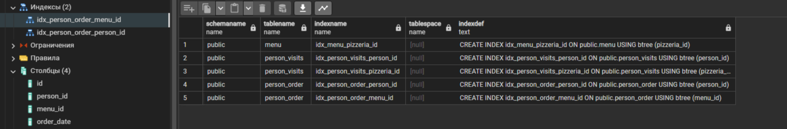
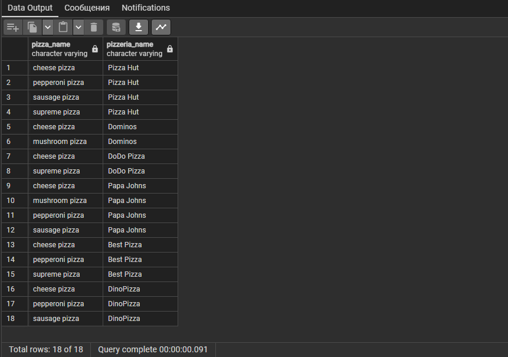
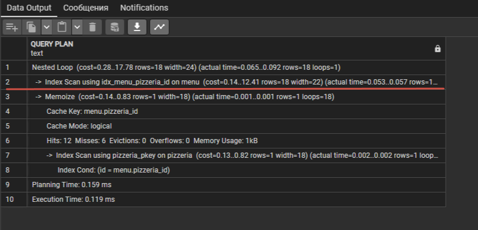
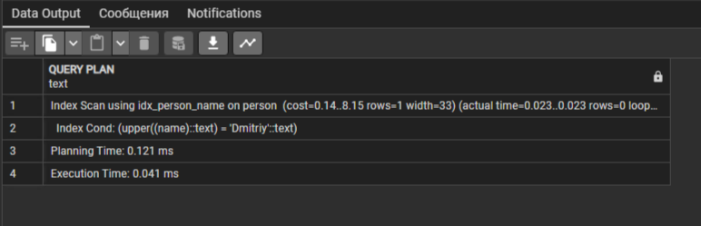
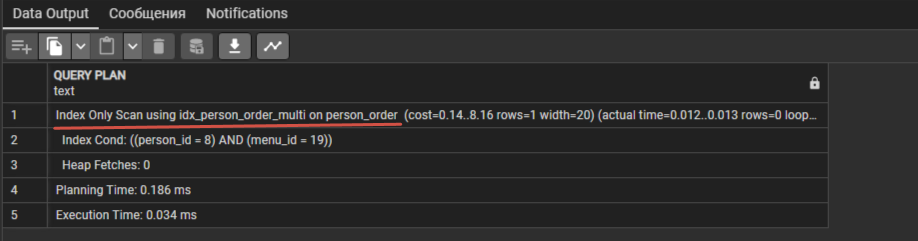
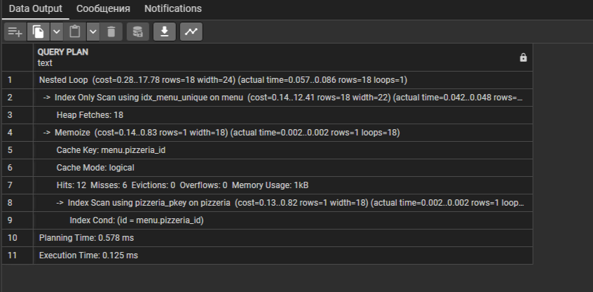
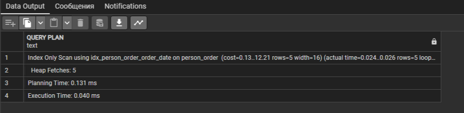
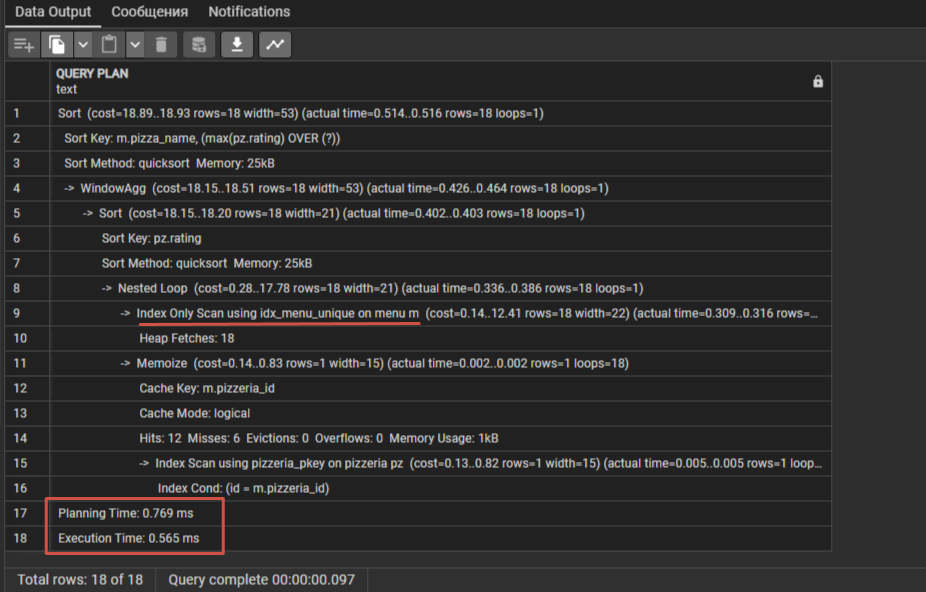
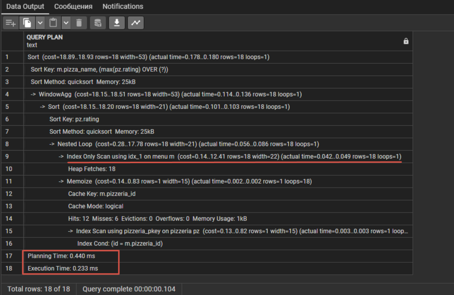

  

## Содержимое


[Преамбула](#преамбула)  
[Общие правила](#общие-правила)   
[Пояснения к таблицам](#пояснения-к-таблицам)   
[Exercise 00 - Let’s create indexes for every foreign key](#exercise-00)  
[Exercise 01 - How to see that index works?](#exercise-01)  
[Exercise 02 - Formula is in the index. Is it Ok?](#exercise-02)  
[Exercise 03 - Multicolumn index for our goals](#exercise-03)  
[Exercise 04 - Uniqueness for data](#exercise-04)  
[Exercise 05 - Partial uniqueness for data](#exercise-05)  
[Exercise 06 - Let’s make performance improvement](#exercise-06)  

## Преамбула


### Что такое индексы B-Tree в SQL?

Индексы B-Tree представляют собой структуру данных, используемую в базах данных, чтобы ускорить поиск, сортировку и извлечение данных.   
Они отображают значение столбца в строку таблицы, что позволяет быстро находить строки по определенному значению.  

#### Для чего нужны индексы B-Tree в SQL?

* Ускорение поиска: индексы B-Tree позволяют быстро находить строки с определенным значением, что повышает производительность запросов, особенно на больших объемах данных.
* Улучшение сортировки: использование индексов B-Tree способствует более эффективной сортировке данных.
* Оптимизация объединений и условий: при использовании индексов B-Tree выполнение операций объединения таблиц и выполнение операций, содержащих условия, становится более эффективным.


#### Как использовать индексы B-Tree?

Для создания индекса B-Tree в SQL используется оператор `CREATE INDEX`. Например:  

```sql
CREATE INDEX index_name ON table_name (column_name);
-- создаст индекс B-Tree для указанного столбца таблицы
```


При написании запросов следует учитывать использование индексов B-Tree. Например:  

```sql
SELECT * FROM table_name WHERE column_name = 'value';
-- индекс B-Tree будет использован для быстрого поиска значений
```

После создания индекса необходимо выполнить команду `ANALYZE` для каждой таблицы, для которой вы создали индексы, чтобы обновить статистическую информацию, которая используется оптимизатором запросов для принятия решений о эффективном использовании индексов.

Примерно так:

```sql
ANALYZE menu;
ANALYZE pizzeria;
-- Это обновит статистику указанных таблиц и позволит оптимизатору запросов определить наиболее эффективный план, включающий использование индексов
```

### Мониторинг производительности запросов 

После создания индексов важно мониторить производительность запросов и, если необходимо, оптимизировать индексы для улучшения производительности системы.

Оператор `EXPLAIN` в SQL используется для анализа плана выполнения запросов. Это мощный инструмент, который позволяет понять, как база данных выполняет запросы и что происходит внутри её движка для оптимизации запросов. Вот как и для чего его используют:

* Оптимизация производительности: анализ плана выполнения запросов помогает выявить узкие места и неэффективные операции, что может помочь в оптимизации производительности запросов.
* Идентификация использования индексов: `EXPLAIN` позволяет увидеть, какие индексы используются для выполнения запросов, а также определить, нужно ли создавать новые индексы для улучшения производительности.
* Понимание порядка операций: анализ плана выполнения запросов помогает понять последовательность операций, выполняемых базой данных для выполнения запроса.

```sql
EXPLAIN SELECT * FROM table_name WHERE column_name = 'value';
-- покажет план выполнения запроса
```

Оператор `EXPLAIN ANALYZE` в SQL используется для анализа плана выполнения запроса и выполнения самого запроса сбора информации о времени выполнения.   

`EXPLAIN ANALYZE` - это комбинированный инструмент, который предоставляет информацию о плане выполнения запроса и собирает реальные статистические данные о времени выполнения запроса. Это позволяет увидеть реальное время выполнения запроса и оценить его производительность на основе статистических данных.  

В PostgreSQL `EXPLAIN ANALYZE` используется перед запросом для его анализа с сбором статистики выполнения. Например:

```sql
EXPLAIN ANALYZE SELECT * FROM table_name WHERE column_name = 'value';
-- выдаст план выполнения запроса и реальные статистические данные о времени выполнения.
```

Результат выполнения `EXPLAIN ANALYZE` следует интерпретировать вместе с предоставленной статистикой, чтобы понять, как эффективно выполняется запрос и какие шаги могут быть оптимизированы.
`EXPLAIN ANALYZE` позволяет оценить производительность запроса на основе фактических статистических данных, что помогает в идентификации проблем и оптимизации запросов.
Используя `EXPLAIN ANALYZE`, можно получить более подробную информацию о выполнении запросов и оценить их производительность на основе реальных статистических данных.

### Общие правила

- Убедитесь, что используете последнюю версию PostgreSQL.  
- Для оценки ваше решение должно находиться в репозитории git, в ветке develop и папке src.  
- Вы не должны оставлять в своей директории никаких других файлов, кроме тех, которые явно указаны в инструкциях по упражнению.   
- Убедитесь, что у вас есть собственная база данных и доступ к ней в вашем кластере PostgreSQL.
- Скачайте [script](materials/model.sql) с моделью базы данных здесь и примените скрипт к своей базе данных (вы можете использовать командную строку с psql или просто запустить его через любую среду IDE, например DataGrip от JetBrains или pgAdmin от PostgreSQL community).
- Все задачи содержат список разрешенных и запрещенных разделов с перечисленными параметрами базы данных, типами баз данных, конструкциями SQL и т.д.  
- И да пребудет с вами SQL-сила!
- Абсолютно все может быть представлено в SQL! Давайте начнем и повеселимся!


## Пояснения к таблицам

- Пожалуйста, убедитесь, что у вас есть собственная база данных и доступ к ней в вашем кластере PostgreSQL.
- Пожалуйста, скачайте [скрипт](materials/model.sql) с моделью базы данных здесь и примените скрипт к своей базе данных (вы можете использовать командную строку с psql или просто запустить его через любую среду IDE, например DataGrip от JetBrains или pgAdmin от PostgreSQL community).
- Все задачи содержат список разрешенных и запрещенных разделов с перечисленными параметрами базы данных, типами баз данных, конструкциями SQL и т.д. Пожалуйста, ознакомьтесь с разделом перед началом.
- Пожалуйста, взгляните на логический вид нашей модели базы данных.


1. Таблица **pizzeria** (таблица-справочник с доступными пиццериями)
- id - первичный ключ
- name - название пиццерии
- rating - средняя оценка пиццерии (от 0 до 5 баллов)
2. Таблица **person** (таблица словаря с лицами, которые любят пиццу)
- id - первичный ключ
- name - имя человека
- age - возраст человека
- gender - пол человека
- address - адрес человека
3. Таблица **menu** (таблица-словарь с доступным меню и ценой на конкретную пиццу)
- id - первичный ключ
- pizzeria_id - внешний ключ для пиццерии
- pizza_name - название пиццы в пиццерии
- price - цена конкретной пиццы
4. Таблица **person_visits** (оперативная таблица с информацией о посещениях пиццерии)
- id - первичный ключ
- person_id - внешний ключ для человека
- pizzeria_id - внешний ключ для пиццерии
- visit_date - дата (например, 2022-01-01) посещения человека
5. Таблица **person_order** (Оперативная таблица с информацией о заказах людей)
- id - первичный ключ
- person_id - внешний ключ к person
- menu_id - внешний ключ к меню
- order_date - дата (например, 2022-01-01) заказа человека

Посещение человека и заказ человека являются разными объектами и не содержат никакой корреляции между данными.   
Например, клиент может находиться в одном ресторане (просто просматривая меню) и в это время сделать заказ в другом по телефону или с помощью мобильного приложения.   
Или в другом случае просто быть дома и снова позвонить с заказом без каких-либо посещений.  


## Exercise 00

| Exercise 00: Let’s create indexes for every foreign key |                                                                                                                          |
|---------------------------------------|--------------------------------------------------------------------------------------------------------------------------|
| Turn-in directory                     | ex00                                                                                                                     |
| Files to turn-in                      | `day05_ex00.sql`                                                                                 |
| **Allowed**                               |                                                                                                                          |
| Language                        | ANSI SQL                                                                                              |

Создайте простой индекс BTree для каждого внешнего ключа в нашей базе данных.   
Шаблон имени должен удовлетворять следующему правилу “idx_{имя_таблицы}_{имя_колонки}”.   
Например, индекс имени BTree для столбца pizzeria_id в таблице `menu` равен `idx_menu_pizzeria_id`.

<details>
  <summary>Решение</summary>
</p>

```sql
CREATE INDEX idx_menu_pizzeria_id ON menu(pizzeria_id); 					--  menu
CREATE INDEX idx_person_visits_person_id ON person_visits(person_id); 		--  person_visits
CREATE INDEX idx_person_visits_pizzeria_id ON person_visits(pizzeria_id); 	--  person_visits
CREATE INDEX idx_person_order_person_id ON person_order(person_id); 		--  person_order
CREATE INDEX idx_person_order_menu_id ON person_order(menu_id);  			--  person_order

-- обновляем статус таблиц и включаем созданные индексы
ANALYZE menu;
ANALYZE pizzeria;
ANALYZE person;
ANALYZE person_visits;
ANALYZE person_order;

-- Поиск всех индексов в базе данных
SELECT * FROM pg_indexes WHERE indexname LIKE 'idx_%';
```



</p>
</details>


## Exercise 01

| Exercise 01: How to see that index works?|                                                                                                                          |
|---------------------------------------|--------------------------------------------------------------------------------------------------------------------------|
| Turn-in directory                     | ex01                                                                                                                     |
| Files to turn-in                      | `day05_ex01.sql`                                                                                 |
| **Allowed**                               |                                                                                                                          |
| Language                        | ANSI SQL                                                                                              |

Напишите инструкцию SQL, которая возвращает:
- названия пицц и соответствующих пиццерий  
- сортировка не требуется  

Пример выходных данных  

| pizza_name | pizzeria_name | 
| ------ | ------ |
| cheese pizza | Pizza Hut |
| ... | ... |

Теперь предоставим доказательство того, что наши индексы работают.
Примером доказательства является вывод команды `EXPLAIN ANALYZE`.
Взгляните на пример команды вывода.

    ...
    ->  Index Scan using idx_menu_pizzeria_id on menu m  (...)
    ...

**Подсказка**: подумайте, почему ваши индексы не работают напрямую и что мы должны сделать, чтобы это включить?

<details>
  <summary>Решение</summary>
</p>

```sql
SET ENABLE_SEQSCAN TO OFF; -- выключить последовательное сканирование

EXPLAIN ANALYZE
SELECT 
		pizza_name, 
		pizzeria.name AS pizzeria_name 
  FROM 	menu
  JOIN 	pizzeria ON pizzeria.id = menu.pizzeria_id;
```

 

</p>
</details>


## Exercise 02

| Exercise 02: Formula is in the index. Is it Ok?|                                                                                                                          |
|---------------------------------------|--------------------------------------------------------------------------------------------------------------------------|
| Turn-in directory                     | ex02                                                                                                                     |
| Files to turn-in                      | `day05_ex02.sql`                                                                                 |
| **Allowed**                               |                                                                                                                          |
| Language                        | ANSI SQL                                                                                              |

- Создайте функциональный индекс B-дерева с именем `idx_person_name` для имени столбца таблицы `person`.   
- Индекс должен содержать имена людей в верхнем регистре.   

Напишите и предоставьте любой SQL с доказательством (`EXPLAIN ANALYZE`), что индекс `idx_person_name` работает.

<details>
  <summary>Решение</summary>
</p>

```sql
CREATE INDEX idx_person_name ON person(UPPER(name));
ANALYZE person;
SELECT * FROM pg_indexes WHERE indexname = 'idx_person_name';

EXPLAIN ANALYZE SELECT * FROM person WHERE UPPER(name) IN ('DMITRIY');
```



</p>
</details>


## Exercise 03

| Exercise 03: Multicolumn index for our goals |                                                                                                                          |
|---------------------------------------|--------------------------------------------------------------------------------------------------------------------------|
| Turn-in directory                     | ex03                                                                                                                     |
| Files to turn-in                      | `day05_ex03.sql`                                                                                 |
| **Allowed**                               |                                                                                                                          |
| Language                        | ANSI SQL                                                                                              |

Создайте лучший многоколоночный индекс B-дерева с именем `idx_person_order_multi` для приведенной ниже инструкции SQL.

```sql
    SELECT	person_id, menu_id,order_date
      FROM	person_order
     WHERE	person_id = 8 AND menu_id = 19;
```

Команда `EXPLAIN ANALYZE` должна вернуть следующий шаблон. Пожалуйста, обратите внимание на сканирование "Только по индексу"!

    ...
    ->  Index Only Scan using idx_person_order_multi on person_order ...
    ...

Предоставьте любой SQL с доказательством `EXPLAIN ANALYZE`, что индекс `idx_person_order_multi` работает.  

<details>
  <summary>Решение</summary>
</p>

```sql
DROP INDEX idx_person_order_menu_id;
DROP INDEX idx_person_order_person_id;

CREATE INDEX idx_person_order_multi ON person_order (person_id, menu_id, order_date);
ANALYZE person_order;

EXPLAIN ANALYZE
SELECT	person_id, menu_id, order_date
  FROM	person_order
 WHERE	person_id = 8 AND menu_id = 19;
```



</p>
</details>


## Exercise 04

| Exercise 04: Uniqueness for data |                                                                                                                          |
|---------------------------------------|--------------------------------------------------------------------------------------------------------------------------|
| Turn-in directory                     | ex04                                                                                                                     |
| Files to turn-in                      | `day05_ex04.sql`                                                                                 |
| **Allowed**                               |                                                                                                                          |
| Language                        | ANSI SQL                                                                                              |

- создайте уникальный индекс BTree с именем `idx_menu_unique` в таблице `menu` для столбцов `pizzeria_id` и `pizza_name`    
- напишите и предоставьте любой SQL с доказательством `EXPLAIN ANALYZE`, что индекс `idx_menu_unique` работает    

<details>
  <summary>Решение</summary>
</p>

```sql
CREATE INDEX idx_menu_unique ON menu (pizzeria_id, pizza_name);
ANALYZE menu;

EXPLAIN ANALYZE
SELECT 
		pizza_name, 
		pizzeria.name AS pizzeria_name 
  FROM 	menu
  JOIN 	pizzeria ON pizzeria.id = menu.pizzeria_id;
```



</p>
</details>


## Exercise 05

| Exercise 05: Partial uniqueness for data |                                                                                                                          |
|---------------------------------------|--------------------------------------------------------------------------------------------------------------------------|
| Turn-in directory                     | ex05                                                                                                                     |
| Files to turn-in                      | `day05_ex05.sql`                                                                                 |
| **Allowed**                               |                                                                                                                          |
| Language                        | ANSI SQL                                                                                              |

- создайте частичный уникальный индекс BTree с именем `idx_person_order_order_date` в таблице `person_order` для атрибутов `person_id` и `menu_id` с частичной уникальностью для столбца `order_date` для даты ‘2022-01-01’.

- команда `EXPLAIN ANALYZE` должна возвращать следующий шаблон

	...
    ->  Index Only Scan using idx_person_order_order_date on person_order …
    ...

<details>
  <summary>Решение</summary>
</p>

```sql
CREATE UNIQUE INDEX idx_person_order_order_date ON person_order(person_id, menu_id) WHERE order_date = '2022-01-01';
ANALYZE person_order;

EXPLAIN ANALYZE 
SELECT person_id, menu_id FROM person_order WHERE order_date = '2022-01-01';
```



</p>
</details>


## Exercise 06

| Exercise 06: Let’s make performance improvement|                                                                                                                          |
|---------------------------------------|--------------------------------------------------------------------------------------------------------------------------|
| Turn-in directory                     | ex06                                                                                                                     |
| Files to turn-in                      | `day05_ex06.sql`                                                                                 |
| **Allowed**                               |                                                                                                                          |
| Language                        | ANSI SQL                                                                                              |

Взгляните на SQL ниже с технической точки зрения (игнорируйте логический случай этого оператора SQL).  

```sql
    SELECT
        m.pizza_name AS pizza_name,
        max(rating) OVER (PARTITION BY rating ORDER BY rating ROWS BETWEEN UNBOUNDED PRECEDING AND UNBOUNDED FOLLOWING) AS k
    FROM  menu m
    INNER JOIN pizzeria pz ON m.pizzeria_id = pz.id
    ORDER BY 1,2;
```

- создайте новый индекс BTree с именем `idx_1`, который должен улучшить показатель “Execution Time (Время выполнения)” этого SQL.   
- предоставьте доказательство `EXPLAIN ANALYZE`, что SQL был улучшен  

**Подсказка**: это упражнение выглядит как задача “грубой силы”, чтобы найти хороший покрывающий индекс, поэтому перед вашим новым тестом удалите индекс `idx_1`.

Пример улучшения:

**Before**:

    Sort  (cost=26.08..26.13 rows=19 width=53) (actual time=0.247..0.254 rows=19 loops=1)
    "  Sort Key: m.pizza_name, (max(pz.rating) OVER (?))"
    Sort Method: quicksort  Memory: 26kB
    ->  WindowAgg  (cost=25.30..25.68 rows=19 width=53) (actual time=0.110..0.182 rows=19 loops=1)
            ->  Sort  (cost=25.30..25.35 rows=19 width=21) (actual time=0.088..0.096 rows=19 loops=1)
                Sort Key: pz.rating
                Sort Method: quicksort  Memory: 26kB
                ->  Merge Join  (cost=0.27..24.90 rows=19 width=21) (actual time=0.026..0.060 rows=19 loops=1)
                        Merge Cond: (m.pizzeria_id = pz.id)
                        ->  Index Only Scan using idx_menu_unique on menu m  (cost=0.14..12.42 rows=19 width=22) (actual time=0.013..0.029 rows=19 loops=1)
                            Heap Fetches: 19
                        ->  Index Scan using pizzeria_pkey on pizzeria pz  (cost=0.13..12.22 rows=6 width=15) (actual time=0.005..0.008 rows=6 loops=1)
    Planning Time: 0.711 ms
    Execution Time: 0.338 ms

**After**:

    Sort  (cost=26.28..26.33 rows=19 width=53) (actual time=0.144..0.148 rows=19 loops=1)
    "  Sort Key: m.pizza_name, (max(pz.rating) OVER (?))"
    Sort Method: quicksort  Memory: 26kB
    ->  WindowAgg  (cost=0.27..25.88 rows=19 width=53) (actual time=0.049..0.107 rows=19 loops=1)
            ->  Nested Loop  (cost=0.27..25.54 rows=19 width=21) (actual time=0.022..0.058 rows=19 loops=1)
                ->  Index Scan using idx_1 on …
                ->  Index Only Scan using idx_menu_unique on menu m  (cost=0.14..2.19 rows=3 width=22) (actual time=0.004..0.005 rows=3 loops=6)
    …
    Planning Time: 0.338 ms
    Execution Time: 0.203 ms

<details>
  <summary>Решение</summary>
</p>

```sql
CREATE INDEX idx_1 ON menu(pizzeria_id, pizza_name);
ANALYZE menu;

EXPLAIN ANALYZE 	
    SELECT
			m.pizza_name AS pizza_name,
			max(rating) OVER (PARTITION BY rating ORDER BY rating ROWS BETWEEN UNBOUNDED PRECEDING AND UNBOUNDED FOLLOWING) AS k
      FROM  menu m
INNER JOIN 	pizzeria pz ON m.pizzeria_id = pz.id
  ORDER BY 	1,2;
```
До создания idx_1  
   

После  
  

</p>
</details>