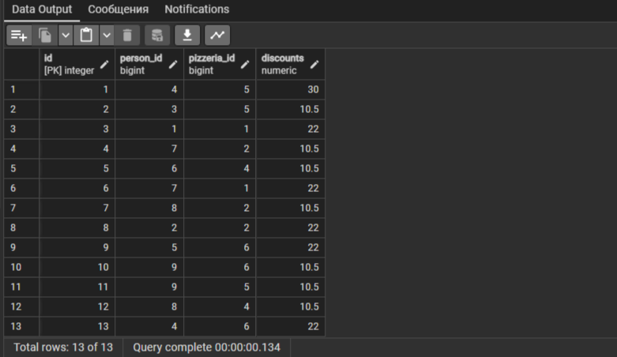
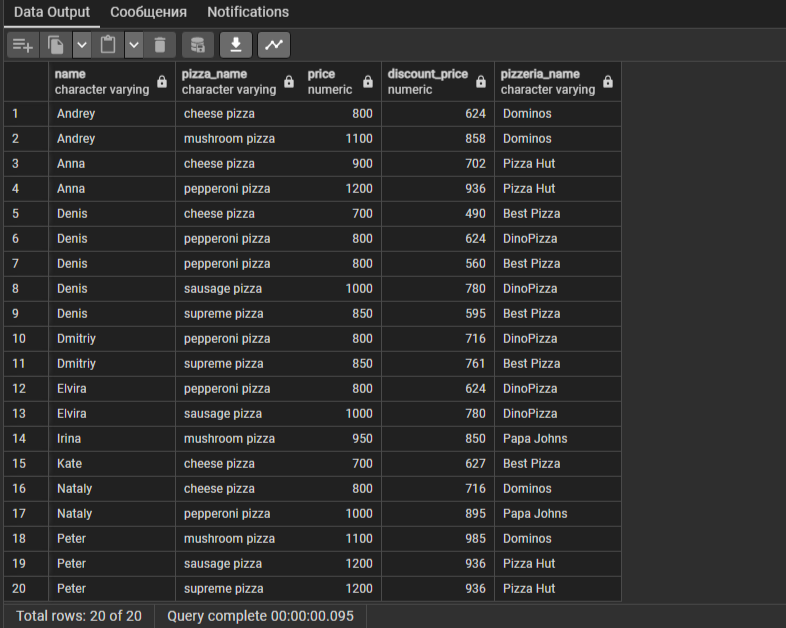
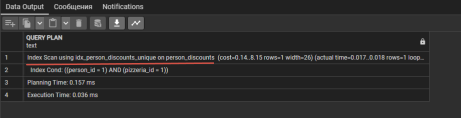
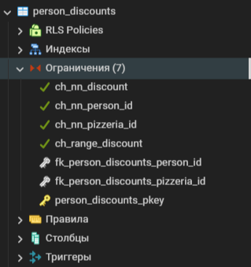
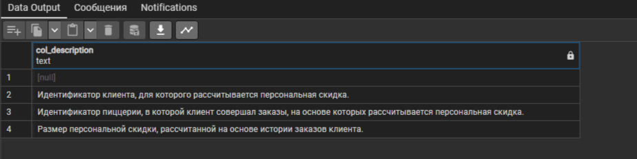

  

  

## Содержимое

[Преамбула](#преамбула)  
[Общие правила](#общие-правила)   
[Пояснения к таблицам](#пояснения-к-таблицам)   
[Exercise 00 - Discounts, discounts , everyone loves discounts](#exercise-00)    
[Exercise 01 - Let’s set personal discounts](#exercise-01)    
[Exercise 02 - Let’s recalculate a history of orders.](#exercise-02)    
[Exercise 03 - Improvements are in a way](#exercise-03)    
[Exercise 04 - We need more Data Consistency](#exercise-04)   
[Exercise 05 - Data Governance Rules](#exercise-05)  
[Exercise 06 - Let’s automate Primary Key generation](#exercise-06)  


## Преамбула


Почему алмаз является одним из самых прочных объектов? Причина кроется в структуре. Каждый атом знает о своем месте в топологии алмаза и делает весь алмаз неразрушимым.

Логическая структура подобна алмазу. Если вы найдете подходящую структуру для своей собственной модели базы данных, то вы найдете золото (или бриллиант :-).  
Моделирование баз данных имеет два аспекта. Первый - это логический подход, другими словами, то, как ваша модель будет плавно описывать реальный мир бизнеса.  


С другой стороны, ваша модель должна решать ваши функциональные задачи с минимальным воздействием. Это означает, что представление логической модели преобразуется в представление физической модели, а не только из описаний таблиц и атрибутов. Но на самом деле, с точки зрения производительности и бюджета, которые в настоящее время более актуальны. Как найти баланс? Для этого случая есть 3 шага, чтобы создать очень хороший дизайн. Просто взгляните на картинку ниже.  


### Общие правила

- Убедитесь, что используете последнюю версию PostgreSQL.  
- Для оценки ваше решение должно находиться в репозитории git, в ветке develop и папке src.  
- Вы не должны оставлять в своей директории никаких других файлов, кроме тех, которые явно указаны в инструкциях по упражнению.   
- Убедитесь, что у вас есть собственная база данных и доступ к ней в вашем кластере PostgreSQL.
- Скачайте [script](materials/model.sql) с моделью базы данных здесь и примените скрипт к своей базе данных (вы можете использовать командную строку с psql или просто запустить его через любую среду IDE, например DataGrip от JetBrains или pgAdmin от PostgreSQL community).
- Все задачи содержат список разрешенных и запрещенных разделов с перечисленными параметрами базы данных, типами баз данных, конструкциями SQL и т.д.  
- И да пребудет с вами SQL-сила!
- Абсолютно все может быть представлено в SQL! Давайте начнем и повеселимся!


## Пояснения к таблицам

**Все изменения, которые вы внесли в День 03 и в День 04, должны быть на месте.**

- Пожалуйста, убедитесь, что у вас есть собственная база данных и доступ к ней в вашем кластере PostgreSQL.
- Пожалуйста, скачайте [скрипт](materials/model.sql) с моделью базы данных здесь и примените скрипт к своей базе данных (вы можете использовать командную строку с psql или просто запустить его через любую среду IDE, например DataGrip от JetBrains или pgAdmin от PostgreSQL community).
- Все задачи содержат список разрешенных и запрещенных разделов с перечисленными параметрами базы данных, типами баз данных, конструкциями SQL и т.д. Пожалуйста, ознакомьтесь с разделом перед началом.
- Пожалуйста, взгляните на логический вид нашей модели базы данных.


1. Таблица **pizzeria** (таблица-справочник с доступными пиццериями)
- id - первичный ключ
- name - название пиццерии
- rating - средняя оценка пиццерии (от 0 до 5 баллов)
2. Таблица **person** (таблица словаря с лицами, которые любят пиццу)
- id - первичный ключ
- name - имя человека
- age - возраст человека
- gender - пол человека
- address - адрес человека
3. Таблица **menu** (таблица-словарь с доступным меню и ценой на конкретную пиццу)
- id - первичный ключ
- pizzeria_id - внешний ключ для пиццерии
- pizza_name - название пиццы в пиццерии
- price - цена конкретной пиццы
4. Таблица **person_visits** (оперативная таблица с информацией о посещениях пиццерии)
- id - первичный ключ
- person_id - внешний ключ для человека
- pizzeria_id - внешний ключ для пиццерии
- visit_date - дата (например, 2022-01-01) посещения человека
5. Таблица **person_order** (Оперативная таблица с информацией о заказах людей)
- id - первичный ключ
- person_id - внешний ключ к person
- menu_id - внешний ключ к меню
- order_date - дата (например, 2022-01-01) заказа человека

Посещение человека и заказ человека являются разными объектами и не содержат никакой корреляции между данными.   
Например, клиент может находиться в одном ресторане (просто просматривая меню) и в это время сделать заказ в другом по телефону или с помощью мобильного приложения.   
Или в другом случае просто быть дома и снова позвонить с заказом без каких-либо посещений.  


## Exercise 00

| Exercise 00: Discounts, discounts , everyone loves discounts |                                                                                                                          |
|---------------------------------------|--------------------------------------------------------------------------------------------------------------------------|
| Turn-in directory                     | ex00                                                                                                                     |
| Files to turn-in                      | `day06_ex00.sql`                                                                                 |
| **Allowed**                               |                                                                                                                          |
| Language                        | SQL, DML, DDL                                                                                              |

Давайте расширим нашу модель данных, включив в нее новую бизнес-функцию.
Каждый человек хочет видеть персональную скидку, и каждый бизнес хочет быть ближе к клиентам.

Пожалуйста, подумайте о персональных скидках для людей с одной стороны и для ресторанов-пиццерий с другой.   

Необходимо создать новую реляционную таблицу `person_discounts` со следующими правилами:  
- установите атрибут `id` как первичный ключ (пожалуйста, посмотрите на столбец `id` в существующих таблицах и выберите тот же тип данных)
- установить для атрибутов `person_id` и `pizzeria_id` внешние ключи для соответствующих таблиц (типы данных должны быть такими же, как для столбцов `id` в соответствующих родительских таблицах)
- задайте явные имена для ограничений внешних ключей по шаблону `fk_{имя_таблицы}_{имя_столбца}`, например `fk_person_discounts_person_id`
- добавьте атрибут `discounts`, чтобы сохранить значение скидки в процентах. 

Помните, что значение скидки может быть числом с плавающей точкой (используйте тип данных `numeric`). Выберите соответствующий тип данных, чтобы учесть эту возможность.

<details>
  <summary>Решение</summary>
</p>

```sql
CREATE TABLE person_discounts (
     		 id 	SERIAL PRIMARY KEY, -- автоматически генерирует уникальные значения при вставке новой записи
      person_id 	BIGINT,
    pizzeria_id 	BIGINT,
      discounts 	NUMERIC,
     CONSTRAINT 	fk_person_discounts_person_id FOREIGN KEY (person_id) REFERENCES person(id),
     CONSTRAINT 	fk_person_discounts_pizzeria_id FOREIGN KEY (pizzeria_id) REFERENCES pizzeria(id)
);
```

</p>
</details>


## Exercise 01

| Exercise 01: Let’s set personal discounts|                                                                                                                          |
|---------------------------------------|--------------------------------------------------------------------------------------------------------------------------|
| Turn-in directory                     | ex01                                                                                                                     |
| Files to turn-in                      | `day06_ex01.sql`                                                                                 |
| **Allowed**                               |                                                                                                                          |
| Language                        | SQL, DML, DDL                                                                                              |

Собственно, мы создали структуру для хранения наших скидок и готовы пойти дальше и заполнить нашу таблицу `person_discounts` новыми записями.

Итак, есть таблица `person_order`, в которой хранится история заказов человека. Пожалуйста, напишите инструкцию DML (`INSERT INTO ... SELECT ...`), которая выполняет вставку новых записей в таблицу `person_discounts` на основе следующих правил.
- возьмите агрегированное состояние по столбцам person_id и pizzeria_id 
- рассчитайте значение персональной скидки по следующему псевдокоду:

```c
    `if “amount of orders” = 1 then
        “discount” = 10.5 
    else if “amount of orders” = 2 then 
        “discount” = 22
    else 
        “discount” = 30`
```

- чтобы сгенерировать первичный ключ для таблицы `person_discounts`, используйте приведенную ниже конструкцию SQL (эта конструкция взята из области SQL функции WINDOW).
    
    `... ROW_NUMBER( ) OVER ( ) AS id ...`

<details>
  <summary>Решение</summary>
</p>

```sql
WITH order_counts AS (
    SELECT person_order.person_id, 
           menu.pizzeria_id, 
           COUNT(*) AS order_count -- считаем кол-во заказов для каждой уникальной комбинации person_id и pizzeria_id
      FROM person_order
     JOIN menu ON person_order.menu_id = menu.id -- присоединяем таблицу menu для получения информации о пиццерии
  GROUP BY person_order.person_id, menu.pizzeria_id -- группируем результаты по person_id и pizzeria_id
)

INSERT INTO person_discounts (id, person_id, pizzeria_id, discounts)
-- вставляем данные в таблицу person_discounts
SELECT ROW_NUMBER() OVER () AS id, -- генерируем уникальные значения id
       order_counts.person_id,
       order_counts.pizzeria_id, 
       CASE
        WHEN order_counts.order_count = 1 THEN 10.5
        WHEN order_counts.order_count = 2 THEN 22
        ELSE 30
       END AS discount -- рассчитываем значение скидки основываясь на количестве заказов
  FROM order_counts; 
```



</p>
</details>


## Exercise 02

| Exercise 02: Let’s recalculate a history of orders|                                                                                                                          |
|---------------------------------------|--------------------------------------------------------------------------------------------------------------------------|
| Turn-in directory                     | ex02                                                                                                                     |
| Files to turn-in                      | `day06_ex02.sql`                                                                                 |
| **Allowed**                               |                                                                                                                          |
| Language                        | SQL, DML, DDL                                                                                              |

Напишите SQL-инструкцию, которая возвращает:  
- заказы с фактической ценой и ценой с примененной скидкой
- для каждого человека
- в соответствующей пиццерии
- сортировка по имени человека и названию пиццы   

Пример выходных данных   

| name | pizza_name | price | discount_price | pizzeria_name | 
| ------ | ------ | ------ | ------ | ------ |
| Andrey | cheese pizza | 800 | 624 | Dominos |
| Andrey | mushroom pizza | 1100 | 858 | Dominos |
| ... | ... | ... | ... | ... |

<details>
  <summary>Решение</summary>
</p>

```sql
WITH discounted_orders AS
(
    -- создаем СТЕ для получения истории заказов с учетом примененной скидки
    SELECT person.name,
           menu.pizza_name, 
           menu.price,
           ROUND((menu.price * ((100 - pd.discount) / 100))) AS discount_price, -- рассчитываем цену со скидкой на основе примененной скидки из таблицы person_discounts
           piz.name AS pizzeria_name 
    FROM person_order AS po
    JOIN person ON person.id = po.person_id 
    JOIN menu ON po.menu_id = menu.id 
    JOIN pizzeria AS piz ON menu.pizzeria_id = piz.id 
    JOIN person_discounts AS pd ON (po.person_id = pd.person_id AND menu.pizzeria_id = pd.pizzeria_id)
)
-- извлекаем все столбцы из СТЕ
SELECT * FROM discounted_orders ORDER BY 1, 2;
```



</p>
</details>


## Exercise 03

| Exercise 03: Improvements are in a way |                                                                                                                          |
|---------------------------------------|--------------------------------------------------------------------------------------------------------------------------|
| Turn-in directory                     | ex03                                                                                                                     |
| Files to turn-in                      | `day06_ex03.sql`                                                                                 |
| **Allowed**                               |                                                                                                                          |
| Language                        | SQL, DML, DDL                                                                                              |

Мы должны улучшить согласованность данных, с одной стороны, и настроить производительность - с другой. 
- создайте многоколоночный уникальный индекс (с именем `idx_person_discounts_unique`), который предотвращает дублирование парных значений идентификаторов персоны и пиццерии.
- после создания нового индекса, используя `EXPLAIN ANALYZE` предоставьте любую простую инструкцию SQL, которая показывает доказательство использования индекса.

Пример “доказательства” приведен ниже
    
    ...
    Index Scan using idx_person_discounts_unique on person_discounts
    ...

<details>
  <summary>Решение</summary>
</p>

```sql
CREATE UNIQUE INDEX idx_person_discounts_unique ON person_discounts (person_id, pizzeria_id);
ANALYZE person_discounts;

SET ENABLE_SEQSCAN TO OFF;
EXPLAIN ANALYZE
SELECT * from person_discounts WHERE person_id = 1 AND pizzeria_id = 1;
```



</p>
</details>


## Exercise 04

| Exercise 04: We need more Data Consistency |                                                                                                                          |
|---------------------------------------|--------------------------------------------------------------------------------------------------------------------------|
| Turn-in directory                     | ex04                                                                                                                     |
| Files to turn-in                      | `day06_ex04.sql`                                                                                 |
| **Allowed**                               |                                                                                                                          |
| Language                        | SQL, DML, DDL                                                                                              |

Добавьте следующие правила ограничения для существующих столбцов таблицы `person_discounts`.
- столбец `person_id` не должен быть нулевым (используйте имя ограничения `ch_nn_person_id`)
- столбец `pizzeria_id` не должен быть нулевым (используйте имя ограничения `ch_nn_pizzeria_id`)
- столбец `discount` не должен быть нулевым (используйте имя ограничения `ch_nn_discount`)
- столбец `discount` по умолчанию должен быть равен 0 процентам
- столбец `discount` должен находиться в диапазоне значений от 0 до 100 (используйте имя ограничения `ch_range_discount`)

<details>
  <summary>Решение</summary>
</p>

> ADD CONSTRAINT и CHECK являются частью языка SQL и используются для добавления ограничений на столбцы таблицы.   
> 
> ADD CONSTRAINT используется для добавления нового ограничения к таблице базы данных.  
Когда вы добавляете новый ограничение, вы должны предоставить ему уникальное имя, чтобы отличать его от других ограничений в таблице.  
Ограничение может быть проверкой уникальности, внешним ключом, ограничением целостности или любым другим типом ограничения, который вам нужен.  
Например, если вы хотите добавить ограничение CHECK на столбец, который проверяет, что значения в столбце соответствуют определенным условиям, то вы будете использовать ADD CONSTRAINT для добавления этого ограничения.  
> 
> Ограничение типа CHECK используется для проверки значения столбца на соответствие определенному условию.  
Обычно используется для создания правил, которые ограничивают значения, которые могут быть помещены в столбец.  
Например, CHECK (discount >= 0 AND discount <= 100) создает ограничение, которое гарантирует, что значение в столбце "discount" находится в диапазоне от 0 до 100.   
Если значение не соответствует этому условию, то операция изменения данных будет отклонена.  
Таким образом, ADD CONSTRAINT и CHECK используются в SQL для добавления и настройки ограничений, которые обеспечивают целостность данных в таблицах базы данных.  

```sql
ALTER TABLE person_discounts
    ADD CONSTRAINT ch_nn_person_id CHECK (person_id IS NOT NULL), -- не должен быть NULL
    ADD CONSTRAINT ch_nn_pizzeria_id CHECK (pizzeria_id IS NOT NULL), -- не должен быть NULL
    ADD CONSTRAINT ch_nn_discount CHECK (discount IS NOT NULL), -- не должен быть NULL
    ADD CONSTRAINT ch_range_discount CHECK (discount >= 0 AND discount <= 100); -- должен быть в диапазоне от 0 до 100

ALTER TABLE person_discounts
    ALTER COLUMN discount SET DEFAULT 0; -- установка столбца discount по умолчанию на 0 процентов
```



</p>
</details>


## Exercise 05

| Exercise 05: Data Governance Rules|                                                                                                                          |
|---------------------------------------|--------------------------------------------------------------------------------------------------------------------------|
| Turn-in directory                     | ex05                                                                                                                     |
| Files to turn-in                      | `day06_ex05.sql`                                                                                 |
| **Allowed**                               |                                                                                                                          |
| Language                        |  SQL, DML, DDL                                                                                              |

Чтобы соответствовать политикам управления данными, необходимо добавить комментарии к таблице и столбцам таблицы. Давайте применим эту политику к таблице `person_discounts`. 

Добавьте комментарии на английском или русском языках, которые объясняют, какова бизнес-цель таблицы и все включенные атрибуты.  

<details>
  <summary>Решение</summary>
</p>

```sql
 COMMENT ON TABLE person_discounts IS 'Эта таблица хранит информацию о персональных скидках, предоставляемых на основе истории заказов конкретных клиентов в конкретных пиццериях.';
COMMENT ON COLUMN person_discounts.person_id IS 'Идентификатор клиента, для которого рассчитывается персональная скидка.';
COMMENT ON COLUMN person_discounts.pizzeria_id IS 'Идентификатор пиццерии, в которой клиент совершал заказы, на основе которых рассчитывается персональная скидка.';
COMMENT ON COLUMN person_discounts.discount IS 'Размер персональной скидки, рассчитанной на основе истории заказов клиента.';

-- проверяем добавление
SELECT col_description((SELECT 'person_discounts'::regclass), ordinal_position)
FROM information_schema.columns
WHERE table_name = 'person_discounts';
```



</p>
</details>


## Exercise 06

| Exercise 06: Let’s automate Primary Key generation|                                                                                                                          |
|---------------------------------------|--------------------------------------------------------------------------------------------------------------------------|
| Turn-in directory                     | ex06                                                                                                                     |
| Files to turn-in                      | `day06_ex06.sql`                                                                                 |
| **Allowed**                               |                                                                                                                          |
| Language                        | SQL, DML, DDL                                                                                              |
| **Denied**                               |                                                                                                                          |
| SQL Syntax Pattern                        | Don’t use hard-coded value for amount of rows to set a right value for sequence                                                                                              |

Давайте создадим последовательность базы данных с именем `seq_person_discounts` (начиная со значения 1) и установим значение по умолчанию для атрибута `id` таблицы `person_discounts`, чтобы каждый раз автоматически принимать значение из `seq_person_discounts`. 

Имейте в виду, что ваш следующий порядковый номер равен 1, в этом случае, установите фактическое значение для последовательности базы данных на основе формулы “количество строк в таблице person_discounts” + 1. В противном случае вы получите сообщения об ограничении нарушения первичного ключа.  

<details>
  <summary>Решение</summary>
</p>

```sql
CREATE SEQUENCE seq_person_discounts START 1; -- создание последовательности базы данных

ALTER TABLE person_discounts
ALTER COLUMN id SET DEFAULT nextval('seq_person_discounts'); -- установка значения по умолчанию для атрибута id в таблице person_discounts
```

> Создаем последовательность базы данных с именем seq_person_discounts, начиная с значения 1.
> Изменяем таблицу person_discounts, устанавливая значение по умолчанию для атрибута id, чтобы оно автоматически бралось из последовательности seq_person_discounts > при вставке новых записей.
> Это позволит автоматически присваивать значения атрибуту id из созданной последовательности и избежать нарушений первичного ключа при вставке новых записей.


</p>
</details>
