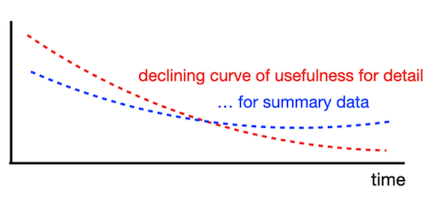
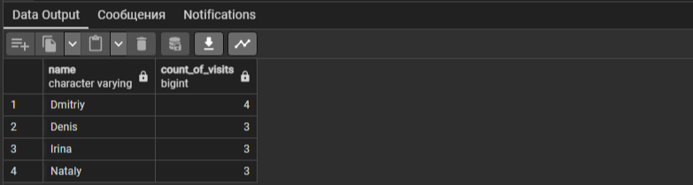

  


## Содержимое

[Преамбула](#преамбула)   
[Общие правила](#общие-правила)    
[Пояснения к таблицам](#пояснения-к-таблицам)   
[Exercise 00 - Simple aggregated information](#exercise-00)   
[Exercise 01 - Let’s see real names](#exercise-01)   
[Exercise 02 - Restaurants statistics](#exercise-02)   
[Exercise 03 - Restaurants statistics #2](#exercise-03)   
[Exercise 04 - Clause for groups](#exercise-04)  
[Exercise 05 - Person's uniqueness](#exercise-05)  
[Exercise 06 - Restaurant metrics](#exercise-06)  
[Exercise 07 - Average global rating](#exercise-07)  
[Exercise 08 - Find pizzeria’s restaurant locations](#exercise-08)    
[Exercise 09 - Explicit type transformation](#exercise-09)        


## Преамбула



OLAP (Online Analytical Processing) - это метод анализа данных, который позволяет проводить многомерный анализ информации. OLAP-структуры предоставляют возможность пользователю анализировать данные по различным измерениям и атрибутам, таким как время, продукт, местоположение и другим бизнес-ориентированным параметрам.

OLAP-структуры обычно используются в системах бизнес-аналитики и отчетности. Они позволяют строить многомерные кубы данных, предоставляя возможность динамического изменения измерений и агрегаций данных для анализа информации с различных точек зрения.

OLAP-структуры могут быть построены на основе различных моделей, таких как многомерные модели (чаще используется в OLAP на базе кубов), и табличные модели (чаще используется в OLAP на базе отношений). Они обеспечивают быстрый доступ к данным и поддерживают операции агрегирования, детализации, фильтрации и просмотра данных, что делает их эффективным инструментом анализа для бизнес-пользователей.

Таким образом, OLAP-структуры позволяют пользователям проводить сложный анализ данных с точки зрения различных измерений и атрибутов, что делает их важным элементом в системах бизнес-аналитики и принятия решений.

Пожалуйста, взгляните на кривую полезности подробных данных во времени. Другими словами, подробные данные (подразумевают транзакции пользователей, факты о продуктах и поставщиках и т.д.) бесполезны для нас с исторической точки зрения, потому что нам просто нужно знать некоторую агрегацию, чтобы описать, что происходило год назад.

Почему это происходит? Причина кроется в нашем аналитическом уме. На самом деле мы хотим сконцентрироваться на нашей бизнес-стратегии с исторической точки зрения, чтобы поставить новые бизнес-цели, и нам не нужны детали. 

С точки зрения базы данных, “аналитический разум” соответствует трафику OLAP (информационный уровень), “детали” соответствуют трафику OLTP (уровень необработанных данных). Сегодня существует более гибкая схема хранения подробных данных и агрегированной информации в экосистеме. Я говорю о `LakeHouse = DataLake + DataWareHouse`.

Если мы говорим об исторических данных, то мы должны упомянуть шаблон “Управление жизненным циклом данных”. Простыми словами, что мы должны делать со старыми данными? TTL (time-to-live), SLA для данных, Политика хранения данных и т.д. - это термины, которые используются в стратегии управления данными.


### Общие правила

- Убедитесь, что используете последнюю версию PostgreSQL.  
- Для оценки ваше решение должно находиться в репозитории git, в ветке develop и папке src.  
- Вы не должны оставлять в своей директории никаких других файлов, кроме тех, которые явно указаны в инструкциях по упражнению.   
- Убедитесь, что у вас есть собственная база данных и доступ к ней в вашем кластере PostgreSQL.
- Скачайте [script](materials/model.sql) с моделью базы данных здесь и примените скрипт к своей базе данных (вы можете использовать командную строку с psql или просто запустить его через любую среду IDE, например DataGrip от JetBrains или pgAdmin от PostgreSQL community).
- Все задачи содержат список разрешенных и запрещенных разделов с перечисленными параметрами базы данных, типами баз данных, конструкциями SQL и т.д.  
- И да пребудет с вами SQL-сила!
- Абсолютно все может быть представлено в SQL! Давайте начнем и повеселимся!


## Пояснения к таблицам

**Все изменения, которые вы внесли в День 03 и в День 04, должны быть на месте.**

- Пожалуйста, убедитесь, что у вас есть собственная база данных и доступ к ней в вашем кластере PostgreSQL.
- Пожалуйста, скачайте [скрипт](materials/model.sql) с моделью базы данных здесь и примените скрипт к своей базе данных (вы можете использовать командную строку с psql или просто запустить его через любую среду IDE, например DataGrip от JetBrains или pgAdmin от PostgreSQL community).
- Все задачи содержат список разрешенных и запрещенных разделов с перечисленными параметрами базы данных, типами баз данных, конструкциями SQL и т.д. Пожалуйста, ознакомьтесь с разделом перед началом.
- Пожалуйста, взгляните на логический вид нашей модели базы данных.


1. Таблица **pizzeria** (таблица-справочник с доступными пиццериями)
- id - первичный ключ
- name - название пиццерии
- rating - средняя оценка пиццерии (от 0 до 5 баллов)
2. Таблица **person** (таблица словаря с лицами, которые любят пиццу)
- id - первичный ключ
- name - имя человека
- age - возраст человека
- gender - пол человека
- address - адрес человека
3. Таблица **menu** (таблица-словарь с доступным меню и ценой на конкретную пиццу)
- id - первичный ключ
- pizzeria_id - внешний ключ для пиццерии
- pizza_name - название пиццы в пиццерии
- price - цена конкретной пиццы
4. Таблица **person_visits** (оперативная таблица с информацией о посещениях пиццерии)
- id - первичный ключ
- person_id - внешний ключ для человека
- pizzeria_id - внешний ключ для пиццерии
- visit_date - дата (например, 2022-01-01) посещения человека
5. Таблица **person_order** (Оперативная таблица с информацией о заказах людей)
- id - первичный ключ
- person_id - внешний ключ к person
- menu_id - внешний ключ к меню
- order_date - дата (например, 2022-01-01) заказа человека

Посещение человека и заказ человека являются разными объектами и не содержат никакой корреляции между данными.   
Например, клиент может находиться в одном ресторане (просто просматривая меню) и в это время сделать заказ в другом по телефону или с помощью мобильного приложения.   
Или в другом случае просто быть дома и снова позвонить с заказом без каких-либо посещений.  


## Exercise 00

| Exercise 00: Simple aggregated information |                                                                                                                          |
|---------------------------------------|--------------------------------------------------------------------------------------------------------------------------|
| Turn-in directory                     | ex00                                                                                                                     |
| Files to turn-in                      | `day07_ex00.sql`                                                                                 |
| **Allowed**                               |                                                                                                                          |
| Language                        | ANSI SQL|

Давайте сделаем простую агрегацию  
Напишите SQL-инструкцию, которая возвращает:  
- идентификаторы пользователей и соответствующее количество посещений в любых пиццериях   
- сортировка по количеству посещений в режиме убывания и по `person_id` в режиме возрастания  

Пример выходных данных  

| person_id | count_of_visits |
| ------ | ------ |
| 9 | 4 |
| 4 | 3 |
| ... | ... | 

<details>
  <summary>Решение</summary>
</p>

```sql
  SELECT person_id, COUNT(*) AS count_of_visits -- подсчет количества посещений для каждого person_id
    FROM person_visits
GROUP BY person_id
ORDER BY count_of_visits DESC, person_id ASC;
```


</p>
</details>


## Exercise 01

| Exercise 01: Let’s see real names|                                                                                                                          |
|---------------------------------------|--------------------------------------------------------------------------------------------------------------------------|
| Turn-in directory                     | ex01                                                                                                                     |
| Files to turn-in                      | `day07_ex01.sql`                                                                                 |
| **Allowed**                               |                                                                                                                          |
| Language                        | ANSI SQL                                                                                              |

- измените инструкцию SQL из упражнения 00 и верните имя пользователя (не идентификатор).   
- дополнительное условие - нам нужно видеть только топ-4 пользователей с максимальным количеством посещений в любых пиццериях и отсортированных по имени пользователя.  

Пример выходных данных  

| name | count_of_visits |
| ------ | ------ |
| Dmitriy | 4 |
| Denis | 3 |
| ... | ... | 

<details>
  <summary>Решение</summary>
</p>

```sql
  SELECT person.name, COUNT(*) AS count_of_visits -- подсчет количества посещений для каждого person_id
    FROM person_visits
	JOIN person ON person.id = person_visits.person_id
GROUP BY person.name, person_visits.person_id
ORDER BY count_of_visits DESC, person.name
   LIMIT 4;
```



</p>
</details>


## Exercise 02

| Exercise 02: Restaurants statistics|                                                                                                                          |
|---------------------------------------|--------------------------------------------------------------------------------------------------------------------------|
| Turn-in directory                     | ex02                                                                                                                     |
| Files to turn-in                      | `day07_ex02.sql`                                                                                 |
| **Allowed**                               |                                                                                                                          |
| Language                        | ANSI SQL                                                                                              |

Напишите SQL-инструкцию, чтобы увидеть:  
- 3 любимых ресторана по посещениям и заказам в одном списке 
- добавьте столбец action_type со значениями ‘order’ или ‘visit’, это зависит от данных из соответствующей таблицы  
- результат должен быть отсортирован по столбцу action_type в режиме возрастания и по столбцу count в режиме убывания   

Пример выходных данных  

| name | count | action_type |
| ------ | ------ | ------ |
| Dominos | 6 | order |
| ... | ... | ... |
| Dominos | 7 | visit |
| ... | ... | ... |

<details>
  <summary>Решение</summary>
</p>

```sql
SELECT name, count, action_type
FROM (
    SELECT p.name AS name, COUNT(*) AS count, 'visit' AS action_type
    FROM person_visits pv
    JOIN pizzeria p ON p.id = pv.pizzeria_id
    GROUP BY p.name

    UNION ALL

    SELECT p.name AS name, COUNT(*) AS count, 'order' AS action_type
    FROM person_order po
    JOIN menu m ON m.id = po.menu_id
    JOIN pizzeria p ON p.id = m.pizzeria_id
    GROUP BY p.name
) combined_data
ORDER BY action_type ASC, count DESC;
```


</p>
</details>


## Exercise 03

| Exercise 03: Restaurants statistics #2 |                                                                                                                          |
|---------------------------------------|--------------------------------------------------------------------------------------------------------------------------|
| Turn-in directory                     | ex03                                                                                                                     |
| Files to turn-in                      | `day07_ex03.sql`                                                                                 |
| **Allowed**                               |                                                                                                                          |
| Language                        | ANSI SQL                                                                                              |

Напишите инструкцию SQL, чтобы увидеть, как рестораны группируются по посещениям и заказам и объединяются друг с другом с помощью названия ресторана.  
Вы можете использовать внутренний Sql из упражнения 02 (рестораны по посещениям и заказам) без ограничений по количеству строк.

Дополнительно, добавьте следующие правила:  
- рассчитайте сумму заказов и посещений для соответствующей пиццерии (имейте в виду, не все ключи от пиццерии представлены в обеих таблицах)
- отсортируйте результаты по столбцу `total_count` в режиме убывания и по `name` в режиме возрастания


Пример выходных данных  

| name | total_count |
| ------ | ------ |
| Dominos | 13 |
| DinoPizza | 9 |
| ... | ... | 

<details>
  <summary>Решение</summary>
</p>

```sql

WITH combined_data AS (
    -- выбираем название пиццерии из таблицы person_visits и считаем количество посещений
    SELECT p.name AS name, COUNT(*) AS total_count
    FROM person_visits pv
    JOIN pizzeria p ON p.id = pv.pizzeria_id
    GROUP BY p.name
    
    UNION ALL
    
    -- выбираем название пиццерии из таблицы person_order, связываем через меню и считаем количество заказов
    SELECT p.name AS name, COUNT(*) AS total_count
    FROM person_order po
    JOIN menu m ON m.id = po.menu_id
    JOIN pizzeria p ON p.id = m.pizzeria_id
    GROUP BY p.name
)

-- выбираем название пиццерии и суммируем общее количество (посещений и заказов), группируем по названию пиццерии
SELECT name, SUM(total_count) AS total_count
FROM combined_data
GROUP BY name
ORDER BY total_count DESC, name ASC;
```


</p>
</details>


## Exercise 04

| Exercise 04: Clause for groups |                                                                                                                          |
|---------------------------------------|--------------------------------------------------------------------------------------------------------------------------|
| Turn-in directory                     | ex04                                                                                                                     |
| Files to turn-in                      | `day07_ex04.sql`                                                                                 |
| **Allowed**                               |                                                                                                                          |
| Language                        | ANSI SQL                                                                                              |
| **Denied**                               |                                                                                                                          |
| Syntax construction                        | `WHERE`                                                                                              |

Напишите SQL-инструкцию, которая возвращает:  
- имя пользователя  
- и соответствующее количество посещений в любой пиццерии
- если человек посетил ее более 3 раз (> 3)  

Пример выходных данных  

| name | count_of_visits |
| ------ | ------ |
| Dmitriy | 4 |

<details>
  <summary>Решение</summary>
</p>

```sql
   SELECT p.name AS name, COUNT(*) AS count_of_visits
	 FROM person_visits pv
	 JOIN person AS p ON p.id = pv.person_id
 GROUP BY p.name
   HAVING COUNT(*) > 3;
```


</p>
</details>


## Exercise 05

| Exercise 05: Person's uniqueness|                                                                                                                          |
|---------------------------------------|--------------------------------------------------------------------------------------------------------------------------|
| Turn-in directory                     | ex05                                                                                                                     |
| Files to turn-in                      | `day07_ex05.sql`                                                                                 |
| **Allowed**                               |                                                                                                                          |
| Language                        |  ANSI SQL                                                                                              |
| **Denied**                               |                                                                                                                          |
| Syntax construction                        |  `GROUP BY`, any type (`UNION`,...) working with sets                                                                                              |

Напишите простой SQL-запрос, который возвращает:  
- список уникальных имен людей, которые делали заказы в любых пиццериях  
- сортировка по имени человека  

Пример выходных данных  

| name | 
| ------ |
| Andrey |
| Anna | 
| ... | 

<details>
  <summary>Решение</summary>
</p>

```sql
SELECT DISTINCT p.name
FROM person p
JOIN person_order po ON p.id = po.person_id
ORDER BY p.name;
```

</p>
</details>


## Exercise 06

| Exercise 06: Restaurant metrics|                                                                                                                          |
|---------------------------------------|--------------------------------------------------------------------------------------------------------------------------|
| Turn-in directory                     | ex06                                                                                                                     |
| Files to turn-in                      | `day07_ex06.sql`                                                                                 |
| **Allowed**                               |                                                                                                                          |
| Language                        | ANSI SQL                                                                                              |

Напишите SQL-инструкцию, которая возвращает:  
- количество заказов  
- среднюю цену
- максимальную и минимальную цены на проданную пиццу в соответствующем ресторане-пиццерии
- округлите вашу среднюю цену до 2 чисел с плавающей запятой  
- результат должен быть отсортирован по названию пиццерии  

Пример выходных данных  

| name | count_of_orders | average_price | max_price | min_price |
| ------ | ------ | ------ | ------ | ------ |
| Best Pizza | 5 | 780 | 850 | 700 |
| DinoPizza | 5 | 880 | 1000 | 800 |
| ... | ... | ... | ... | ... |

<details>
  <summary>Решение</summary>
</p>

```sql
  SELECT 
			p.name AS name, 
			COUNT(po.id) AS count_of_orders, 
			ROUND(AVG(m.price), 2) AS average_price, 
			MAX(m.price) AS max_price, 
			MIN(m.price) AS min_price
    FROM 	pizzeria p
    JOIN 	menu m ON p.id = m.pizzeria_id
    JOIN 	person_order po ON m.id = po.menu_id
GROUP BY 	p.name
ORDER BY 	p.name;
```

</p>
</details>


## Exercise 07

| Exercise 07: Average global rating|                                                                                                                          |
|---------------------------------------|--------------------------------------------------------------------------------------------------------------------------|
| Turn-in directory                     | ex07                                                                                                                     |
| Files to turn-in                      | `day07_ex07.sql`                                                                                 |
| **Allowed**                               |                                                                                                                          |
| Language                        | ANSI SQL                                                                                              |

Напишите SQL-инструкцию, которая возвращает:  
- общий средний рейтинг (имя выходного атрибута - global_rating) для всех ресторанов  
- округлите ваш средний рейтинг до 4 чисел с плавающей запятой  

<details>
  <summary>Решение</summary>
</p>

```sql
SELECT ROUND(AVG(rating), 4) AS global_rating
FROM pizzeria;
```


</p>
</details>


## Exercise 08

| Exercise 08: Find pizzeria’s restaurant locations|                                                                                                                          |
|---------------------------------------|--------------------------------------------------------------------------------------------------------------------------|
| Turn-in directory                     | ex08                                                                                                                     |
| Files to turn-in                      | `day07_ex08.sql`                                                                                 |
| **Allowed**                               |                                                                                                                          |
| Language                        | ANSI SQL                                                                                              |

Мы знаем о личных адресах из наших данных. Давайте представим, что конкретный человек посещает пиццерии только в своем городе. 
Напишите SQL-запрос, который возвращает:  
- адрес, название пиццерии и количество заказов людей  
- результат должен быть отсортирован по адресу, а затем по названию ресторана  

Пример выходных данных  

| address | name |count_of_orders |
| ------ | ------ |------ |
| Kazan | Best Pizza |4 |
| Kazan | DinoPizza |4 |
| ... | ... | ... | 

<details>
  <summary>Решение</summary>
</p>

```sql
  SELECT p.address, pz.name, COUNT(po.id) AS count_of_orders
    FROM person p
    JOIN person_order po ON p.id = po.person_id
    JOIN menu m ON po.menu_id = m.id
    JOIN pizzeria pz ON m.pizzeria_id = pz.id
   WHERE p.address = p.address
GROUP BY p.address, pz.name
ORDER BY p.address, pz.name;
```

</p>
</details>


## Exercise 09

| Exercise 09: Explicit type transformation|                                                                                                                          |
|---------------------------------------|--------------------------------------------------------------------------------------------------------------------------|
| Turn-in directory                     | ex09                                                                                                                     |
| Files to turn-in                      | `day07_ex09.sql`                                                                                 |
| **Allowed**                               |                                                                                                                          |
| Language                        | ANSI SQL                                                                                              |

Напишите SQL-инструкцию, которая возвращает:  
- агрегированную информацию по адресу человека
- результат “Максимальный возраст - (Минимальный возраст / Максимальный возраст максимума)”, который представлен в виде столбца формулы, 
- следующий - средний возраст по адресу и результат сравнения столбцов формулы и среднего значения (другими словами, если формула больше среднего значения, тогда значение True, в противном случае значение False).
- результат должен быть отсортирован по столбцу адреса  

Пример выходных данных  

| address | formula |average | comparison |
| ------ | ------ |------ |------ |
| Kazan | 44.71 |30.33 | true |
| Moscow | 20.24 | 18.5 | true |
| ... | ... | ... | ... |

<details>
  <summary>Решение</summary>
</p>

```sql
  SELECT 
			DISTINCT address,
			ROUND(MAX(age::numeric) - (MIN(age::numeric) / MAX(age::numeric)), 2) AS formula,
			ROUND(AVG(age::numeric), 2) AS average,
			(MAX(age::numeric) - (MIN(age::numeric) / MAX(age::numeric))) > AVG(age::numeric) AS comparison
    FROM 	person
GROUP BY 	address
ORDER BY 	address;
```


</p>
</details>
