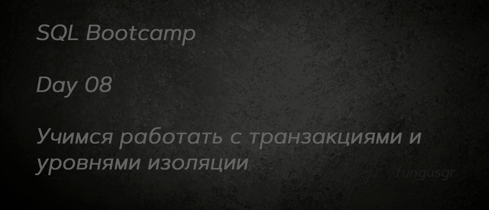  

## Содержимое

[Преамбула](#преамбула)   
[Общие правила](#общие-правила)    
[Пояснения к таблицам](#пояснения-к-таблицам)   
[Exercise 00 - Simple transaction](#exercise-00)  
[Exercise 01 - Lost Update Anomaly](#exercise-01)  
[Exercise 02 - Lost Update for Repeatable Read](#exercise-02)  
[Exercise 03 - Non-Repeatable Reads Anomaly](#exercise-03)  
[Exercise 04 - Non-Repeatable Reads for Serialization](#exercise-04)  
[Exercise 05 - Phantom Reads Anomaly](#exercise-05)  
[Exercise 06 - Phantom Reads for Repeatable Read](#exercise-06)  
[Exercise 07 - Deadlock](#exercise-07)  
      


## Преамбула


Лестница Пенроуза или ступени Пенроуза, также называемая невозможной лестницей, - это невозможный объект, созданный Лайонелом Пенроузом и его сыном Роджером Пенроузом. Вариация треугольника Пенроуза, это двумерное изображение лестницы, в которой ступени совершают четыре поворота на 90 градусов при подъеме или спуске, но при этом образуют непрерывную петлю, так что человек мог бы подниматься по ним вечно и никогда не подняться выше. Очевидно, что это невозможно в трех измерениях. "Непрерывная лестница" впервые была представлена в статье, которую Пенроузы написали в 1959 году, основанной на так называемом "треугольнике Пенроуза", опубликованном Роджером Пенроузом в Британском журнале психологии в 1958 году. 

“Лестница Пенроуза” - это математическая аномалия, на самом деле теория баз данных имеет 4 фундаментальных аномалии данных (физические аномалии).
- Аномалия потерянного обновления
- Аномалия грязного чтения
- Аномалия неповторяемого чтения
- Аномалия фантомного чтения

Поэтому в стандарте ANSI SQL существуют различные уровни изоляции, которые предотвращают известные аномалии.

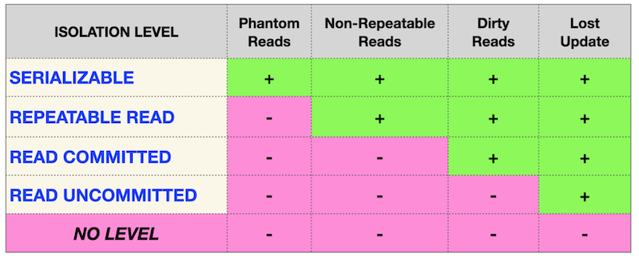

С одной стороны, эта матрица должна быть стандартной для каждой реляционной базы данных, но реальность... выглядит немного по-другому.

|  |  | |
| ------ | ------ | ------ |
| PostgreSQL | 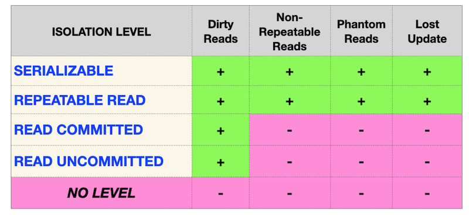 |
| Oracle |  |
| MySQL |  |

В настоящее время ИТ-сообщество обнаружило ряд новых аномалий, основанных на модели базы данных (логический вид)
- Аномалия перекоса чтения
- Аномалия перекоса записи
- Аномалия сериализации
- Аномалия веерных ловушек
- Аномалия ловушек пропасти 
- Аномалия циклов модели данных
- и т.д.


### Общие правила

- Убедитесь, что используете последнюю версию PostgreSQL.  
- Для оценки ваше решение должно находиться в репозитории git, в ветке develop и папке src.  
- Вы не должны оставлять в своей директории никаких других файлов, кроме тех, которые явно указаны в инструкциях по упражнению.   
- Убедитесь, что у вас есть собственная база данных и доступ к ней в вашем кластере PostgreSQL.
- Скачайте [script](materials/model.sql) с моделью базы данных здесь и примените скрипт к своей базе данных (вы можете использовать командную строку с psql или просто запустить его через любую среду IDE, например DataGrip от JetBrains или pgAdmin от PostgreSQL community).
- Все задачи содержат список разрешенных и запрещенных разделов с перечисленными параметрами базы данных, типами баз данных, конструкциями SQL и т.д.  
- И да пребудет с вами SQL-сила!
- Абсолютно все может быть представлено в SQL! Давайте начнем и повеселимся!


## Пояснения к таблицам

**Все изменения, которые вы внесли в День 03 и в День 04, должны быть на месте.**

- Пожалуйста, убедитесь, что у вас есть собственная база данных и доступ к ней в вашем кластере PostgreSQL.
- Пожалуйста, скачайте [скрипт](materials/model.sql) с моделью базы данных здесь и примените скрипт к своей базе данных (вы можете использовать командную строку с psql или просто запустить его через любую среду IDE, например DataGrip от JetBrains или pgAdmin от PostgreSQL community).
- Все задачи содержат список разрешенных и запрещенных разделов с перечисленными параметрами базы данных, типами баз данных, конструкциями SQL и т.д. Пожалуйста, ознакомьтесь с разделом перед началом.
- Пожалуйста, взгляните на логический вид нашей модели базы данных.


1. Таблица **pizzeria** (таблица-справочник с доступными пиццериями)
- id - первичный ключ
- name - название пиццерии
- rating - средняя оценка пиццерии (от 0 до 5 баллов)
2. Таблица **person** (таблица словаря с лицами, которые любят пиццу)
- id - первичный ключ
- name - имя человека
- age - возраст человека
- gender - пол человека
- address - адрес человека
3. Таблица **menu** (таблица-словарь с доступным меню и ценой на конкретную пиццу)
- id - первичный ключ
- pizzeria_id - внешний ключ для пиццерии
- pizza_name - название пиццы в пиццерии
- price - цена конкретной пиццы
4. Таблица **person_visits** (оперативная таблица с информацией о посещениях пиццерии)
- id - первичный ключ
- person_id - внешний ключ для человека
- pizzeria_id - внешний ключ для пиццерии
- visit_date - дата (например, 2022-01-01) посещения человека
5. Таблица **person_order** (Оперативная таблица с информацией о заказах людей)
- id - первичный ключ
- person_id - внешний ключ к person
- menu_id - внешний ключ к меню
- order_date - дата (например, 2022-01-01) заказа человека

Посещение человека и заказ человека являются разными объектами и не содержат никакой корреляции между данными.   
Например, клиент может находиться в одном ресторане (просто просматривая меню) и в это время сделать заказ в другом по телефону или с помощью мобильного приложения.   
Или в другом случае просто быть дома и снова позвонить с заказом без каких-либо посещений.  


## Exercise 00

| Exercise 00: Simple transaction |                                                                                                                          |
|---------------------------------------|--------------------------------------------------------------------------------------------------------------------------|
| Turn-in directory                     | ex00                                                                                                                     |
| Files to turn-in                      | `day08_ex00.sql` with comments for Session #1, Session #2 statements; screenshot of psql output for Session #1; screenshot of psql output for Session #2 |
| **Allowed**                               |                                                                                                                          |
| Language                        |  SQL|

Пожалуйста, для этой задачи используйте командную строку для базы данных PostgreSQL (psql).   
Вам нужно проверить, как ваши изменения будут опубликованы в базе данных для других пользователей базы данных. 

На самом деле, нам нужны две активные сессии (имеется в виду 2 параллельных сессии в командных строках). 

Пожалуйста, предоставьте подтверждение того, что ваша параллельная сессия не сможет увидеть ваши изменения, пока вы не сделаете `COMMIT`;

Ознакомьтесь с приведенными ниже шагами.

**Сессия #1**
- обновление рейтинга “Pizza Hut” до 5 баллов в режиме транзакции.
- убедитесь, что вы можете видеть изменения в сеансе #1

**Сеанс #2**
- убедитесь, что вы не видите изменений в сеансе №2

**Сеанс №1**
- опубликуйте свои изменения для всех параллельных сеансов.

**Сеанс №2**
- убедитесь, что вы можете видеть изменения в сеансе №2


Итак, взгляните на пример моих выходных данных для сеанса №2.

    pizza_db=> select * from pizzeria where name  = 'Pizza Hut';
    id |   name    | rating
    ----+-----------+--------
    1 | Pizza Hut |    4.6
    (1 row)

    pizza_db=> select * from pizzeria where name  = 'Pizza Hut';
    id |   name    | rating
    ----+-----------+--------
    1 | Pizza Hut |      5
    (1 row)

Вы можете видеть, что один и тот же запрос возвращает разные результаты, потому что первый был запущен перед публикацией в сеансе#1, а второй был запрошен после завершения сеанса#1.

<details>
  <summary>Решение</summary>
</p>

```sql
-- начать транзакцию
BEGIN;

-- обновление рейтинга "Pizza Hut" до 5 баллов
UPDATE pizzeria SET rating = 5 WHERE name = 'Pizza Hut';

-- убедиться, что изменения видны/не видны
SELECT * FROM pizzeria WHERE name = 'Pizza Hut';

-- опубликовать изменения для всех параллельных сессий
COMMIT;
```

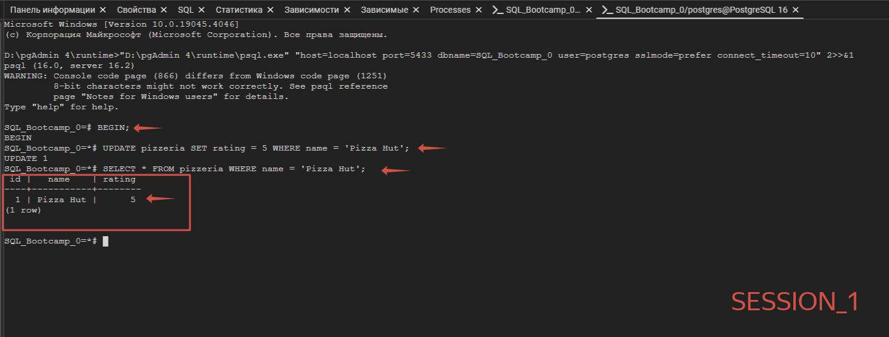  
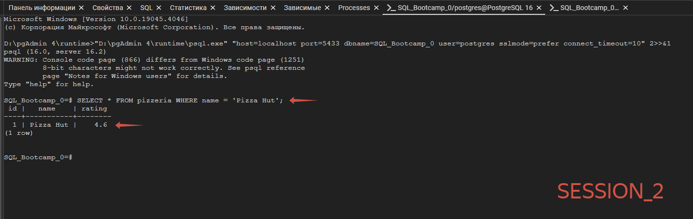 
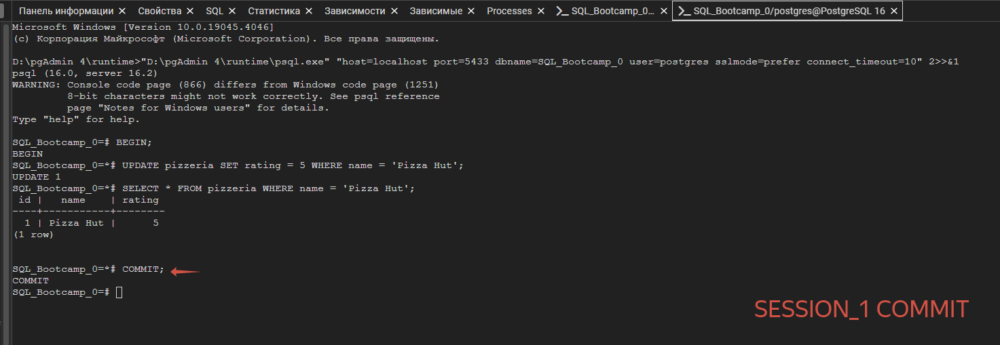 
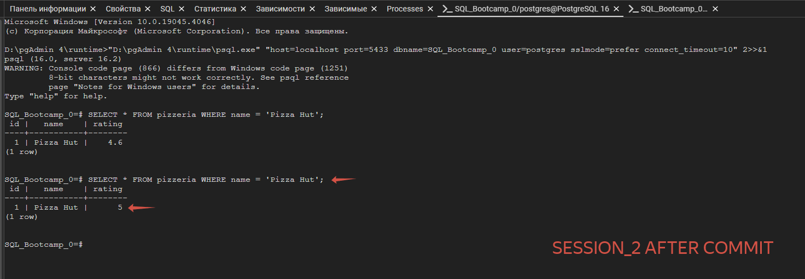 

</p>
</details>


## Exercise 01

| Exercise 01: Lost Update Anomaly|                                                                                                                          |
|---------------------------------------|--------------------------------------------------------------------------------------------------------------------------|
| Turn-in directory                     | ex01                                                                                                                     |
| Files to turn-in                      | `day08_ex01.sql` with comments for Session #1, Session #2 statements; screenshot of psql output for Session #1; screenshot of psql output for Session #2                                                                                 |
| **Allowed**                               |                                                                                                                          |
| Language                        |  SQL                                                                                              |

Пожалуйста, для этой задачи используйте командную строку для базы данных PostgreSQL (psql). Вам нужно проверить, как ваши изменения будут опубликованы в базе данных для других пользователей базы данных. 

На самом деле, нам нужны две активные сессии (имеется в виду 2 параллельных сессии в командных строках). 

Перед выполнением задачи убедитесь, что в вашей базе данных установлен уровень изоляции по умолчанию. Просто запустите следующую инструкцию

`SHOW TRANSACTION ISOLATION LEVEL;`

и результатом должно быть “read committed”;

Если нет, то, пожалуйста, явно установите уровень изоляции “read committed” на уровне сеанса.

|  |  |
| ------ | ------ |
| Давайте проверим один из известных шаблонов базы данных “Аномалия потерянного обновления”. Вы можете увидеть графическое представление этой аномалии на картинке. Горизонтальная красная линия означает окончательные результаты после всех последовательных шагов для обоих сеансов. |  |

Пожалуйста, проверьте рейтинг “Pizza Hut” в режиме транзакции для обоих сеансов, а затем `UPDATE` рейтинг до значения 4 в сеансе №1 и `UPDATE` рейтинг до значения 3,6 в сеансе №2 (в том же порядке, что и на картинке).

<details>
  <summary>Решение</summary>
</p>

Сценарий представляет аномалию потерянного обновления (Lost Update Anomaly), которая возникает, когда две транзакции одновременно читают одни и те же данные, после чего производят обновление этих данных без учета изменений, сделанных другой транзакцией между чтением и обновлением. Это может привести к тому, что изменения одной транзакции перезапишут изменения другой транзакции, что приведет к потере данных.

После завершения обеих сессий можно проанализировать результаты и посмотреть возникнет ли потеря данных из-за одновременного обновления одной и той же записи в разных транзакциях без учета изменений сделанных другой транзакцией.

Появление аномалии потерянного обновления будет видно в том случае, если изменения, внесенные одной из сессий, затрут изменения, внесенные другой сессией, что приведет к непредсказуемым и потенциально нежелательным результатам в базе данных.

> В контексте баз данных, термин "tuple" относится к структуре данных, которая представляет собой строку в таблице. Каждый кортеж (tuple) представляет собой набор значений, соответствующих различным столбцам в таблице базы данных. В сущности, он представляет собой одну запись в базе данных.
> 
> Например, если у вас есть таблица "person" с колонками "id", "name", "age", и "gender", то каждая строка (или кортеж) в этой таблице представляет собой набор значений для каждого из этих столбцов для конкретного человека. Таким образом, каждая строка в таблице "person" является кортежем.
> 
> В работе с базами данных, операции SELECT и UPDATE позволяют выбирать (SELECT) и обновлять (UPDATE) значения конкретных кортежей в таблице.
> 
> Таким образом, "tuple" - это просто строка данных в базе данных, которая содержит значения для различных полей или столбцов

```sql
-- SESSION_1
BEGIN; 
SELECT rating FROM pizzeria WHERE name = 'Pizza Hut';
UPDATE pizzeria SET rating = 4 WHERE name = 'Pizza Hut';
COMMIT;
SELECT rating FROM pizzeria WHERE name = 'Pizza Hut';

-- SESSION_2
BEGIN;
SELECT rating FROM pizzeria WHERE name = 'Pizza Hut';
UPDATE pizzeria SET rating = 3.6 WHERE name = 'Pizza Hut';
COMMIT;
SELECT rating FROM pizzeria WHERE name = 'Pizza Hut';
```

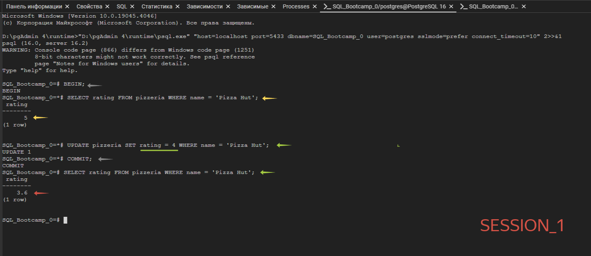  
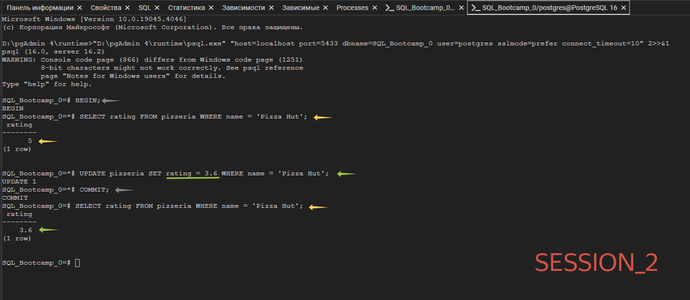 

</p>
</details>


## Exercise 02

| Exercise 02: Lost Update for Repeatable Read|                                                                                                                          |
|---------------------------------------|--------------------------------------------------------------------------------------------------------------------------|
| Turn-in directory                     | ex02                                                                                                                     |
| Files to turn-in                      | `day08_ex02.sql` with comments for Session #1, Session #2 statements; screenshot of psql output for Session #1; screenshot of psql output for Session #2                                                                                  |
| **Allowed**                               |                                                                                                                          |
| Language                        |  SQL                                                                                              |

Пожалуйста, для этой задачи используйте командную строку для базы данных PostgreSQL (psql). Вам нужно проверить, как ваши изменения будут опубликованы в базе данных для других пользователей базы данных. 

На самом деле, нам нужны две активные сессии (имеется в виду 2 параллельных сессии в командных строках).

|  |  |
| ------ | ------ |
| Давайте проверим один из известных шаблонов базы данных “Аномалия потерянного обновления”, но с уровнем изоляции `REPEATABLE READ`. Вы можете увидеть графическое представление этой аномалии на картинке. Горизонтальная красная линия означает окончательные результаты после всех последовательных шагов для обоих сеансов.|  |

Пожалуйста, проверьте рейтинг “Pizza Hut” в режиме транзакции для обоих сеансов, а затем `UPDATE` рейтинг до значения 4 в сеансе №1 и `UPDATE` рейтинг до значения 3,6 в сеансе №2 (в том же порядке, что и на картинке).

<details>
  <summary>Решение</summary>
</p>

> Команда "SET TRANSACTION ISOLATION LEVEL REPEATABLE READ;" устанавливает уровень изоляции транзакций REPEATABLE READ для текущей сессии в базе данных.
> 
> Уровень изоляции REPEATABLE READ гарантирует, что результаты всех SELECT-операций в течение транзакции будут неизменными, даже если другая транзакция модифицирует данные, с которыми работает первая транзакция. Это достигается путем блокировики прочитанных данных, чтобы другие транзакции не могли модифицировать или вставлять данные до завершения первой транзакции.
> 
> Таким образом, уровень REPEATABLE READ предотвращает появление фантомных (новых) строк данных и обеспечивает стабильность результатов SELECT-операций в рамках транзакции в течение ее выполнения, обеспечивая консистентность и предсказуемость работы с данными.

```sql
-- Сессия №1
BEGIN;
SET TRANSACTION ISOLATION LEVEL REPEATABLE READ;
SELECT rating FROM pizzeria WHERE name = 'Pizza Hut';
UPDATE pizzeria SET rating = 4 WHERE name = 'Pizza Hut';
COMMIT;
SELECT rating FROM pizzeria WHERE name = 'Pizza Hut';

-- Сессия №2
BEGIN;
SET TRANSACTION ISOLATION LEVEL REPEATABLE READ;
SELECT rating FROM pizzeria WHERE name = 'Pizza Hut';
UPDATE pizzeria SET rating = 3.6 WHERE name = 'Pizza Hut';
COMMIT;
SELECT rating FROM pizzeria WHERE name = 'Pizza Hut';
```

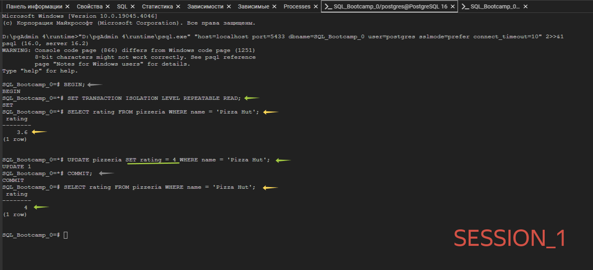  
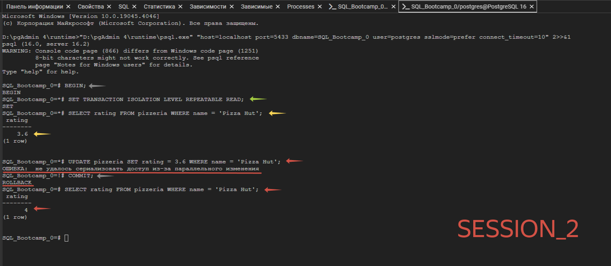

</p>
</details>


## Exercise 03

| Exercise 03: Non-Repeatable Reads Anomaly |                                                                                                                          |
|---------------------------------------|--------------------------------------------------------------------------------------------------------------------------|
| Turn-in directory                     | ex03                                                                                                                     |
| Files to turn-in                      | `day08_ex03.sql` with comments for Session #1, Session #2 statements; screenshot of psql output for Session #1; screenshot of psql output for Session #2                                                                                 |
| **Allowed**                               |                                                                                                                          |
| Language                        |  SQL                                                                                              |

Пожалуйста, для этой задачи используйте командную строку для базы данных PostgreSQL (psql). Вам нужно проверить, как ваши изменения будут опубликованы в базе данных для других пользователей базы данных. 

На самом деле, нам нужны две активные сессии (имеется в виду 2 параллельных сессии в командных строках). 

|  |  |
| ------ | ------ |
| Давайте проверим один из известных шаблонов базы данных “Неповторяемые чтения”, но с уровнем изоляции `READ COMMITTED`. Вы можете увидеть графическое представление этой аномалии на картинке. Горизонтальная красная линия означает окончательные результаты после всех последовательных шагов для обоих сеансов. |  |

Пожалуйста, проверьте рейтинг “Pizza Hut” в режиме транзакции для сеанса №1 и после этого произведите `UPDATE` рейтинга до значения 3,6 в сеансе №2 (в том же порядке, что и на картинке). 

<details>
  <summary>Решение</summary>
</p>

> Смысл аномалии "Неповторимого чтения" заключается в том, что при использовании уровня изоляции транзакций, который не гарантирует повторяемость чтения (например, уровень изоляции READ COMMITTED), другие транзакции могут изменять данные между последовательными операциями чтения в рамках одной и той же транзакции.
> 
> Основной прикол этой аномалии заключается в том, что данные пользователя могут изменяться, когда тот выполняет последовательные операции чтения внутри транзации. Например, если транзакция сначала считывет значение A, а затем считывает его снова, другая транзакция между этими двумя операциями может изменить значение A, что приведет к получению разных результатов при последующем чтении значения A в пределах одной транзакции.
> 
> Эта аномалия подчеркивает важность выбора подходящего уровня изоляции транзакций в зависимости от специфики приложения и требуемой консистентности данных. Понимание и учет подобных аномалий является ключевым для разработчиков баз данных и позволяет эффективно управлять целостностью данных в многопользовательской среде.

```sql
-- Сессия №1
BEGIN;
SET TRANSACTION ISOLATION LEVEL READ COMMITTED;
SELECT rating FROM pizzeria WHERE name = 'Pizza Hut';
SELECT rating FROM pizzeria WHERE name = 'Pizza Hut';
COMMIT;
SELECT rating FROM pizzeria WHERE name = 'Pizza Hut';

-- Сессия 2
BEGIN;
SET TRANSACTION ISOLATION LEVEL READ COMMITTED;
UPDATE pizzeria SET rating = 3.6 WHERE name = 'Pizza Hut';
COMMIT;
SELECT rating FROM pizzeria WHERE name = 'Pizza Hut';
```

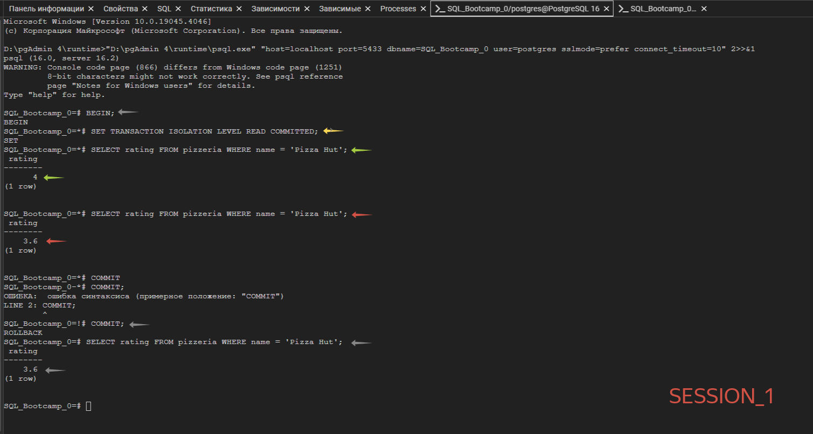  
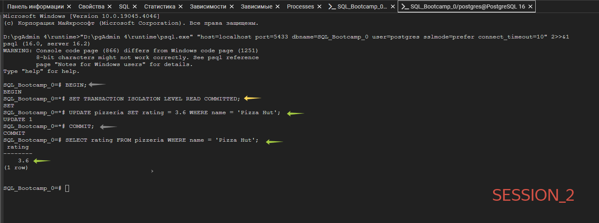

</p>
</details>


## Exercise 04

| Exercise 04: Non-Repeatable Reads for Serialization |                                                                                                                          |
|---------------------------------------|--------------------------------------------------------------------------------------------------------------------------|
| Turn-in directory                     | ex04                                                                                                                     |
| Files to turn-in                      | `day08_ex04.sql` with comments for Session #1, Session #2 statements; screenshot of psql output for Session #1; screenshot of psql output for Session #2                                                                                 |
| **Allowed**                               |                                                                                                                          |
| Language                        |  SQL                                                                                              |

Пожалуйста, для этой задачи используйте командную строку для базы данных PostgreSQL (psql). Вам нужно проверить, как ваши изменения будут опубликованы в базе данных для других пользователей базы данных. 

На самом деле, нам нужны две активные сессии (имеется в виду 2 параллельных сессии в командных строках).

|  |  |
| ------ | ------ |
| Давайте проверим один из известных шаблонов базы данных “Неповторяемое чтение”, но с уровнем изоляции `SERIALIZABLE`. Вы можете увидеть графическое представление этой аномалии на картинке. Горизонтальная красная линия означает окончательные результаты после всех последовательных шагов для обоих сеансов.|  |

Пожалуйста, проверьте рейтинг “Pizza Hut” в режиме транзакции для сеанса №1 и после этого произведите `UPDATE` рейтинга до значения 3.0 в сеансе №2 (в том же порядке, что и на картинке).

<details>
  <summary>Решение</summary>
</p>

> Уровень изоляции SERIALIZABLE гарантирует высший уровень изоляции в базе данных, предотвращая различные виды аномалий чтения, включая "Неповторяемое чтение".
> 
> При установке уровня изоляции SERIALIZABLE транзакции выполняются таким образом, что они будут обрабатывать данные так, как если бы одна транзакция была выполнена целиком до другой. Это означает, что никакие другие транзакции не смогут внести изменения в данные, с которыми работает текущая транзакция, пока она не будет завершена. Это обеспечивает высокую степень защиты от конфликтов параллельных транзакций и аномалий чтения.

```sql
-- Сессия №1
BEGIN;
SET TRANSACTION ISOLATION LEVEL SERIALIZABLE;
SELECT rating FROM pizzeria WHERE name = 'Pizza Hut';
SELECT rating FROM pizzeria WHERE name = 'Pizza Hut';
COMMIT;
SELECT rating FROM pizzeria WHERE name = 'Pizza Hut';

-- Сессия №2
BEGIN;
SET TRANSACTION ISOLATION LEVEL SERIALIZABLE;
UPDATE pizzeria SET rating = 3.0 WHERE name = 'Pizza Hut';
COMMIT;
SELECT rating FROM pizzeria WHERE name = 'Pizza Hut';
```

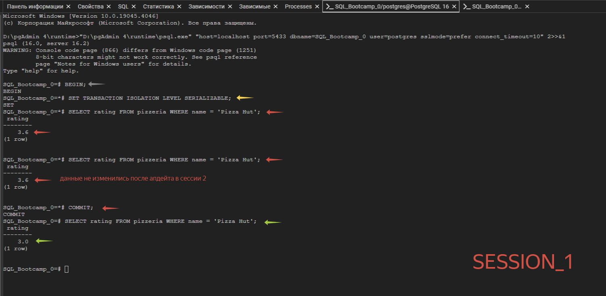  
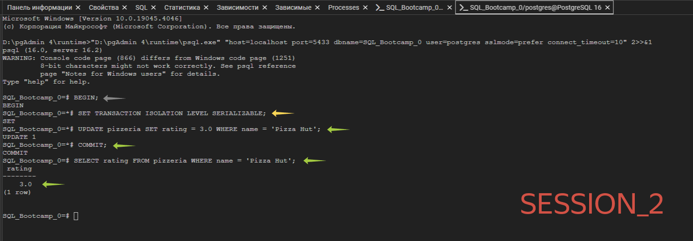

</p>
</details>


## Exercise 05

| Exercise 05: Phantom Reads Anomaly|                                                                                                                          |
|---------------------------------------|--------------------------------------------------------------------------------------------------------------------------|
| Turn-in directory                     | ex05                                                                                                                     |
| Files to turn-in                      | `day08_ex05.sql`  with comments for Session #1, Session #2 statements; screenshot of psql output for Session #1; screenshot of psql output for Session #2                                                                                 |
| **Allowed**                               |                                                                                                                          |
| Language                        |   SQL                                                                                              |

Пожалуйста, для этой задачи используйте командную строку для базы данных PostgreSQL (psql). Вам нужно проверить, как ваши изменения будут опубликованы в базе данных для других пользователей базы данных. 

На самом деле, нам нужны две активные сессии (имеется в виду 2 параллельных сессии в командных строках).

|  |  |
| ------ | ------ |
| Давайте проверим один из известных шаблонов базы данных “Фантомное чтение”, но с уровнем изоляции `READ COMMITTED`. Вы можете увидеть графическое представление этой аномалии на картинке. Горизонтальная красная линия означает окончательные результаты после всех последовательных шагов для обоих сеансов.|  |

Пожалуйста, суммируйте все оценки для всех пиццерий в режиме транзакции для сеанса №1 и после этого `UPDATE` рейтинг до значения 1 для ресторана "Pizza Hut" в сеансе №2 (в том же порядке, что и на картинке).

 <details>
  <summary>Решение</summary>
</p>

> Эти действия создают ситуацию, при которой первый сеанс увидит фантомные данные, так как после первой транзакции во второй сессии суммарная оценка для всех пиццерий уже не будет актуальной из-за изменения в ресторане "Pizza Hut".
> 
> Это помогает понять, почему уровень изоляции READ COMMITTED не предотвращает возникновение данной аномалии.  

```sql
-- Сессия №1
BEGIN;
SET TRANSACTION ISOLATION LEVEL READ COMMITTED;
SELECT SUM(rating) FROM pizzeria;
SELECT SUM(rating) FROM pizzeria;
COMMIT;
SELECT SUM(rating) FROM pizzeria;

-- Сессия №2
BEGIN;
SET TRANSACTION ISOLATION LEVEL READ COMMITTED;
UPDATE pizzeria SET rating = 1 WHERE name = 'Pizza Hut';
COMMIT;
SELECT SUM(rating) FROM pizzeria;
```

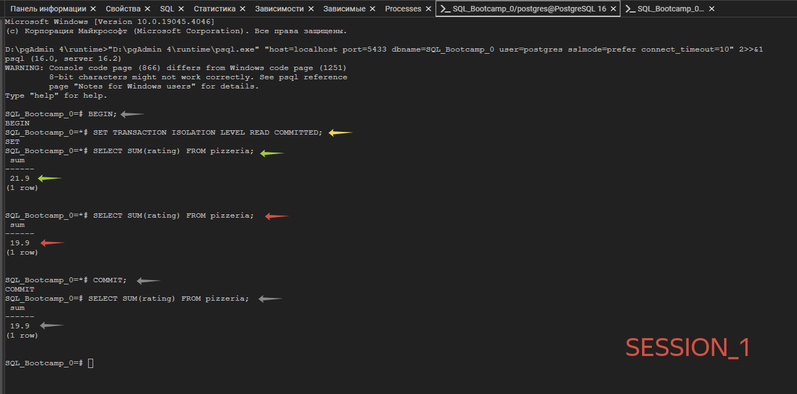  
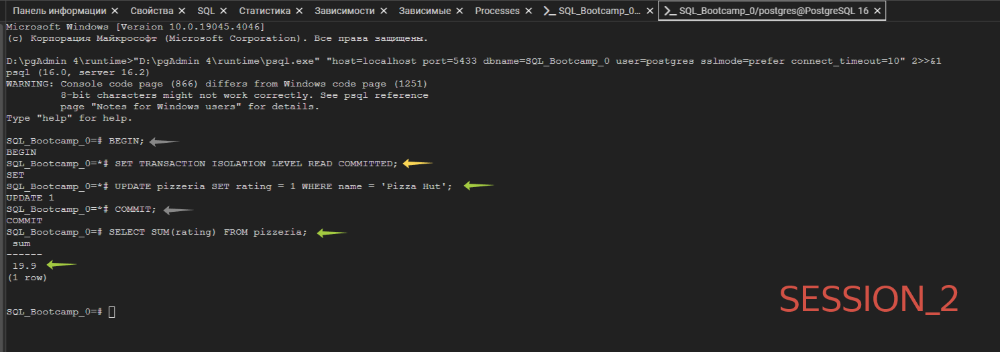

</p>
</details>


## Exercise 06

| Exercise 06: Phantom Reads for Repeatable Read|                                                                                                                          |
|---------------------------------------|--------------------------------------------------------------------------------------------------------------------------|
| Turn-in directory                     | ex06                                                                                                                     |
| Files to turn-in                      | `day08_ex06.sql`  with comments for Session #1, Session #2 statements; screenshot of psql output for Session #1; screenshot of psql output for Session #2                                                                                 |
| **Allowed**                               |                                                                                                                          |
| Language                        |  SQL                                                                                              |

Пожалуйста, для этой задачи используйте командную строку для базы данных PostgreSQL (psql). Вам нужно проверить, как ваши изменения будут опубликованы в базе данных для других пользователей базы данных. 

На самом деле, нам нужны две активные сессии (имеется в виду 2 параллельных сессии в командных строках).

|  |  |
| ------ | ------ |
| Давайте проверим один из известных шаблонов базы данных “фантомного чтения”, но с уровнем изоляции `REPEATABLE READ`. Вы можете увидеть графическое представление этой аномалии на картинке. Горизонтальная красная линия означает окончательные результаты после всех последовательных шагов для обоих сеансов.|  |


Пожалуйста, суммируйте все оценки для всех пиццерий в режиме транзакции для сеанса №1 и после этого `UPDATE` рейтинг до значения 5 для ресторана "Pizza Hut" в сеансе №2 (в том же порядке, что и на картинке).

<details>
  <summary>Решение</summary>
</p>

> При использовании уровня изоляции REPEATABLE READ, первый сеанс не увидит фантомные данные из-за специфики этого уровня изоляции.   
Уровень изоляции REPEATABLE READ гарантирует, что каждый запрос в пределах транзакционной границы будет видеть те же данные, что и при начале транзакции, несмотря на изменения, внесенные другими транзакциями.

```sql
-- Сессия №1
BEGIN;
SET TRANSACTION ISOLATION LEVEL REPEATABLE READ;
SELECT SUM(rating) FROM pizzeria;
SELECT SUM(rating) FROM pizzeria;
COMMIT;
SELECT SUM(rating) FROM pizzeria;

-- Сессия №2
BEGIN;
SET TRANSACTION ISOLATION LEVEL REPEATABLE READ;
UPDATE pizzeria SET rating = 5 WHERE name = 'Pizza Hut';
COMMIT;
SELECT SUM(rating) FROM pizzeria;
```

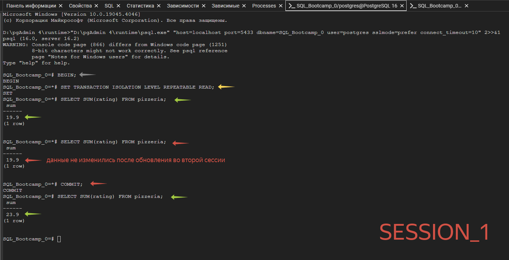  
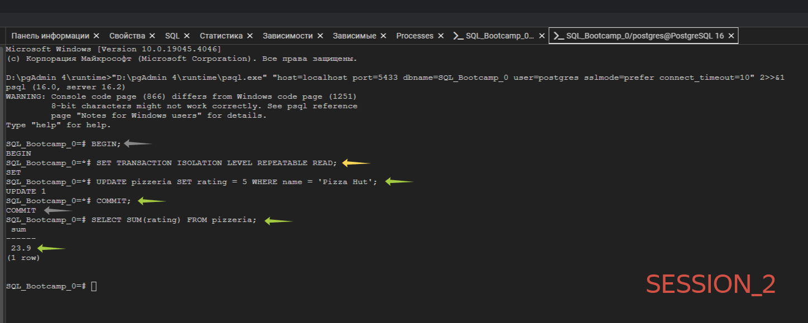

</p>
</details>


## Exercise 07

| Exercise 07: Deadlock|                                                                                                                          |
|---------------------------------------|--------------------------------------------------------------------------------------------------------------------------|
| Turn-in directory                     | ex07                                                                                                                     |
| Files to turn-in                      | `day08_ex07.sql`    with comments for Session #1, Session #2 statements; screenshot of psql output for Session #1; screenshot of psql output for Session #2                                                                                |
| **Allowed**                               |                                                                                                                          |
| Language                        |  SQL                                                                                              |

Пожалуйста, для этой задачи используйте командную строку для базы данных PostgreSQL (psql). Вам нужно проверить, как ваши изменения будут опубликованы в базе данных для других пользователей базы данных. 

На самом деле, нам нужны две активные сессии (имеется в виду 2 параллельных сессии в командных строках). 


|  |  |
| ------ | ------ |
| Давайте воспроизведем тупиковую ситуацию в нашей базе данных. Вы можете увидеть графическое представление тупиковой ситуации на картинке. Выглядит как “перекрестная блокировка” между параллельными сеансами. |  |


Пожалуйста, напишите любую инструкцию SQL с любым уровнем изоляции (вы можете использовать настройку по умолчанию) в таблице `pizzeria`, чтобы воспроизвести эту тупиковую ситуацию.

<details>
  <summary>Решение</summary>
</p>

> Запросы этих сессий приводят к тупиковой ситуации или deadlock.
> 
> Тупиковая ситуация обычно возникает, когда два или более процесса блокируют друг друга, ожидая освобождения ресурсов, занятых другим процессом.   
В нашем примере, первая сессия блокирует строки с id=1, затем пытается обновить строку с id=2, в то время как вторая сессия блокирует строки с id=2 и затем пытается обновить строку с id=1.
> 
> Это приводит к ситуации, когда обе сессии ждут освобождения ресурсов, которые блокируют друг друга, что создает патовую ситацию.   
Каждая сессия будет ждать другую, чтобы освободить заблокированный ресурс, что приведет к бесконечному ожиданию и блокировке, или тупиковой ситуации.

```sql
-- Сессия №1
BEGIN;
UPDATE pizzeria SET rating = 4.99 WHERE id = 1;
UPDATE pizzeria SET rating = 4.99 WHERE id = 2;
COMMIT;
SELECT * FROM pizzeria WHERE id IN (1,2);

-- Сессия №2
BEGIN;
UPDATE pizzeria SET rating = 3.99 WHERE id = 2;
UPDATE pizzeria SET rating = 3.99 WHERE id = 1;
COMMIT;
SELECT * FROM pizzeria WHERE id IN (1,2);

-- Вернуть изменения в рейтинге
BEGIN;
UPDATE pizzeria SET rating = 5 WHERE id = 1; -- pizzeria.id 1 это Pizza Hut с рейтингом 5
UPDATE pizzeria SET rating = 4.3 WHERE id = 2; -- pizzeria.id 2 это Dominos с рейтингом 4.3
COMMIT;
SELECT * FROM pizzeria WHERE id IN (1,2);
```

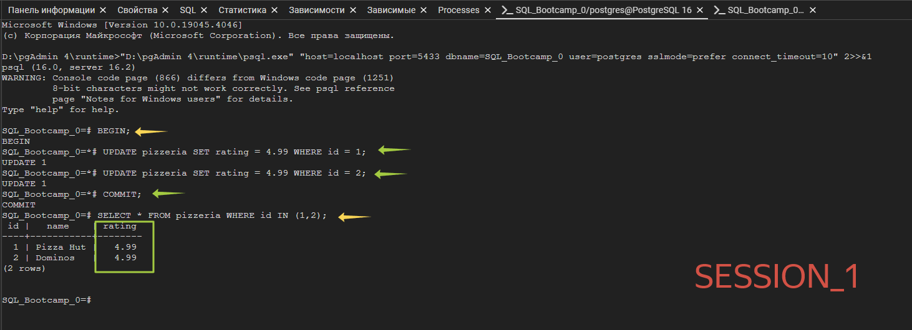  
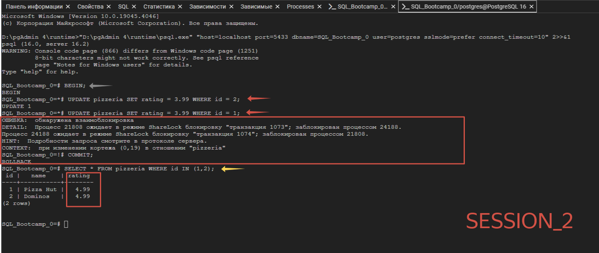

</p>
</details>
