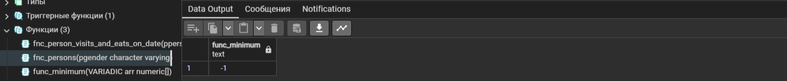

  


## Содержимое

[Преамбула](#преамбула)   
[Общие правила](#общие-правила)    
[Пояснения к таблицам](#пояснения-к-таблицам)    
[Exercise 00 - Audit of incoming inserts](#exercise-00)  
[Exercise 01 - Audit of incoming updates](#exercise-01)  
[Exercise 02 - Audit of incoming deletes](#exercise-02)  
[Exercise 03 - Generic Audit](#exercise-03)   
[Exercise 04 - Database View VS Database Function](#exercise-04)  
[Exercise 05 - Parameterized Database Function](#exercise-05)  
[Exercise 06 - Function like a function-wrapper](#exercise-06)  
[Exercise 07 - Different view to find a Minimum](#exercise-07)  
[Exercise 08 - Fibonacci algorithm is in a function](#exercise-08)     
      

## Преамбула


В мире СУБД существует множество функциональных языков программирования. В основном мы можем говорить о взаимно однозначной зависимости между конкретным ядром СУБД и функциональным языком внутри него. Пожалуйста, взгляните на примеры этих языков:
- T-SQL,
- PL/SQL,
- SQL,
- PL/PGSQL,
- PL/R,
- PL/Python,
- и т.д.

На самом деле, в мире ИТ существует два противоположных мнения о том, где должна располагаться бизнес-логика. Первое мнение относится к прикладному уровню, второе - к СУБД, непосредственно основанной на наборе UDF (определяемых пользователем функций / процедур / пакетов). 
Каждый выбирает свой собственный способ реализации бизнес-логики. С нашей точки зрения, бизнес-логика должна быть в обоих местах, и мы можем рассказать вам почему.  
Пожалуйста, взгляните на 2 простые архитектуры ниже.

|  |  |
| ------ | ------ |
|  | Все понятно, интерфейсы и бэкенды работают через специальный уровень REST API, который реализует всю бизнес-логику. Это действительно идеальный мир приложений. |
| Но всегда есть какие-то привилегированные люди / приложения (например, IDEA), которые работают напрямую с нашими базами данных и... наш шаблон может быть нарушен. |  |

Важно отделять бизнес-логику от слоя доступа к данным на уровне приложений, чтобы управлять функциональностью и обеспечить чистоту данных.  
Одновременно, также важно убедиться, что бизнес-логика, особенно критическая и общая, организована и безопасна на уровне базы данных с использованием UDF, чтобы обеспечить целостность данных и управлять разделением обязанностей.  
Конечно, конкретный способ организации бизнес-логики будет зависеть от требований и особенностей конкретного приложения, но важно рассматривать оба аспекта - на уровне приложения и в базе данных - в целях разработки эффективной и устойчивой архитектуры.  

### Функции баз данных и "чистая архитектура"

В чистой архитектуре функции баз данных играют важную роль в обеспечении следующих принципов и концепций:  

**Отделение ответственностей (Separation of Concerns)**  
Функции баз данных, такие как триггеры, хранимые процедуры и функции, позволяют отделить бизнес-логику от слоя доступа к данным.   
Это помогает создать четкую границу между операциями, которые относятся к обработке данных, и операциями, которые относятся к бизнес-логике приложения.  

**Однозначность (Single Responsibility Principle)**  
Каждая функция базы данных должна быть ответственной за конкретное действие или операцию, такую как аудит, валидация данных или преобразование.   
Это соответствует принципу единой ответственности, который является ключевым аспектом чистой архитектуры.  

**Соблюдение бизнес-правил**  
Функции баз данных могут содержать проверки целостности данных, валидацию и обработку бизнес-правил.   
Это помогает обеспечить, что данные сохраняют свою правильность и соответствуют требованиям бизнес-логики, что является важной составляющей чистой архитектуры.  

**Минимизация дублирования кода (Minimization of Duplication)**  
Использование функций баз данных позволяет уменьшить дублирование кода и обеспечить единый источник правды при работе с данными.   
Это соответствует принципу достижения единственной точки входа, что способствует поддержанию чистоты архитектуры.  

**Тестируемость (Testability)**  
Функции баз данных могут быть модульно протестированы для обеспечения корректности их работы.   
Это позволяет разработчикам убедиться в правильности функциональности и обеспечить надежность при работе с данными, что является важным аспектом чистой архитектуры.  

Таким образом, функции баз данных играют важную роль в обеспечении чистой архитектуры, поскольку помогают разделять ответственности, обеспечивать единый источник правды, соблюдать бизнес-правила и минимизировать дублирование кода при работе с данными.


### Триггеры и функции баз данных

Триггеры и функции - это важные элементы баз данных, используемые для автоматизации определенных действий и обеспечения целостности данных.   

**Триггеры** - это специальные хранимые процедуры, которые выполняются автоматически при наступлении определенных событий в базе данных, таких как вставка, обновление или удаление записи в таблице.  
Основная цель триггеров - обеспечить автоматическое выполнение определенных действий или логики при возникновении определенных событий, что делает их полезными для внедрения бизнес-правил, ограничений целостности и многих других аспектов управления данными.  
Например, триггер может быть настроен на автоматическое обновление дополнительных таблиц или уведомление администратора при вставке новых данных.  

**Функции баз данных** - это набор инструкций, которые выполняют определенную задачу и могут принимать входные данные и возвращать результат.  
Функции позволяют выполнять сложные расчеты, обработку данных, валидацию, преобразования и многие другие операции, которые могут быть использованы в SQL-запросах, триггерах и других элементах баз данных.  
Например, функция может быть создана для расчета среднего возраста клиентов, обработки строковых данных или преобразования формата даты.  

В целом, триггеры и функции баз данных предоставляют мощный механизм автоматизации и обработки данных, что делает их важными инструментами для обеспечения целостности и эффективного управления данными в базах данных.  


### Общие правила

- Убедитесь, что используете последнюю версию PostgreSQL.  
- Для оценки ваше решение должно находиться в репозитории git, в ветке develop и папке src.  
- Вы не должны оставлять в своей директории никаких других файлов, кроме тех, которые явно указаны в инструкциях по упражнению.   
- Убедитесь, что у вас есть собственная база данных и доступ к ней в вашем кластере PostgreSQL.
- Скачайте [script](materials/model.sql) с моделью базы данных здесь и примените скрипт к своей базе данных (вы можете использовать командную строку с psql или просто запустить его через любую среду IDE, например DataGrip от JetBrains или pgAdmin от PostgreSQL community).
- Все задачи содержат список разрешенных и запрещенных разделов с перечисленными параметрами базы данных, типами баз данных, конструкциями SQL и т.д.  
- И да пребудет с вами SQL-сила!
- Абсолютно все может быть представлено в SQL! Давайте начнем и повеселимся!


## Пояснения к таблицам

**Все изменения, которые вы внесли в День 03 и в День 04, должны быть на месте.**

- Пожалуйста, убедитесь, что у вас есть собственная база данных и доступ к ней в вашем кластере PostgreSQL.
- Пожалуйста, скачайте [скрипт](materials/model.sql) с моделью базы данных здесь и примените скрипт к своей базе данных (вы можете использовать командную строку с psql или просто запустить его через любую среду IDE, например DataGrip от JetBrains или pgAdmin от PostgreSQL community).
- Все задачи содержат список разрешенных и запрещенных разделов с перечисленными параметрами базы данных, типами баз данных, конструкциями SQL и т.д. Пожалуйста, ознакомьтесь с разделом перед началом.
- Пожалуйста, взгляните на логический вид нашей модели базы данных.


1. Таблица **pizzeria** (таблица-справочник с доступными пиццериями)
- id - первичный ключ
- name - название пиццерии
- rating - средняя оценка пиццерии (от 0 до 5 баллов)

2. Таблица **person** (таблица словаря с лицами, которые любят пиццу)
- id - первичный ключ
- name - имя человека
- age - возраст человека
- gender - пол человека
- address - адрес человека

3. Таблица **menu** (таблица-словарь с доступным меню и ценой на конкретную пиццу)
- id - первичный ключ
- pizzeria_id - внешний ключ для пиццерии
- pizza_name - название пиццы в пиццерии
- price - цена конкретной пиццы

4. Таблица **person_visits** (оперативная таблица с информацией о посещениях пиццерии)
- id - первичный ключ
- person_id - внешний ключ для человека
- pizzeria_id - внешний ключ для пиццерии
- visit_date - дата (например, 2022-01-01) посещения человека

5. Таблица **person_order** (Оперативная таблица с информацией о заказах людей)
- id - первичный ключ
- person_id - внешний ключ к person
- menu_id - внешний ключ к меню
- order_date - дата (например, 2022-01-01) заказа человека

Посещение человека и заказ человека являются разными объектами и не содержат никакой корреляции между данными.   
Например, клиент может находиться в одном ресторане (просто просматривая меню) и в это время сделать заказ в другом по телефону или с помощью мобильного приложения.   
Или в другом случае просто быть дома и снова позвонить с заказом без каких-либо посещений.  


## Exercise 00

| Exercise 00: Audit of incoming inserts |                                                                                                                          |
|---------------------------------------|--------------------------------------------------------------------------------------------------------------------------|
| Turn-in directory                     | ex00                                                                                                                     |
| Files to turn-in                      | `day09_ex00.sql`                                                                                 |
| **Allowed**                               |                                                                                                                          |
| Language                        | SQL, DDL, DML|

Мы хотим лучше работать с данными и не хотим потерять ни одного события изменения. Давайте реализуем функцию аудита для входящих изменений `INSERT`.   
- создайте таблицу `person_audit` с той же структурой, что и таблица `person`, но, добавьте некоторые дополнительные изменения.   

Взгляните на приведенную ниже таблицу с описаниями для каждого столбца.

| Column | Type | Description |
| ------ | ------ | ------ |
| created | timestamp with time zone | временная метка при создании нового события. Значением по умолчанию является текущая временная метка **NOT NULL** |
| type_event | char(1) | возможные значения I (insert), D (delete), U (update). Значение по умолчанию ‘I’. **NOT NULL**. Добавьте контрольное ограничение `ch_type_event` с возможными значениями ‘I’, ‘U’ и ‘D’ |
| row_id |bigint | копия person.id. **NOT NULL** |
| name |varchar | копия person.name **без ограничений** |
| age |integer | копия person.age **без ограничений** |
| gender |varchar | копия person.gender **без ограничений** |
| address |varchar | копия person.address **без ограничений** |

- создайте триггерную функцию базы данных с именем `fnc_trg_person_insert_audit`, которая должна обработать DML-трафик `INSERT` и создать копию новой строки в таблице `person_audit`.

Если вы хотите реализовать триггер PostgreSQL, вам нужно создать 2 объекта: функцию запуска базы данных и триггер базы данных.  

Итак, пожалуйста, определите триггер базы данных с именем `trg_person_insert_audit` со следующими параметрами:  
- триггер с параметром "FOR EACH ROW" (ДЛЯ КАЖДОЙ СТРОКИ)
- триггер с параметром "AFTER INSERT" (ПОСЛЕ ВСТАВКИ)
- триггер вызывает триггерную функцию fnc_trg_person_insert_audit

Когда вы закончите с триггерными объектами, пожалуйста, выполните команду `INSERT` в таблицу person.
`INSERT INTO person(id, name, age, gender, address) VALUES (10,'Damir', 22, 'male', 'Irkutsk');`

<details>
  <summary>Решение</summary>
</p>

```sql
-- создание таблицы person_audit
CREATE TABLE person_audit (
       created 	TIMESTAMP WITH TIME ZONE DEFAULT CURRENT_TIMESTAMP NOT NULL,
				-- ограничиваем возможные значения колонки type_event с помощью CHECK
    type_event 	CHAR(1) DEFAULT 'I' NOT NULL CHECK (type_event IN ('I', 'U', 'D')),
        row_id 	BIGINT NOT NULL,
          name 	VARCHAR,
           age 	INTEGER DEFAULT 10,
        gender 	VARCHAR,
       address 	VARCHAR
);

-- cоздание триггерной функции для обработки трафика INSERT
CREATE OR REPLACE FUNCTION fnc_trg_person_insert_audit()
RETURNS TRIGGER AS $$ -- возвращаем триггер
		BEGIN
			-- добавляем новые данные в таблицу person_audit при операции вставки
			IF (TG_OP = 'INSERT') THEN
				INSERT INTO person_audit (row_id, name, age, gender, address)
				-- NEW представляет новую строку данных, сгенерированную при операции вставки
				VALUES (NEW.id, NEW.name, NEW.age, NEW.gender, NEW.address);
			END IF;
			RETURN NEW; -- возвращаем новую строку
		END;
$$ LANGUAGE plpgsql;


-- cоздание триггера
CREATE TRIGGER trg_person_insert_audit
AFTER INSERT ON person -- указывает, что триггер должен срабатывать после операции вставки в таблицу person
FOR EACH ROW -- гарантирует, что триггер будет выполняться отдельно для каждой вставленной строки данных
EXECUTE FUNCTION fnc_trg_person_insert_audit(); -- задает выполнение функции fnc_trg_person_insert_audit при срабатывании триггера

-- проверка создания триггера
SELECT * 
  FROM information_schema.triggers 
 WHERE event_object_table = 'person_audit';

-- проверка работы триггера, шаг 1: вставка новых данных в person
INSERT INTO person (id, name, age, gender, address) VALUES (10, 'Damir', 22, 'male', 'Irkutsk');

-- проверка работы триггера, шаг 2: проверяем новую таблицу
SELECT * FROM person_audit;
```

  

</p>
</details>


## Exercise 01

| Exercise 01: Audit of incoming updates|                                                                                                                          |
|---------------------------------------|--------------------------------------------------------------------------------------------------------------------------|
| Turn-in directory                     | ex01                                                                                                                     |
| Files to turn-in                      | `day09_ex01.sql`                                                                                 |
| **Allowed**                               |                                                                                                                          |
| Language                        | SQL, DDL, DML                                                                                              |

Давайте продолжим внедрять наш шаблон аудита для таблицы `person`. 

- создайте триггер `trg_person_update_audit` и соответствующую триггерную функцию `fnc_trg_person_update_audit` для обработки всего трафика `UPDATE` в таблице `person`. 
- сохраните старые состояния всех значений колонок (то есть сохранить данные в их виде до обновления) 

Когда вы будете готовы, примените инструкции `UPDATE`, приведенные ниже.

`UPDATE person SET name = 'Bulat' WHERE id = 10;`
`UPDATE person SET name = 'Damir' WHERE id = 10;`

<details>
  <summary>Решение</summary>
</p>

```sql
-- cоздание триггерной функции для обработки трафика UPDATE
CREATE OR REPLACE FUNCTION fnc_trg_person_update_audit()
RETURNS TRIGGER AS $$
	BEGIN
		IF (TG_OP = 'UPDATE') THEN -- гарантирует, что операция выполняется только для обновления данных
			INSERT INTO person_audit (created, type_event, row_id, name, age, gender, address)
			VALUES (CURRENT_TIMESTAMP, 'U', OLD.*); -- сохраняем старые значения атрибутов при обновлении
		END IF;
		RETURN NEW;
	END;
$$ LANGUAGE plpgsql;


-- cоздание триггера
CREATE TRIGGER trg_person_update_audit
AFTER UPDATE ON person
FOR EACH ROW
EXECUTE FUNCTION fnc_trg_person_update_audit();

-- проверка работы триггера, шаг 1: обновление данных в person
UPDATE person SET name = 'Bulat' WHERE id = 10;
UPDATE person SET name = 'Damir' WHERE id = 10;

-- проверка работы триггера, шаг 2: проверяем новую таблицу
SELECT * FROM person_audit;
```

  

</p>
</details>


## Exercise 02

| Exercise 02: Audit of incoming deletes|                                                                                                                          |
|---------------------------------------|--------------------------------------------------------------------------------------------------------------------------|
| Turn-in directory                     | ex02                                                                                                                     |
| Files to turn-in                      | `day09_ex02.sql`                                                                                 |
| **Allowed**                               |                                                                                                                          |
| Language                        | SQL, DDL, DML                                                                                              |

Наконец, нам нужно обработать инструкции `DELETE` и создать копию СТАРЫХ состояний для всех значений атрибута. Создайте триггер `trg_person_delete_audit` и соответствующую триггерную функцию `fnc_trg_person_delete_audit`. 

Когда вы будете готовы, используйте приведенную ниже инструкцию SQL.

`DELETE FROM person WHERE id = 10;`

<details>
  <summary>Решение</summary>
</p>

```sql
-- Создание триггерной функции для обработки трафика DELETE
CREATE OR REPLACE FUNCTION fnc_trg_person_delete_audit()
RETURNS TRIGGER AS $$
	BEGIN
    	-- Добавляем старые данные в таблицу person_audit при операции удаления
    	IF (TG_OP = 'DELETE') THEN
			INSERT INTO person_audit (created, type_event, row_id, name, age, gender, address)
			VALUES (CURRENT_TIMESTAMP, 'D', OLD.*); -- сохраняем старые значения атрибутов при обновлении
    	END IF;
    	RETURN OLD; -- Возвращаем удаляемую строку
	END;
$$ LANGUAGE plpgsql;

-- Создание триггера
CREATE TRIGGER trg_person_delete_audit
AFTER DELETE ON person
FOR EACH ROW
EXECUTE FUNCTION fnc_trg_person_delete_audit();

-- проверка работы триггера, шаг 1: удаление данных в person
DELETE FROM person WHERE id = 10;

-- проверка работы триггера, шаг 2: проверяем новую таблицу
SELECT * FROM person_audit;
```

  

</p>
</details>


## Exercise 03

| Exercise 03: Generic Audit |                                                                                                                          |
|---------------------------------------|--------------------------------------------------------------------------------------------------------------------------|
| Turn-in directory                     | ex03                                                                                                                     |
| Files to turn-in                      | `day09_ex03.sql`                                                                                 |
| **Allowed**                               |                                                                                                                          |
| Language                        | SQL, DDL, DML                                                                                              |

Сейчас у нас есть 3 триггера для одной таблицы `person`.   
Давайте объединим всю нашу логику в один основной триггер под названием `trg_person_audit` и новую соответствующую триггерную функцию `fnc_trg_person_audit`.  

- весь трафик DML (`INSERT`, `UPDATE`, `DELETE`) должен обрабатываться одним функциональным блоком     
- явно определите отдельный блок IF-ELSE для каждого события (I, U, D)  

Дополнительно выполните следующие действия:  
- удалите 3 старых триггера из таблицы `person`
- удалите 3 старые триггерные функции
- удалите все строки в таблице `person_audit`

Когда вы будете готовы, повторно примените набор инструкций DML.

`INSERT INTO person(id, name, age, gender, address)  VALUES (10,'Damir', 22, 'male', 'Irkutsk');`  
`UPDATE person SET name = 'Bulat' WHERE id = 10;`  
`UPDATE person SET name = 'Damir' WHERE id = 10;`  
`DELETE FROM person WHERE id = 10;`  

<details>
  <summary>Решение</summary>
</p>

```sql
-- Создание основной триггерной функции
CREATE OR REPLACE FUNCTION fnc_trg_person_audit()
RETURNS TRIGGER AS $$
	BEGIN
		IF (TG_OP = 'INSERT') THEN
			INSERT INTO person_audit (created, type_event, row_id, name, age, gender, address)
			VALUES (CURRENT_TIMESTAMP, 'I', NEW.id, NEW.name, NEW.age, NEW.gender, NEW.address);
		ELSIF (TG_OP = 'UPDATE') THEN
			INSERT INTO person_audit (created, type_event, row_id, name, age, gender, address)
			VALUES (CURRENT_TIMESTAMP, 'U', OLD.*);
		ELSIF (TG_OP = 'DELETE') THEN
			INSERT INTO person_audit (created, type_event, row_id, name, age, gender, address)
			VALUES (CURRENT_TIMESTAMP, 'D', OLD.*);
		END IF;
		RETURN NULL;
	END;
$$ LANGUAGE plpgsql;

-- Создание триггера
CREATE TRIGGER trg_person_audit
AFTER INSERT OR UPDATE OR DELETE ON person
FOR EACH ROW
EXECUTE FUNCTION fnc_trg_person_audit();

-- Удаление старых триггеров
DROP TRIGGER IF EXISTS trg_person_insert_audit ON person CASCADE;
DROP TRIGGER IF EXISTS trg_person_update_audit ON person CASCADE;
DROP TRIGGER IF EXISTS trg_person_delete_audit ON person CASCADE;

-- Удаление старых триггерных функций
DROP FUNCTION IF EXISTS fnc_trg_person_insert_audit CASCADE;
DROP FUNCTION IF EXISTS fnc_trg_person_update_audit CASCADE;
DROP FUNCTION IF EXISTS fnc_trg_person_delete_audit CASCADE;

-- Удаление всех строк в таблице person_audit
DELETE FROM person_audit;

-- проверка работы триггера, шаг 1: изменение данных в person
INSERT INTO person(id, name, age, gender, address) VALUES (10,'Damir', 22, 'male', 'Irkutsk');
UPDATE person SET name = 'Bulat' WHERE id = 10;
UPDATE person SET name = 'Damir' WHERE id = 10;
DELETE FROM person WHERE id = 10;

-- проверка работы триггера, шаг 2: проверяем новую таблицу
SELECT * FROM person_audit;
```

  

</p>
</details>


## Exercise 04

| Exercise 04: Database View VS Database Function |                                                                                                                          |
|---------------------------------------|--------------------------------------------------------------------------------------------------------------------------|
| Turn-in directory                     | ex04                                                                                                                     |
| Files to turn-in                      | `day09_ex04.sql`                                                                                 |
| **Allowed**                               |                                                                                                                          |
| Language                        | SQL, DDL, DML                                                                                              |

Как вы помните, мы создали 2 представления базы данных, чтобы отделить данные из таблицы `person` по признаку пола. 
Пожалуйста, определите 2 функции SQL (обратите внимание, не функции pl/pgsql) с именами:
- `fnc_persons_female` (должны возвращать лица женского пола),
- `fnc_persons_male` (должно возвращать лиц мужского пола).

Чтобы проверить себя и вызвать функцию, вы можете сделать заявление, подобное этому (Вы можете работать с функцией, как с виртуальной таблицей!):

```sql
    SELECT *
    FROM fnc_persons_male();

    SELECT *
    FROM fnc_persons_female();
```

<details>
  <summary>Решение</summary>
</p>

```sql
-- функция для возврата женщин
CREATE OR REPLACE FUNCTION fnc_persons_female() RETURNS TABLE (
         id BIGINT,
       name VARCHAR,
        age INT,
     gender VARCHAR,
    address VARCHAR
) AS $$
    SELECT id, name , age, gender, address
    FROM person
	WHERE person.gender = 'female';
$$ LANGUAGE SQL;

-- функция для возврата мужчин
CREATE OR REPLACE FUNCTION fnc_persons_male() RETURNS TABLE (
         id BIGINT,
       name VARCHAR,
        age INT,
     gender VARCHAR,
    address VARCHAR
) AS $$
    SELECT id, name, age, gender, address
    FROM person
	WHERE person.gender = 'male';
$$ LANGUAGE SQL;

-- вызов функции с фильтром по женщинам
SELECT * FROM fnc_persons_female();

-- вызов с фильтром по мужчинам
SELECT * FROM fnc_persons_male();
```
Вызов функции с фильтром по женщинам  

  

Вызов с фильтром по мужчинам  

  

</p>
</details>


## Exercise 05

| Exercise 05: Parameterized Database Function|                                                                                                                          |
|---------------------------------------|--------------------------------------------------------------------------------------------------------------------------|
| Turn-in directory                     | ex05                                                                                                                     |
| Files to turn-in                      | `day09_ex05.sql`                                                                                 |
| **Allowed**                               |                                                                                                                          |
| Language                        |  SQL, DDL, DML                                                                                               |

Похоже, что 2 функции из упражнения 04 нуждаются в более общем подходе.   
- удалите эти функции из базы данных, прежде чем продолжить  
- напишите универсальную SQL-функцию (обратите внимание, не pl/pgsql-функцию) с именем `fnc_persons`
- в этой функции должен быть параметр `IN` `pgender` со значением по умолчанию = 'female'   

Чтобы проверить себя и вызвать функцию, вы можете сделать заявление, подобное этому:  

```sql
    select *
    from fnc_persons(pgender := 'male');

    select *
    from fnc_persons();
```
Вы можете работать с функцией, как с виртуальной таблицей, но с большей гибкостью!


<details>
  <summary>Решение</summary>
</p>

```sql
-- удаление существующих функций
DROP FUNCTION IF EXISTS fnc_persons_female CASCADE;
DROP FUNCTION IF EXISTS fnc_persons_male CASCADE;

-- создание универсальной SQL-функции fnc_persons без использования PL/pgSQL
CREATE OR REPLACE FUNCTION fnc_persons(pgender VARCHAR DEFAULT 'female') RETURNS TABLE (
         id BIGINT,
       name VARCHAR,
        age INT,
     gender VARCHAR,
    address VARCHAR
) AS $$
		SELECT *
		  FROM person
		 WHERE pgender = person.gender
$$ LANGUAGE SQL;

-- вызов функции для лиц мужского пола
SELECT * FROM fnc_persons(pgender := 'male');

-- вызов функции для лиц женского пола (используется значение по умолчанию "female")
SELECT * FROM fnc_persons();
```

Вызов функции с фильтром по мужчинам 

  

Вызов с фильтром по женщинам  

  

</p>
</details>


## Exercise 06

| Exercise 06: Function like a function-wrapper|                                                                                                                          |
|---------------------------------------|--------------------------------------------------------------------------------------------------------------------------|
| Turn-in directory                     | ex06                                                                                                                     |
| Files to turn-in                      | `day09_ex06.sql`                                                                                 |
| **Allowed**                               |                                                                                                                          |
| Language                        | SQL, DDL, DML                                                                                              |

Теперь давайте посмотрим на функции pl/pgsql. 

- создайте функцию pl/pgsql `fnc_person_visits_and_eats_on_date` на основе инструкции SQL, которая найдет названия пиццерий, которые посетил человек (в `IN` параметре pperson со значением по умолчанию 'Dmitriy') и где он мог купить пиццу дешевле указанной суммы в рублях (в `IN` параметре pprice со значением по умолчанию '500') на заданную дату (параметр pdate `IN` со значением по умолчанию 8 января 2022 года).

Чтобы проверить себя и вызвать функцию, вы можете сделать оператор, подобный приведенному ниже.

```sql
    select *
    from fnc_person_visits_and_eats_on_date(pprice := 800);

    select *
    from fnc_person_visits_and_eats_on_date(pperson := 'Anna',pprice := 1300,pdate := '2022-01-01');
```

<details>
  <summary>Решение</summary>
</p>

```sql
-- создание функции PL/pgSQL fnc_person_visits_and_eats_on_date
CREATE OR REPLACE FUNCTION fnc_person_visits_and_eats_on_date
	(
			IN pperson VARCHAR DEFAULT 'Dmitriy', 
			IN pprice NUMERIC DEFAULT 500, 
			IN pdate DATE DEFAULT '2022-01-08'
	) 
	RETURNS VARCHAR AS $$
		DECLARE 
			pizzeria_name VARCHAR;  -- переменная для хранения названия пиццерии
			BEGIN
				-- выборка названия пиццерии в переменную pizzeria_name
				SELECT pizzeria.name INTO pizzeria_name
				  FROM pizzeria
				  JOIN person_visits ON person_visits.pizzeria_id = pizzeria.id
				  JOIN person ON person.id = person_id
				  JOIN menu ON menu.pizzeria_id = pizzeria.id
				 WHERE person.name = pperson AND price < pprice AND visit_date = pdate;
				
				RETURN pizzeria_name;  -- возврат названия пиццерии
			END;
$$ LANGUAGE PLPGSQL;

-- вызов функции для поиска пиццерии, где человек мог купить пиццу дешевле 800 рублей 8 января 2022 года
SELECT * FROM fnc_person_visits_and_eats_on_date(pprice := 800);

-- вызов функции для указания другого человека (Anna), суммы и даты покупки пиццы
SELECT * FROM fnc_person_visits_and_eats_on_date(pperson := 'Anna', pprice := 1300, pdate := '2022-01-01');
```

</p>
</details>


## Exercise 07

| Exercise 07: Different view to find a Minimum|                                                                                                                          |
|---------------------------------------|--------------------------------------------------------------------------------------------------------------------------|
| Turn-in directory                     | ex07                                                                                                                     |
| Files to turn-in                      | `day09_ex07.sql`                                                                                 |
| **Allowed**                               |                                                                                                                          |
| Language                        | SQL, DDL, DML                                                                                              |

- напишите функцию SQL или pl/pgsql `func_minimum`, которая имеет входной параметр, представляющий собой массив чисел
- функция должна возвращать минимальное значение   

Чтобы проверить себя и вызвать функцию, вы можете сделать оператор, подобный приведенному ниже.

```sql
    SELECT func_minimum(VARIADIC arr => ARRAY[10.0, -1.0, 5.0, 4.4]);
```

<details>
  <summary>Решение</summary>
</p>

```sql
-- создание функции PL/pgSQL func_minimum с обработкой целых чисел без десятичной точки
CREATE OR REPLACE FUNCTION func_minimum(VARIADIC arr numeric[]) RETURNS text AS $$
DECLARE
    min_val numeric;  -- переменная для содержания минимального значения
    result_text text;  -- переменная для вывода результата
BEGIN
    SELECT MIN(val) INTO min_val FROM unnest(arr) AS val; -- выборка минимального значения из массива
    IF min_val = ROUND(min_val) THEN
        result_text := to_char(min_val, '9,999'); -- преобразование целого числа без десятичной точки в текст
    ELSE
        result_text := to_char(min_val, '9,999.9'); -- преобразование числа с десятичной точкой в текст
    END IF;
    RETURN result_text;  -- возврат минимального значения в виде текста
END;
$$ LANGUAGE plpgsql;

-- вызов функции для поиска минимального значения из массива
SELECT func_minimum(VARIADIC ARRAY[10.0, -1.0, 5.0, 4.4]);
```

  

</p>
</details>


## Exercise 08

| Exercise 08: Fibonacci algorithm is in a function|                                                                                                                          |
|---------------------------------------|--------------------------------------------------------------------------------------------------------------------------|
| Turn-in directory                     | ex08                                                                                                                     |
| Files to turn-in                      | `day09_ex08.sql`                                                                                 |
| **Allowed**                               |                                                                                                                          |
| Language                        | SQL, DDL, DML                                                                                              |

- напишите функцию SQL или pl/pgsql `fnc_fibonacci`
- у которой есть входной параметр `pstop` типа `integer` (по умолчанию 10)
- а выходные данные функции представляют собой таблицу всех чисел Фибоначчи, меньших, чем `pstop`

Чтобы проверить себя и вызвать функцию, вы можете сделать оператор, подобный приведенному ниже  

```sql
    select * from fnc_fibonacci(20);
    select * from fnc_fibonacci();
```

<details>
  <summary>Решение</summary>
</p>

```sql
-- создание функции PL/pgSQL fnc_fibonacci
CREATE OR REPLACE FUNCTION fnc_fibonacci(pstop INTEGER DEFAULT 10) 
RETURNS TABLE (fib_num BIGINT) AS $$
	DECLARE
		a BIGINT := 0;  -- первое число Фибоначчи
		b BIGINT := 1;  -- второе число Фибоначчи
		temp BIGINT;     -- временная переменная для обмена значений
		BEGIN
			fib_num := a;  -- возвращаем первое число Фибоначчи
			RETURN NEXT;

			WHILE b < pstop LOOP
				fib_num := b;  -- возвращаем текущее число Фибоначчи
				RETURN NEXT;

				temp := a + b;  -- подсчет следующего числа Фибоначчи
				a := b;
				b := temp;
			END LOOP;

			RETURN;  -- завершение функции
		END;
$$ LANGUAGE plpgsql;

-- вызов функции для получения всех чисел Фибоначчи, меньших, чем 20
SELECT * FROM fnc_fibonacci(20);

-- вызов функции для получения всех чисел Фибоначчи, меньших, чем 10 (значение по умолчанию)
SELECT * FROM fnc_fibonacci();
```

 

</p>
</details>
