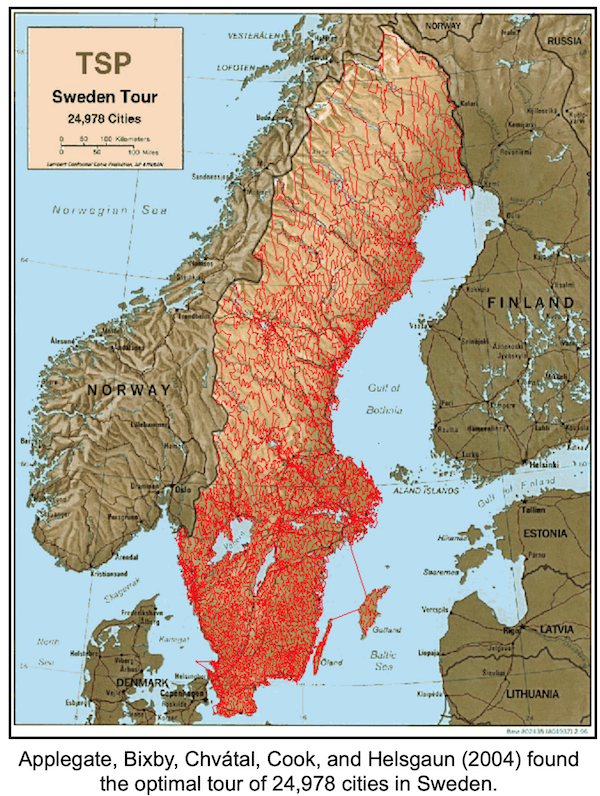

  

##  Содержание

[Преамбула](#преамбула)  
[Общие правила](#общие-правила)  
[Exercise 00 - Classical TSP](#exercise-00-classical-tsp)  
[Exercise 01 - Opposite TSP](#exercise-01-opposite-tsp)  


## Преамбула


Учитывая конечное число "городов" и стоимость проезда между каждой парой городов, найдите самый дешевый способ посетить все города и вернуться в исходную точку. (На снимке компания "Проктор энд Гэмбл" провела конкурс в 1962 году.  В конкурсе требовалось решить TSP для заданного набора из 33 городов.  Многие люди нашли оптимальный вариант.  Один из первых исследователей TSP, профессор Джеральд Томпсон из Университета Карнеги-Меллон, был одним из победителей).

Транспортные расходы симметричны в том смысле, что путешествие из города X в город Y стоит столько же, сколько путешествие из Y в X; "способ посетить все города" - это просто порядок посещения городов. Другими словами, данные состоят из целых весов, присвоенных ребрам конечного полного графа; цель состоит в том, чтобы найти гамильтонов цикл (т.е. цикл, проходящий через все вершины) с минимальным общим весом.  В этом контексте гамильтоновы циклы обычно называются турами.



Происхождение TSP неясно. В 1920-х годах математик и экономист Карл Менгер опубликовал его среди своих коллег в Вене. В 1930-х годах проблема вновь всплыла в математических кругах Принстона. В 1940-х годах он был изучен статистиками (Махаланобис (1940), Йессен (1942), Гош (1948), Маркс (1948)) в связи с применением в сельском хозяйстве, а математик Мерилл Флад популяризировал его среди своих коллег в корпорации RAND.  В конце концов, TSP стал известен как прототип сложной задачи комбинаторной оптимизации: об изучении туров по одному не может быть и речи из-за их большого количества, и долгое время на горизонте не было никакой другой идеи.


## Общие правила
- Пожалуйста, убедитесь, что у вас есть собственная база данных и доступ к ней в вашем кластере PostgreSQL.
- Все задачи содержат список разрешенных и запрещенных разделов с перечисленными параметрами базы данных, типами баз данных, конструкциями SQL и т.д. 
- Используйте эту страницу в качестве единственной ссылки. Не прислушивайтесь к слухам и домыслам о том, как подготовить ваше решение.
- Убедитесь, что вы используете последнюю версию PostgreSQL.
- Совершенно нормально, если вы используете IDE для написания исходного кода (он же SQL script).
- Для оценки ваше решение должно находиться в вашем репозитории GIT.
- Ваши решения будут оцениваться вашими коллегами.
- Вы не должны оставлять в своем каталоге никаких файлов, кроме тех, которые явно указаны в инструкциях по выполнению упражнения.   
- У вас есть вопрос? Спросите своего соседа справа. В противном случае попробуйте обратиться к соседу слева.
- Ваше справочное руководство: примечания / Интернет / Google. 
- Внимательно прочитайте примеры. Вам могут понадобиться вещи, не указанные в теме.
- И да пребудет с вами SQL-Сила!


## Exercise 00

| Exercise 00: Classical TSP|                                                                                                                          |
|---------------------------------------|--------------------------------------------------------------------------------------------------------------------------|
| Turn-in directory                     | ex00                                                                                                                     |
| Files to turn-in                      | `team00_ex00.sql` DDL for table creation with INSERTs of data; SQL DML statement                                                                                |
| **Allowed**                               |                                                                                                                          |
| Language                        | ANSI SQL|
| SQL Syntax Pattern                        | Recursive Query|


Взгляните на график сверху.  
Есть 4 города (a, b, c и d) и дуги между ними с затратами (или налогами). На самом деле стоимость равна (a, b) = (b,a).

- создайте таблицу с именованными узлами, используя структуру {points1, point2, cost}
- заполните данные на основе изображения (помните, что между двумя узлами есть прямой и обратный пути)  

Напишите SQL-инструкцию, которая возвращает:  
- все туры (иначе называемые путями) с минимальной стоимостью поездки, если мы начнем с города "а"
- отсортируйте данные по общей стоимости, а затем по туру  

Помните, вам нужно найти самый дешевый способ посетить все города и вернуться в исходную точку.   
Например, тур может выглядеть следующим образом a -> b -> c -> d -> a.  

Пример выходных данных  

| total_cost | tour |
| ------ | ------ |
| 80 | {a,b,d,c,a} |
| ... | ... |

<details>
  <summary>Решение</summary>
</p>

```sql
-- STEP 1: CREATE TABLES
-- Создаем таблицу paths для хранения путей между городами

CREATE TABLE IF NOT EXISTS paths (
  point1 CHAR(1),
  point2 CHAR(1),
  cost INT
);


INSERT INTO paths (point1, point2, cost) VALUES 
('a', 'b', 10),
('a', 'c', 15),
('a', 'd', 20),

('b', 'c', 35),
('c', 'd', 30),
('b', 'd', 25),
('c', 'b', 35),
('d', 'b', 25),
('d', 'c', 30),

('b', 'a', 10),
('c', 'a', 15),
('d', 'a', 20);

SELECT * FROM paths ;


-- STEP 2: CREATE VIEW WITH RECURSIVE
-- Создаем запрос для нахождения всех туров с минимальной стоимостью, начиная с города "a"

-- если объект уже существует, CREATE OR REPLACE обновит его
CREATE MATERIALIZED VIEW v_path_way AS (
	WITH RECURSIVE path_finder(last_point, tour, cost) 
		AS (
			SELECT point1, ARRAY[point1], 0 AS cost -- массив для хранения точек маршрута
			  FROM paths
			 WHERE point1 = 'a' -- начинаем с точки "а"
	    UNION
			SELECT 	paths.point2 AS last_point, -- точка финиша
					(path_finder.tour || paths.point2)::char(1)[], -- объединяем массив p.tour с новым значением paths.point2
					path_finder.cost + paths.cost -- вычисление стоимости маршрута 
			  FROM 	paths 
			  JOIN 	path_finder ON paths.point1 = path_finder.last_point -- начало и конец пути
			 WHERE 	NOT paths.point2 = ANY(path_finder.tour) -- исключаем точки, которые уже прошли
		),
		result_path AS (
			SELECT 	-- добавляем символ "а" в конец пути и вычисляем общую стоимость маршрута
					array_append(tour, 'a') AS tour, 
					cost + (SELECT cost FROM paths WHERE point1 = path_finder.last_point AND point2 = 'a') AS cost
			FROM path_finder
			WHERE array_length(path_finder.tour, 1) = 4 -- выставляем длину маршрута (после старта, 5-1=4)
		)
SELECT cost AS total_cost, tour
FROM result_path
ORDER BY total_cost, tour
);

-- выводим результат
SELECT * FROM v_path_way 
WHERE total_cost = (SELECT MIN(total_cost) FROM v_path_way)
ORDER BY total_cost, tour;
```


</p>
</details>


## Exercise 01

| Exercise 01: Opposite TSP|                                                                                                                          |
|---------------------------------------|--------------------------------------------------------------------------------------------------------------------------|
| Turn-in directory                     | ex01                                                                                                                     |
| Files to turn-in                      | `team00_ex01.sql`     SQL DML statement                                                                             |
| **Allowed**                               |                                                                                                                          |
| Language                        | ANSI SQL|
| SQL Syntax Pattern                        | Recursive Query|

- добавьте в SQL из предыдущего упражнения способ просмотра дополнительных строк с наиболее высокой стоимостью  
- отсортируйте данные по total_cost, а затем по tour  

Пример выходных данных  

| total_cost | tour |
| ------ | ------ |
| 80 | {a,b,d,c,a} |
| ... | ... |
| 95 | {a,d,c,b,a} |


<details>
  <summary>Решение</summary>
</p>

```sql

SELECT * FROM v_path_way 
ORDER BY total_cost, tour;
```


</p>
</details>