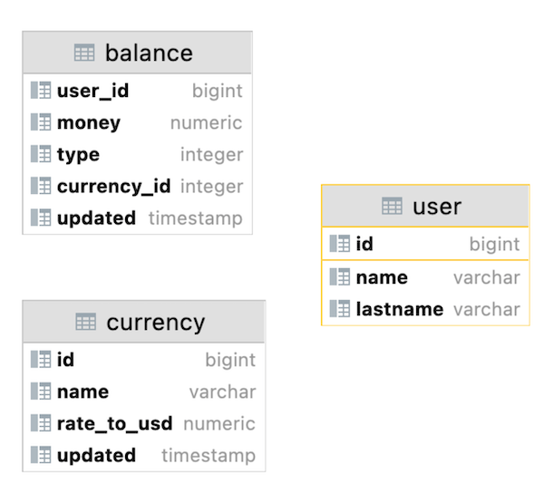
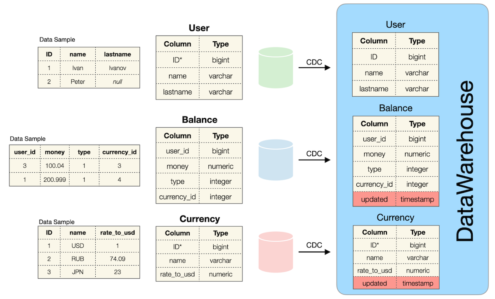

  


## Содержимое

[Преамбула](#преамбула)   
[Общие правила](#общие-правила)   
[Пояснения к таблицам](#пояснения-к-таблицам)    
[Exercise 00 - Classical DWH](#exercise-00)   
[Exercise 01 - Detailed Query](#exercise-01)   


## Преамбула


Data Warehouse (DWH) – это специализированная система хранения данных, предназначенная для анализа информации о предприятии.   
Она объединяет данные из различных источников, таких как операционные базы данных и внешние источники, для обеспечения возможности проведения анализа и получения отчетов общей информации о деятельности предприятия.  

**Основные характеристики Data Warehouse** включают:  

**Интеграцию данных**: DWH интегрирует данные из различных источников, обеспечивая их единый стандарт хранения и доступа.  
**Ориентацию на темы**: Данные в DWH организованы вокруг тем или сущностей, что упрощает анализ информации по различным бизнес-аспектам.  
**Поддержку аналитики**: DWH предназначен для аналитической обработки данных, позволяя проводить запросы и анализ для поддержки принятия управленческих решений.  
**Историчность**: DWH хранит исторические данные, позволяя проводить анализ трендов и изменений в данных по времени.  
**Поддержку отчетности**: Из DWH можно формировать различные отчеты и аналитическую информацию для бизнес-пользователей.  

DWH играет важную роль в обеспечении доступа к данным для целей аналитической обработки, принятия управленческих решений и создания отчетов, что делает его ключевым компонентом в области бизнес-аналитики и управления информацией.  

Есть 2 DWH-"отца" с противоположными мнениями о том, как сделать лучший DWH из логических слоев данных.

|  |  |
| ------ | ------ |
| "DWH - это предметно-ориентированный, интегрированный, энергонезависимый и изменяющийся во времени сбор данных для поддержки управленческих решений". (Билл Инмон) |  |
|  | "DWH - это система, которая извлекает, очищает, согласовывает и доставляет исходные данные в хранилище многомерных данных, а затем поддерживает и реализует запросы и анализ для принятия решений". (Ральф Кимбалл) |

Билл Инмон определяет DWH как предметно-ориентированный, интегрированный, энергонезависимый и изменяющийся во времени сбор данных для поддержки управленческих решений.  
Ральф Кимбалл видит DWH как систему, которая извлекает, очищает, согласовывает и доставляет исходные данные в хранилище многомерных данных, а затем поддерживает и реализует запросы и анализ для принятия решений.  

Сейчас больших объемов данных становится все больше, и нам требуется больше ресурсов для контроля, структурирования и дальнейшего изучения наших данных.   
Для поддержки классических систем хранения данных существует новый шаблон под названием LakeHouse (основанный на λ-архитектуре) = DataLake + DataWareHouse.  
С логической точки зрения мы можем представить современный WareHouse как набор логических уровней данных.

LakeHouse - это новый подход, комбинирующий преимущества Data Lake и Data Warehouse.   
Этот подход позволяет эффективно управлять большими объемами данных, обеспечивая контроль, структурирование и анализ данных.   
Он основан на λ-архитектуре, которая объединяет пакетное (batch) и потоковое (streaming) обработки данных.  


Следовательно, чтобы быть архитектором данных, вам нужно знать "немного больше", чем реляционное моделирование.   
В свете этих расширенных моделей данных архитекторы данных должны обладать более широкими знаниями, чем только реляционное моделирование.   
Они должны уметь выбирать наиболее подходящую модель в зависимости от конкретных требований и задач бизнеса.

Давайте посмотрим на список существующих шаблонов моделей данных: 
- Реляционная модель (Relational Model),
- Временная модель (Temporal Model),
- Битемпоральная модель (BiTemporal Model),
- Модель USS (USS Model),
- Модель EAV (EAV Model),
- Модели звезд / снежинок (Star / Snowflake Models),
- Модель Галактики (Galaxy Model),
- Модель хранилища данных (Data Vault Model),
- Модель привязки (Anchor Model),
- Графическая модель (Graph Model).

Каждая из этих моделей предназначена для решения определенных проблем при управлении и анализе данных.  

### Общие правила

- Убедитесь, что используете последнюю версию PostgreSQL.  
- Для оценки ваше решение должно находиться в репозитории git, в ветке develop и папке src.  
- Вы не должны оставлять в своей директории никаких других файлов, кроме тех, которые явно указаны в инструкциях по упражнению.   
- Убедитесь, что у вас есть собственная база данных и доступ к ней в вашем кластере PostgreSQL.
- Скачайте [script](materials/rush01_model.sql) с моделью базы данных здесь и примените скрипт к своей базе данных (вы можете использовать командную строку с psql или просто запустить его через любую среду IDE, например DataGrip от JetBrains или pgAdmin от PostgreSQL community).
- Все задачи содержат список разрешенных и запрещенных разделов с перечисленными параметрами базы данных, типами баз данных, конструкциями SQL и т.д.  
- И да пребудет с вами SQL-сила!
- Абсолютно все может быть представлено в SQL! Давайте начнем и повеселимся!


## Пояснения к таблицам



Давайте взглянем на источники данных и первый логический уровень данных (ODS - Хранилище оперативных данных) в DWH.




Таблица `user` в базе данных Green Source:

| Column Name | Description |
| ------ | ------ |
| ID | Первичный ключ |
| name | Имя пользователя |
| lastname | Фамилия пользователя |


Таблица `currency` в базе данных Red Source:

| Column Name | Description |
| ------ | ------ |
| ID | Первичный ключ |
| name |  Название валюты |
| rate_to_usd | Соотношение к доллару США |


Таблица `balance` в базе данных Blue Source:

| Column Name | Description |
| ------ | ------ |
| user_id |"Виртуальный внешний ключ" к пользовательской таблице из другого источника |
| money | Сумма денег |
| type | Тип баланса (может быть 0,1,...) |
| currency_id | "Виртуальный внешний ключ" к таблице валют из другого источника |


Зеленая, Красная и Синяя базы данных являются независимыми источниками данных и соответствуют шаблону микросервиса.   
Это означает, что существует высокий риск аномалий данных (см. ниже).  

Данные в таблицах не согласованы. Это означает, что есть Пользователь, но в таблице баланса нет строк, или наоборот, есть баланс, но нет строк в таблице пользователя.   
Такая же ситуация существует между таблицами Валюты и баланса. 

Другими словами: 
- между ними нет явных внешних ключей  
- возможны нулевые значения для имени и фамилии в таблице `user`
- все таблицы работают с трафиком SQL OLTP (OnLine Transaction Processing)  
Это означает, что одновременно существует текущее состояние данных, исторические изменения не сохраняются для каждой таблицы  


Эти 3 перечисленные таблицы являются источниками данных для таблиц с аналогичными моделями данных в области DWH.

Таблица `user` в базе данных DWH:

| Column Name | Description |
| ------ | ------ |
| ID | Первичный ключ |
| name | Имя пользователя |
| lastname | Фамилия пользователя |

Таблица `currency` в базе данных DWH:

| Column Name | Description |
| ------ | ------ |
| ID | Поддельный первичный ключ |
| name | Название валюты |
| rate_to_usd | Соотношение к доллару США |
| updated | Временная метка события из исходной базы данных |

`Mocked Primary Key (Поддельный первичный ключ)` `Поддельный первичный ключ` означает, что есть дубликаты с одним и тем же идентификатором, потому что был добавлен новый обновленный атрибут, который изменяет нашу реляционную модель на временную реляционную модель.   

Взгляните на приведенный ниже образец данных для валюты "EUR".  
Этот пример основан на инструкции SQL:  

```sql
    SELECT *
    FROM Currency
    WHERE name = ‘EUR’
    ORDER BY updated DESC;
```

| ID | name | rate_to_usd | updated |
| ------ | ------ | ------ | ------ |
| 100 | EUR | 0.9 | 03.03.2022 13:31 |
| 100 | EUR | 0.89 | 02.03.2022 12:31 |
| 100 | EUR | 0.87 | 02.03.2022 08:00 |
| 100 | EUR | 0.9 | 01.03.2022 15:36 |
| ... | ... | ... | ... |


Таблица `balance` в базе данных DWH:

| Column Name | Description |
| ------ | ------ |
| user_id | "Виртуальный внешний ключ" к пользовательской таблице из другого источника |
| money | Сумма денег |
| type | Тип баланса (может быть 0,1,...) |
| currency_id | "Виртуальный внешний ключ" к таблице валют из другого источника |
| updated | Временная метка события из исходной базы данных |

Взгляните на образец данных.  
Этот пример основан на инструкции SQL:  

```sql
    SELECT *
    FROM Balance
    WHERE user_id = 103
    ORDER BY type, updated DESC;
```

| user_id | money | type | currency_id | updated |
| ------ | ------ | ------ | ------ | ------ |
| 103 | 200 | 0 | 100 | 03.03.2022 12:31 |
| 103 | 150 | 0 | 100 | 02.03.2022 11:29 |
| 103 | 15 | 0 | 100 | 03.03.2022 08:00 |
| 103 | -100 | 1 | 102 | 01.03.2022 15:36 |
| 103 | 2000 | 1 | 102 | 12.12.2021 15:36 |
| ... | ... | ... | ... |... |


Все таблицы в DWH наследуют все аномалии из исходных таблиц.
- Таблицы не согласованы с данными
- Возможные `NULL`-значения для имени и фамилии в таблице пользователя  


## Exercise 00

| Exercise 00: Classical DWH|                                                                                                                          |
|---------------------------------------|--------------------------------------------------------------------------------------------------------------------------|
| Turn-in directory                     | ex00                                                                                                                     |
| Files to turn-in                      | `team01_ex00.sql`                                                                           |
| **Allowed**                               |                                                                                                                          |
| Language                        |  SQL|

Напишите SQL-инструкцию, которая возвращает:  
- общий объем (сумму всех денег) транзакций с баланса пользователя, агрегированный* по пользователю и типу баланса     
- все данные должны быть обработаны, включая данные с аномалиями  
- отсортируйте результат по имени пользователя в порядке убывания, а затем по фамилии пользователя и типу баланса в порядке возрастания   

Ниже приведена таблица столбцов результатов и соответствующая формула расчета  

| Output Column | Formula (pseudocode) |
| ------ | ------ |
| name | source: user.name if user.name is NULL then return `not defined` value |
| lastname | source: user.lastname if user.lastname is NULL then return `not defined` value |
| type | source: balance.type | 
| volume | source: balance.money need to summarize all money “movements” | 
| currency_name | source: currency.name if currency.name is NULL then return `not defined` value | 
| last_rate_to_usd | source: currency.rate_to_usd. take a last currency.rate_to_usd for corresponding currency if currency.rate_to_usd is NULL then return 1 | 
| total_volume_in_usd | source: volume , last_rate_to_usd. make a multiplication between volume and last_rate_to_usd |

  
Пример выходных данных    

| name | lastname | type | volume | currency_name | last_rate_to_usd | total_volume_in_usd |
| ------ | ------ | ------ | ------ | ------ | ------ | ------ |
| Петр | not defined | 2 | 203 | not defined | 1 | 203 |
| Иван | Иванов | 1 | 410 | EUR | 0.9 | 369 |
| ... | ... | ... | ... | ... | ... | ... |

> *
> "Агрегированный" в контексте запроса означает, что данные сгруппированы и обработаны с использованием агрегирующей функции, такой как SUM(), AVG(), и тп.  
В данном случае, объем транзакций (сумма всех денег) на балансе пользователя агрегирован **по пользователю и типу баланса, что означает, что данные о сумме всех транзакций для каждого конкретного пользователя и их типа баланса были объединены и вычислены с использованием суммирования**.   
Полученная сумма представляет собой общий объем транзакций для каждого пользователя с учетом их типа баланса.  

<details>
  <summary>Решение</summary>
</p>

> В первой части с помощью оператора WITH создаются два виртуальных набора данных:  
> - в `aggregated_user_balance` выполняется выборка и агрегирование баланса пользователя по типу и валюте из таблицы `balance`  
> - в `latest_currency_rates` заносятся последние курсы валют к USD из таблицы `currency` путем определения максимальной даты обновления для каждой валюты  
> 
> Во второй части запроса используются созданные виртуальные наборы данных для выполнения финальной выборки и вычисления объема баланса в USD  
с сортировкой по имени пользователя, фамилии и типу баланса.  

```sql
-- -- ВАРИАНТ №1 С ИСПОЛЬЗОВАНИЕМ CTE (чуток эффективнее)
-- создание предварительных агрегированных данных о балансе пользователя и валюте
WITH aggregated_user_balance AS (
      SELECT
			 -- выборка и агрегация баланса пользователей по типу и валюте
			 user_id, 
			 SUM(money) AS total_balance, 
			 type, 
			 currency_id
        FROM balance
    GROUP BY user_id, type, currency_id
), 

latest_currency_rates AS (
  SELECT 
		 -- получение последних курсов валют к USD
         currency.id, 
         currency.name AS currency_name, 
         currency.rate_to_usd AS last_rate_to_usd
    FROM currency
    JOIN (
      SELECT 
			  -- поиск последнего обновления курса для каждой валюты
             id, 
             name, 
             MAX(updated) AS max_updated
        FROM currency 
    GROUP BY id, name
    ) AS latest ON currency.id = latest.id AND currency.name = latest.name AND currency.updated = latest.max_updated
)

-- Выборка и вычисление итогового общего объема в USD с сортировкой
   SELECT
			COALESCE(usr.name, 'not defined') AS user_name, -- имя пользователя, (при отсутствии выводится "not defined") 
			COALESCE(usr.lastname, 'not defined') AS user_lastname, -- фамилия (при отсутствии "not defined")
			bal.type AS balance_type, -- тип баланса
			bal.total_balance AS total_balance, -- общий баланс пользователя
			COALESCE(cur.currency_name, 'not defined') AS currency_name, -- наименование валюты (при отсутствии "not defined")
			COALESCE(cur.last_rate_to_usd, 1) AS last_rate_to_usd, -- курс валюты к USD, при отсутствии выводится 1 (USD)
			CAST(ROUND(bal.total_balance * COALESCE(cur.last_rate_to_usd, 1), 6) AS real) AS total_balance_in_usd -- общий баланс пользователя в USD с округлением до 6 знаков
     FROM	aggregated_user_balance AS bal
LEFT JOIN	"user" usr ON usr.id = bal.user_id
LEFT JOIN	latest_currency_rates cur ON cur.id = bal.currency_id
 ORDER BY	user_name DESC, user_lastname, balance_type
 ;


-- ВАРИАНТ №2 С ИСПОЛЬЗОВАНИЕМ МАТЕРИАЛИЗОВАННОГО ПРЕДСТАВЛЕНИЯ
-- создание материализованного представления для агрегированных данных о балансе пользователя и валюте
CREATE 	MATERIALIZED VIEW aggregated_user_balance_mv AS 
	SELECT
			user_id, 
			SUM(money) AS total_balance, 
			type, 
			currency_id
	  FROM	balance
  GROUP BY	user_id, type, currency_id;

-- создание материализованного представления для последних курсов валют к USD
CREATE MATERIALIZED VIEW latest_currency_rates_mv AS
  SELECT 
		 currency.id, 
		 currency.name AS currency_name, 
		 currency.rate_to_usd AS last_rate_to_usd
	FROM currency
	JOIN (
	  SELECT 
			 id, 
			 name, 
			 MAX(updated) AS max_updated
		FROM currency 
	GROUP BY id, name
) AS latest ON currency.id = latest.id AND currency.name = latest.name AND currency.updated = latest.max_updated;

-- использование материализованных представлений в основном запросе
SELECT
			COALESCE(usr.name, 'not defined') AS user_name,
			COALESCE(usr.lastname, 'not defined') AS user_lastname,
			bal.type AS balance_type,
			bal.total_balance AS total_balance,
			COALESCE(cur.currency_name, 'not defined') AS currency_name,
			COALESCE(cur.last_rate_to_usd, 1) AS last_rate_to_usd,
			CAST(ROUND(bal.total_balance * COALESCE(cur.last_rate_to_usd, 1), 6) AS real) AS total_balance_in_usd
	 FROM	aggregated_user_balance_mv AS bal
LEFT JOIN	"user" usr ON usr.id = bal.user_id
LEFT JOIN	latest_currency_rates_mv AS cur ON cur.id = bal.currency_id
 ORDER BY	user_name DESC, user_lastname, balance_type
 ;	
```

 

</p>
</details>


## Exercise 01

| Exercise 01: Detailed Query|                                                                                                                          |
|---------------------------------------|--------------------------------------------------------------------------------------------------------------------------|
| Turn-in directory                     | ex01                                                                                                                     |
| Files to turn-in                      | `team01_ex01.sql`                                                                             |
| **Allowed**                               |                                                                                                                          |
| Language                        | ANSI SQL|


Прежде чем углубиться в выполнение этой задачи, пожалуйста, примените следующие инструкции `INSERT`.

`insert into currency values (100, 'EUR', 0.85, '2022-01-01 13:29');`  
`insert into currency values (100, 'EUR', 0.79, '2022-01-08 13:29');`  

Напишите SQL-инструкцию, которая возвращает:  
- всех пользователей, 
- все транзакции баланса (в этой задаче, пожалуйста, игнорируйте валюты, у которых нет ключа в таблице "Валюта") 
с названием валюты и расчетным значением валюты в долларах США на следующий день

Ниже приведена таблица столбцов результатов и соответствующая формула расчета.

| Output Column | Formula (pseudocode) |
| ------ | ------ |
| name | source: user.name if user.name is NULL then return `not defined` value |
| lastname | source: user.lastname if user.lastname is NULL then return `not defined` value |
| currency_name | source: currency.name | 
| currency_in_usd | involved sources: currency.rate_to_usd, currency.updated, balance.updated.Take a look at a graphical interpretation of the formula below.| 


- Вам нужно найти ближайший курс_ к_usd валюты в прошлом (t1)
- Если t1 пуст (означает отсутствие курсов в прошлом), то найдите ближайший курс_ к_usd валюты в будущем (t2)
- Используйте курс t1 ИЛИ t2 для расчета валюты в формате USD

Отсортируйте результат по имени пользователя в порядке убывания, а затем по фамилии пользователя и названию валюты в порядке возрастания.
Смотрите пример вывода ниже.

| name | lastname | currency_name | currency_in_usd |
| ------ | ------ | ------ | ------ |
| Иван | Иванов | EUR | 150.1 |
| Иван | Иванов | EUR | 17 |
| ... | ... | ... | ... |

<details>
  <summary>Решение</summary>
</p>

```sql
-- insert into currency values (100, 'EUR', 0.85, '2022-01-01 13:29');
-- insert into currency values (100, 'EUR', 0.79, '2022-01-08 13:29');

create or replace function get_rate_to_usd(
	pmoney numeric,
	pcurerncy_id integer, 
	pdate timestamp)
returns numeric as $$
declare 
	nearest_rate_to_usd numeric;
begin
	select into nearest_rate_to_usd rate_to_usd from currency
	where id = pcurerncy_id
	and updated <= pdate
	order by pdate - updated, rate_to_usd desc
	limit 1;
	
	if (nearest_rate_to_usd is null) then
		select into nearest_rate_to_usd rate_to_usd from currency
		where id = pcurerncy_id
		and updated > pdate
		order by updated - pdate, rate_to_usd desc
		limit 1;
	end if;
	
	return nearest_rate_to_usd * pmoney;
end;
$$ language plpgsql;

select distinct
coalesce(usr.name, 'not defined') as name,
coalesce(usr.lastname, 'not defined') as lastname,
currency.name as currency_name,
get_rate_to_usd(balance.money, balance.currency_id, balance.updated) as currency_in_usd
from "user" as usr
full join balance on usr.id = balance.user_id
right join currency on balance.currency_id = currency.id
order by name desc, lastname asc, currency_name asc;
```

 

</p>
</details>
